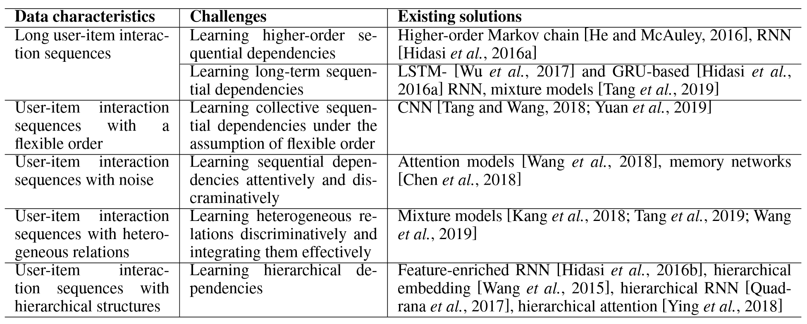
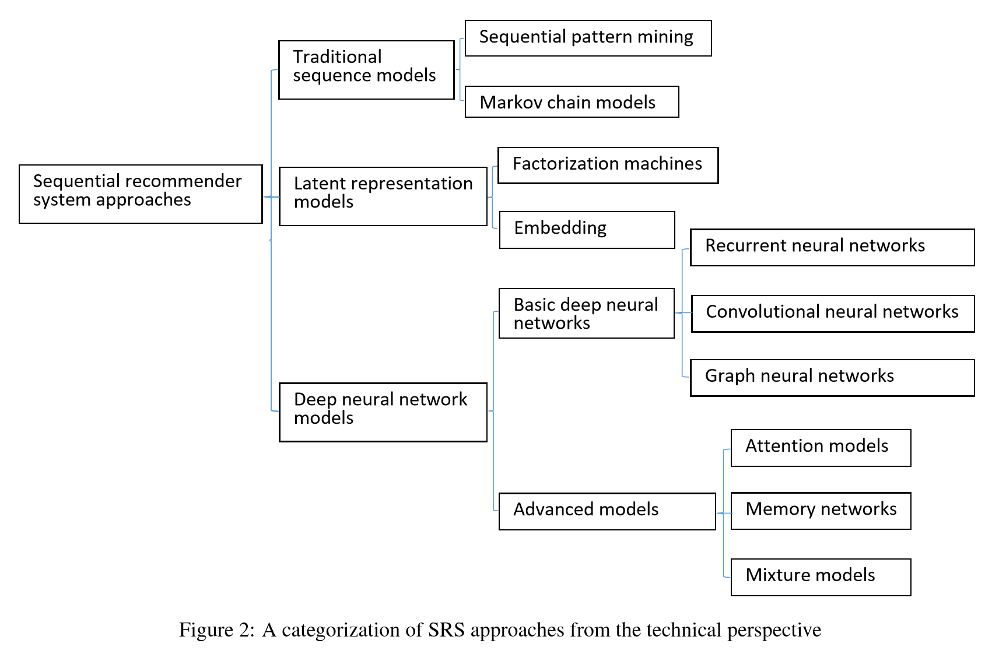
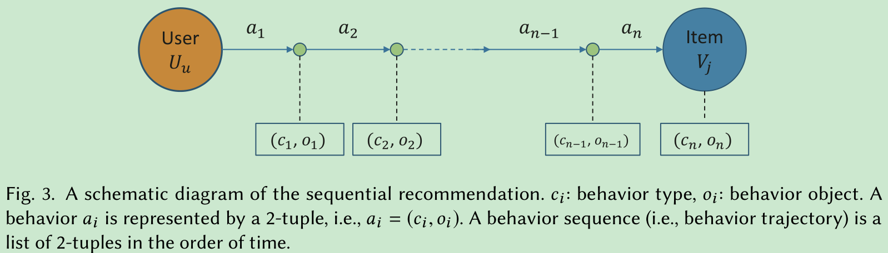
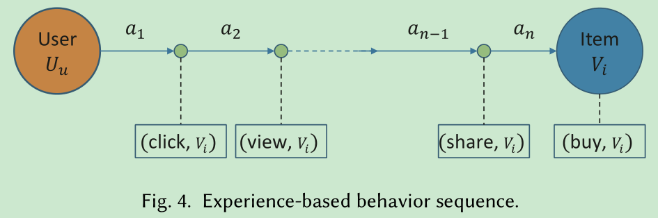
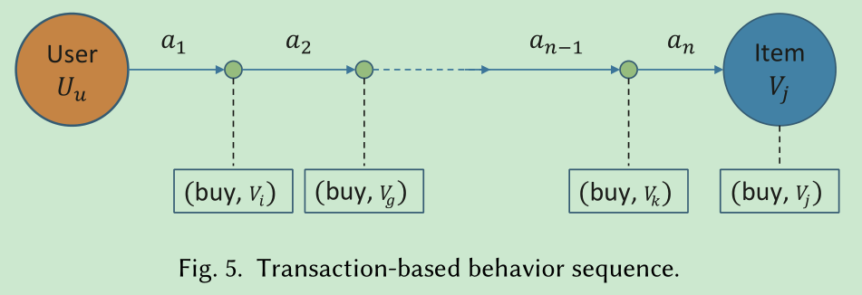
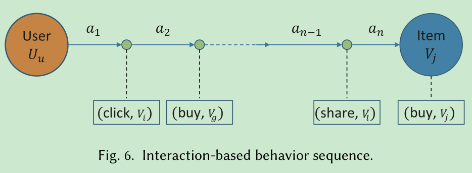
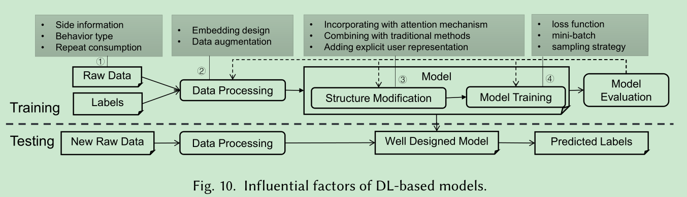
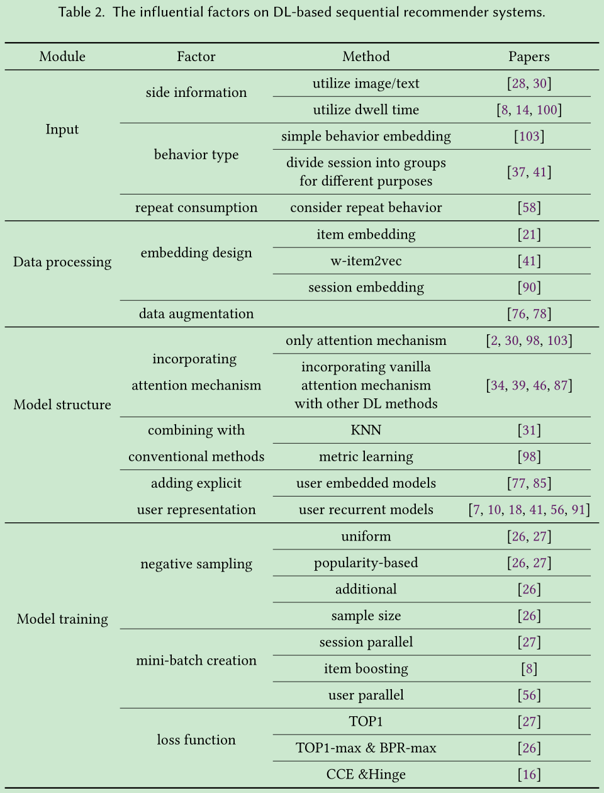

# Survey for Sequential Recommender Systems

[1] Fang, Hui, Danning Zhang, Yiheng Shu, and Guibing Guo. “Deep Learning for Sequential Recommendation: Algorithms, Influential Factors, and Evaluations.” ArXiv:1905.01997 [Cs], November 26, 2019. http://arxiv.org/abs/1905.01997.

[2] Wang, Shoujin, Liang Hu, Yan Wang, Longbing Cao, Quan Z. Sheng, and Mehmet Orgun. “Sequential Recommender Systems: Challenges, Progress and Prospects.” In Proceedings of the Twenty-Eighth International Joint Conference on Artificial Intelligence, 6332–38. Macao, China: International Joint Conferences on Artificial Intelligence Organization, 2019. https://doi.org/10.24963/ijcai.2019/883.

这两篇是讲序列推荐的综述的文章，感觉第一篇文章比我很久以前在 IJCAI19[2] 的文章写的好多了，因为比较全面的介绍了序列推荐，让我知道序列推荐原来还有那么多种类型，以前就只知道最简单的，不过分类角度不同罢了，还是很有启发的，毕竟看到是熟悉的老师。

## Sequential Recommender Systems: Challenges, Progress and Prospects

摘要

The emerging topic of sequential recommender systems (SRSs) has attracted increasing attention
in recent years. Different from the conventional recommender systems (RSs) including collaborative filtering and content-based filtering, SRSs try to understand and model the sequential user behaviors, the interactions between users and items, and the evolution of users’ preferences and item popularity over time. SRSs involve the above aspects for more precise characterization of user contexts, intent and goals, and item consumption trend, leading to more accurate, customized and dynamic recommendations. In this paper, we provide a systematic review on SRSs. We first present the characteristics of SRSs, and then summarize and categorize the key challenges in this research area, followed by the corresponding research progress consisting of the most recent and representative developments on this topic. Finally, we discuss the important research directions in this vibrant area.

本篇主要是以数据特点来对序列推荐进行分类的

动机：

- 序列推荐的用户项目交互具有顺序依赖性
- 用户的偏好和商品的受欢迎程度随着时间的流逝动态变化
- 用户项目交互通常在特定顺序的上下文中发生

下面介绍了序列推荐中的数据挑战以及需要考虑的内容：

数据特征和挑战：

- 处理长用户项目交互序列

  学习高阶序列依赖

  学习长期序列依赖

- 处理灵活顺序的用户项目交互序列

  在现实世界中，某些用户项交互序列是严格排序的，而其他一些则可能并非如此，即，不相邻的交互是依序依赖于序列的。我们要捕获集合序列依赖关系。

- 处理带有噪音的用户项目交互序列

  有选择地和区别对待交互，即注意力

- 处理含异质关系的用户项目交互序列

  在用户-项目交互序列中，除了基于用户-项目交互的广泛的基于出现的顺序依存关系之外，在交互项目之间就其特征而言还存在基于相似性的关系。我们要捕获长期依赖关系和短期依赖关系

- 处理具有层次结构的用户项目交互序列

  元数据和用户-项目交互之间的层次结构

  子序列和用户-项目交互之间的层次结构

文章中提到的分类方法：

<!--  -->

未来的研究方向：

- 上下文感知的序列推荐系统
- 社交感知的序列推荐系统
- 交互式的序列推荐系统
- 跨域的序列推荐系统

结论：

Recommender systems (RS) is one of the most direct and practical applications of artificial intelligence in our daily lives. Sequential recommender systems (SRSs) have been at the core of the RS field in the past three to five years as they provide more intelligent and favorable recommendations to
satisfy our daily requirements. It is our hope that this summary provides an overview of the challenges and the recent progress as well as some future directions in SRSs to the RS research community.

## Deep Learning for Sequential Recommendation: Algorithms, Influential Factors, and Evaluations

### 摘要

In the field of sequential recommendation, deep learning (DL)-based methods have received a lot of attention in the past few years and surpassed traditional models such as Markov chain-based and factorization-based ones. However, there is little systematic study on DL-based methods, especially regarding to how to design an effective DL model for sequential recommendation. In this view, this survey focuses on DL-based sequential recommender systems by taking the aforementioned issues into consideration. Specifically, we illustrate the concept of sequential recommendation, propose a categorization of existing algorithms in terms of three types of behavioral sequence, summarize the key factors affecting the performance of DL-based models, and conduct corresponding evaluations to demonstrate the effects of these factors. We conclude this survey by systematically outlining future directions and challenges in this field.

定义了行为对象和行为类型以后，就决定了序列行为的分类了。以前我只关注了一种行为对象和一种行为目标，即用户和商品具有交互关系，这样其实是限制了想象力，可能是我看的论文都这样吧。行为对象可以有图片、视频、文字时间等许多内容，当然行为类型也有很多内容，比如浏览，停留时间，加入购物车等一系列的操作。

看了这篇综述之后才知道原来研究序列推荐的那么多，而且很多研究都已经关注时间序列，停留时间，多种类型等一系列要考虑的因素在内，我还是停留在最简单的 ID 类的交互上。看完才知道需要学习的内容很多

### 序列推荐

总体的序列推荐任务表示如下：

按照行为序列又分为了三类：

Experience-based behavior sequence

Transaction-based behavior sequence

Interaction-based behavior sequence

可以看出这篇综述和上一篇的分类角度是不同的，上篇是从数据的角度来分类的，而这个是从序列行为的类型来分类的，其中第三个基于交互的行为序列混合了前两类

### 影响因素

论文还有一个很重要的内容是做实验研究了影响序列推荐的因素，从推荐的整体流程中一步步来剖析：

以及现有的论文研究：

未来的研究方向：
- Objective and comprehensive evaluations across different models

  这应该是现在国内推荐系统的通病了，很多评价很多数据集没有一个基准，还是急需一个统一的标准的

- More designs on embedding methods

  现在都是采用的 NLP 中的相对简单的和静态的嵌入，其实序列推荐中要考虑的还是很多的，因为行为类型和行为对象是很复杂且不同的，但是如果研究的比较浅当我没说

- Advanced sampling strategies

  可以看到采样策略其实对性能的影响挺大的，虽然这一块我不太明白，基于统一的，流行的还有 additional 采样等

- Better modeling user long-term preference

  其实大多数都关注于短期的兴趣，但是长期兴趣不一定有效啊，因为用户的兴趣一直在变化，全局的兴趣真的不一定会有效果提升，逻辑上是可以的

- Personalized recommendation based on polymorphic behavior trajectory

  这个就比较难的一个方向了，因为考虑的因素太多太复杂，而且要统一的话更难，不过，也没有那么复杂的系统吧

- Learning behavior sequences in real time

  实时系统对性能要求更重要，应该尽量简化模型，但是现在的论文哪个不是很复杂的神经网络，越来越复杂

- Sequential recommendation for specific domains

  具体需求具体对待

### 结论

The study systematically investigated the DL-based sequential recommendation. Specifically, we
designed a novel taxonomy for investigating the sequential recommendation tasks in terms of the
three types of behavior sequences: experienced-based, transaction-based and interaction-based.
Based on it, we surveyed and explored a considerable amount of representative DL-based algorithms
in the sequential recommendation, with the aim of a better understanding on whether sequential
recommendation tasks have been sufficiently or insufficiently studied. Thirdly, for better guiding the
development of DL-based sequential recommender systems, we thoroughly identified the possible
influential factors that impact the performance of DL-based models from the four perspectives with
respect to learning a better model: model input, data pre-processing, model structure and model
training. We further comprehensively evaluated their impacts via well-designed evaluations, which

### 感悟

- 并不是所有的因素都考虑进去就可以得到好结果，具体问题需要具体对待，也不是复杂的模型就可以得到很好的结果
- 对于序列推荐又有了一个很全面的认识，不是自己以前理解的那样狭隘，对于用户的行为也要考虑进去比如点击浏览加入购物车等这都是一个序列内的多种类型
- 可以从好多方面进行改进，但是要针对特定的个问题去改进，比如显示加入 user 的嵌入等，但是不一定会有效，可能适得其反
- 当然还有一个新发现，这个叫 privileged information 的东西还是挺吸引我的，虽然不知道是不是和我想得一样
