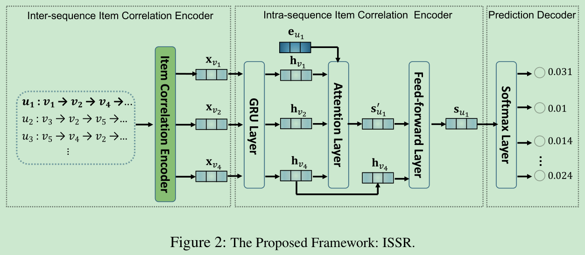
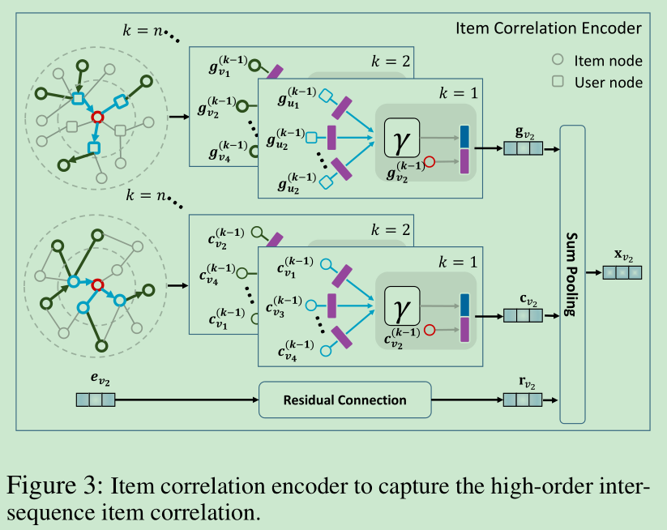

# Inter-Sequence Enhanced Framework for Personalized Sequential Recommendation

[1] Liu, Feng, Weiwen Liu, Xutao Li, and Yunming Ye. “Inter-Sequence Enhanced Framework for Personalized Sequential Recommendation.” ArXiv:2004.12118 [Cs], April 28, 2020. http://arxiv.org/abs/2004.12118.

## 摘要

Modeling sequential correlation of users’ historical interactions is essential in sequential recommendation. However, the majority of the approaches mainly focus on modeling the intra-sequence item correlation within each individual sequence but neglect the inter-sequence item correlation across
different user interaction sequences. Though several studies have been aware of this issue, their method is either simple or implicit. To make better use of such information, we propose an inter-sequence enhanced framework for the Sequential Recommendation (ISSR). In ISSR, both inter-sequence and intra-sequence item correlation are considered. Firstly, we equip graph neural networks in the inter-sequence correlation encoder to capture the high-order item correlation from
the user-item bipartite graph and the item-item graph. Then, based on the inter-sequence correlation encoder, we build GRU network and attention network in the intra-sequence correlation encoder to model the item sequential correlation within each individual sequence and temporal dynamics for predicting users’ preferences over candidate items. Additionally, we conduct extensive experiments on three real-world datasets. The experimental results demonstrate the superiority of ISSR over many state-of-the-art methods and the effectiveness of the inter-sequence correlation encoder.

## 创新点

- 同时考虑了序列间 (inter-sequence) 和序列内 (intra-sequence) 项目的联系

- 利用 GNN 显式地从不同的序列聚合高阶地邻居信息

## 模型图

### Inter-sequence Item Correlation Encoder

论文提出了两个图来捕获高阶地捕获序列间地关系，一个用户项目二部图，一个是项目之间协作图。并且还考虑了残差连接以考虑原始的项目嵌入保证不丢失信息，所以最后的项目嵌入是由三部分组成的

- User-Item Bipartite Graph

  这个可以从图中看出，其实就是借鉴了 NGCF 里面的内容，根据二部图来聚合邻居的信息，用户从项目聚合信息，项目从用户聚合信息，这样做虽然不考虑异质图的问题，但是可以看待吧，毕竟唯一的解法了

- Item-Item Cooccurrence Graph

  这个从图中也可以看出，其实没啥好说的了，估计作者也知道异质图的问题，考虑 items 之间的图就更合理了，做法和上个个图一样，可能都是借鉴了 NGCF，只不过结点类型

- Residual Connection

  这个可能就是新的了，不过也是借鉴别人的

### Intra-sequence Item Correlation Encoder

这个可以从模型图中看出，针对每一个序列内的项目，先用 GRU，再用注意力得到最后每个嵌入，常规操作了。

最后预测的时候还是加上了最后一个项目，SR-GNN 也是这样做的

## 感想

这篇文章我猜是借鉴了 NGCF 的思想应用到会话推荐中的，也考虑到了 NGCF 中的异质图的问题，所以又加上了一个项目之间的图来修正一下，其实我也准备考虑序列间的关系了，也有过这种想法，自然而然吧，毕竟看了 NGCF 那么久了，只可惜还是别人快。其余的残差连接这块倒是也是一个小点吧，NGCF 里面也考虑的不是太完全

## 结论

In this paper, we propose a Inter-Sequence enhanced framework for personalized Sequential Recommendation (ISSR). The inter-sequence item correlation encoder in ISSR utilizes two graphs (i.e., a user-item bipartite graph and an item-item co-occurrence graph) to capture the inter-sequence item correlations. The intra-sequence item correlation encoder aggregates the learned inter-sequence item correlation information and considers the item sequential correlations and temporal dynamics in a current sequence to generate the representation of users’ interests. Then the user’s next behavior
on the candidate items can be predicted by the learned interests. Extensive experiments on three real-world datasets are conducted. The results demonstrate the superiority of ISSR over many state-of-the-art methods.
