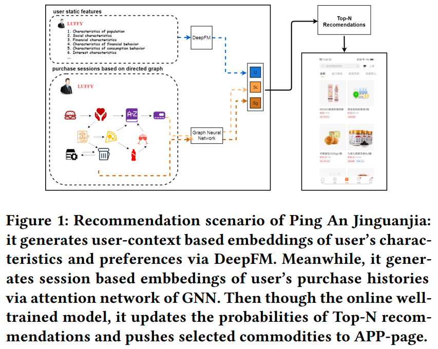
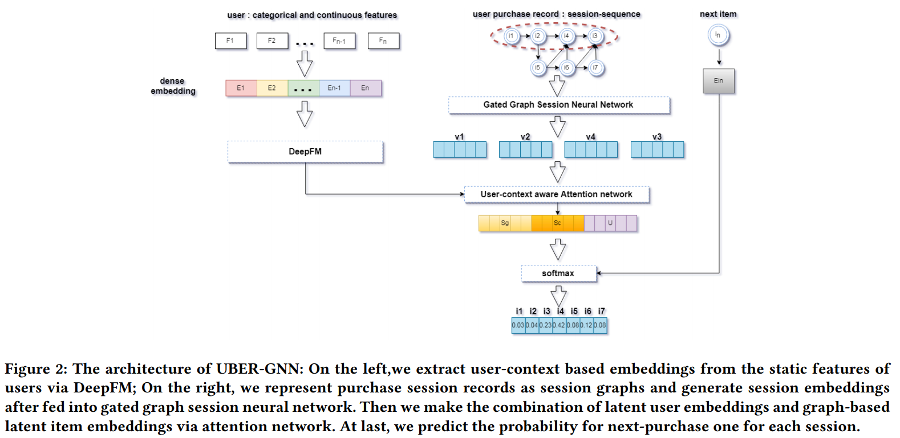
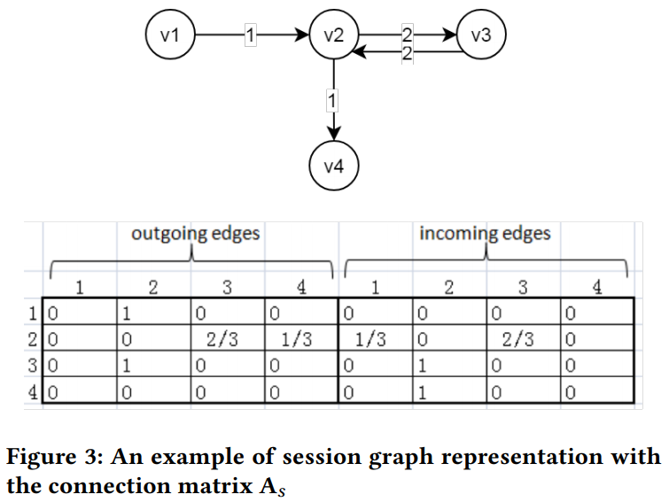

# UBER-GNN: A User-Based Embeddings Recommendation based on Graph Neural Networks

[1] Huang, Bo, Ye Bi, Zhenyu Wu, Jianming Wang, and Jing Xiao. “UBER-GNN: A User-Based Embeddings Recommendation Based on Graph Neural Networks.” ArXiv:2008.02546 [Cs], August 6, 2020. http://arxiv.org/abs/2008.02546.

[2] Yu, Feng, Yanqiao Zhu, Qiang Liu, Shu Wu, Liang Wang, and Tieniu Tan. “TAGNN: Target Attentive Graph Neural Networks for Session-Based Recommendation.” ArXiv:2005.02844 [Cs], May 6, 2020. http://arxiv.org/abs/2005.02844.

https://github.com/CRIPAC-DIG/TAGNN

# 摘要

The problem of session-based recommendation aims to predict user next actions based on session histories. Previous methods models session histories into sequences and estimate user latent features
by RNN and GNN methods to make recommendations. However under massive-scale and complicated financial recommendation scenarios with both virtual and real commodities , such methods are not sufficient to represent accurate user latent features and neglect the long-term characteristics of users.

To take long-term preference and dynamic interests into account, we propose a novel method, i.e User-Based Embeddings Recommendation with Graph Neural Network, UBER-GNN for brevity.
UBER-GNN takes advantage of structured data to generate long-term user preferences, and transfers session sequences into graphs to generate graph-based dynamic interests. The final user latent feature is then represented as the composition of the long-term preferences and the dynamic interests using attention mechanism.

Extensive experiments conducted on real Ping An scenario show that UBER-GNN outperforms the state-of-the-art session-based recommendation methods.

# 主要贡献

- 处理了更复杂的交互情景，考虑了真实的商品和虚拟的商品，因为是银行数据集
- 传统方法 DeepFM 获得用户上下文的嵌入，再用 GNN 获得 item 的嵌入以获得 session 的表示。 long-term动态兴趣都是在 GNN 里面实现的

# 模型

先看看整体的流程。第一张是大致的框架图，更模糊一点。第二张是内部实现图了相当于，可以看成是细化版本，具体的介绍在图例中已经说明

## User context based embeddings

这一块就是纯粹利用 DeepFM 来获取的用户表示，按论文能说的应该是 long-term 的获取。对于输入的话，考虑到了离散和连续两种类型的输入，都用了 one-hot 编码表示

$$U = \sigma(\gamma_{(FM)} + \gamma_{(DNN)})$$

## Session graph representation

首先是图的构建，例子如下，感觉和 SR-GNN 差不多

## Item embeddings via GNN

这部分跟 SR-GNN 也差不多，都用到了 G-RNN 来获取 item 的嵌入了。

## Session embeddings with attention to user context

利用前两部分得到的嵌入，一个是用户的静态属性，一个是 GNN 得到的 item嵌入，然后还有最后一个 item 的嵌入，利用 attention 组合在一起

$$ \lambda_i=A^T\sigma(W_1[U,S_c]+W_2V_i+C)$$
$$S_g=\sum_{i=1}^{N}\lambda_iv_i$$

$S_c$是当前的购买兴趣，$S_g$是全局的购买兴趣。$U$是用户上下文嵌入

最后在得到用户最终的兴趣

$$S_h=W_3[S_c,S_g,U]$$

# 感悟

- 这篇论文不知道为啥找他的了，可能是但是看到了有长期兴趣？不过这里我还是觉得需要有一个统一的标准比较好了，到底什么是长期的兴趣。可以看成是全局的兴趣？虽然我觉得这样比较好而且我也用了。这里的长期兴趣感觉还是很模糊，跟别的论文提到的短期兴趣类似。还是我理解错了？所以还是有个大致的说法吧，long-term 和 long-time 也是不一样的
- 这第二点就是 workshop 不知道是干哈的，感觉这个论文和 SR-GNN 好像，不过是最后那部分改了，还有就是考虑了用户的上下文信息，这个貌似思想那个和 target-user [TAGNN: Target Attentive Graph Neural Networks for Session-based Recommendation](https://github.com/CRIPAC-DIG/TAGNN) 那篇也有类似吧，是 SR-GNN 那帮人的后续论文。
- 还是公司好啊，有数据集就是棒，这里的虚拟商品数据集别人也得不到啊

# 结论

In this paper, we propose a novel architecture for session-based recommendation that takes long-term preference and dynamic interests into consideration. The proposed method UBER-GNN not only takes advantage of structured data to generate long-term user preferences, but also transfers session sequences into graphs to generate graph-based dynamic interests. In addition, it develops an
attention strategy to ensemble long-term preferences and dynamic interests to better predict users’ next actions. Extensive experiments conducted on real Ping An scenario show that UBER-GNN
outperforms the state-of-the-art session-based recommendation methods.
