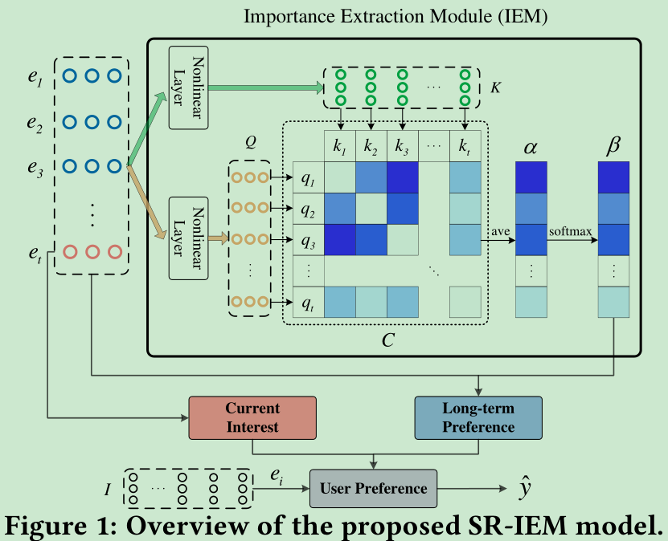

# Rethinking Item Importance in Session-Based Recommendation

[1] Pan, Zhiqiang, Fei Cai, Yanxiang Ling, and Maarten de Rijke. “Rethinking Item Importance in Session-Based Recommendation.” ArXiv:2005.04456 [Cs], May 9, 2020. http://arxiv.org/abs/2005.04456.

## 摘要

Session-based recommendation aims to predict users’ based on anonymous sessions. Previous work mainly focuses on the transition relationship between items during an ongoing session. They generally fail to pay enough atention to the importance of the items in terms of their relevance to user’s main intent. In this paper, we propose a Session-based Recommendation approach with an Importance Extraction Module, i.e., SR-IEM, that considers both a user’s long-term and recent behavior in an ongoing session. We
employ a modifed self-atention mechanism to estimate item importance in a session, which is then used to predict user’s long-term preference. Item recommendations are produced by combining the user’s long-term preference and current interest as conveyed by the last interacted item. Experiments conducted on two benchmark datasets validates that SR-IEM outperforms the start-of-the-art in terms of Recall and MRR and has a reduced computational complexity.

## 主要贡献

- 针对当前方法没有对一个 session 内的项目分配不同的重要性的方法，提出了一个助药性提取模块 IEM 来精准的获得每一个项目的重要性，然后获取用户的长期兴趣和当前兴趣

## 模型

### Importance extraction

先将每个 session 里面的 items 嵌入得到 $E = \{ e_1, e_2, ..., e_t \}$,然后通过非线性变换得到 Query Q 和 Key K:

$$ Q = sigmoid(W_q E) $$
$$ K = sigmoid(W_k E) $$

$W_q\in\mathbb{R}^{d\times l}, W_k\in\mathbb{R}^{d\times l}$ 是训练参数，主要是 l 是注意力维度

为了计算每个 item 的重要性，先计算每两个 items 的亲和力矩阵 C:

$$ C = \frac{sigmoid(QK^T)}{\sqrt{d}} $$

为了去掉自身的影响，mask 掉对角线得出每个 item 的重要性:

$$ \alpha_i = \frac{1}{t} \sum_{j=1,j\neq i}^{t}C_ij $$

$$ \beta = softmax(\alpha) $$

最后融合得到用户的长期兴趣偏好 $z_l$:

$$ z_l = \sum_{i=1}^{t} \beta _i e_i $$

最后加上最后一个 item 当作当前兴趣得到用户的最终兴趣 $z_h$:

$$ z_h = W_0[z_l;z_s=e_t] $$

## 结论

We have proposed an Importance Extraction Module for Sessionbased Recommendation (SR-IEM), that incorporates a user’s longterm preference and his current interest for item recommendation. A modifed self-atention mechanism is applied to estimate item importance in a session for modeling a user’s long-term preference, which is combined with user’s current interest indicated by the last item to produce the fnal item recommendations. Experimental results show that SR-IEM achieves considerable improvements in terms of Recall and MRR over state-of-the-art models with reduced computational costs compared to competitive neural models. As to future work, we would like to apply the Importance Extraction Module to other tasks, e.g., dialogue systems and conversation recommendation.

## 感悟

这篇文章的创新点其实也没啥，就是多了一个注意力机制，相比于 [Wu, Shu, Yuyuan Tang, Yanqiao Zhu, Liang Wang, Xing Xie, and Tieniu Tan. “Session-Based Recommendation with Graph Neural Networks.” Proceedings of the AAAI Conference on Artificial Intelligence 33 (July 17, 2019): 346–53. https://doi.org/10.1609/aaai.v33i01.3301346.
] 来说没有巨大的创新，但是效果好所以投了 SIGIR20 的短文，不过谁让人家快呢。里面很多内容都是和 SR-GNN 很相似，估计代码也是用他的改进的吧
