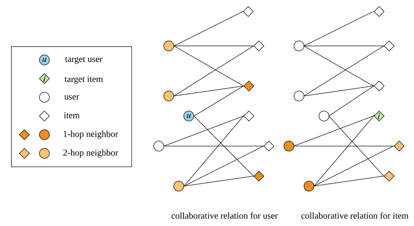
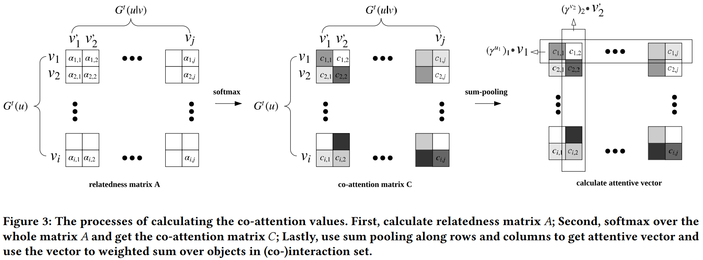
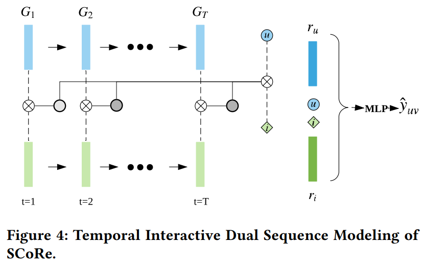

# Sequential Recommendation with Dual Side Neighbor-based Collaborative Relation Modeling

[1] Qin, Jiarui, Kan Ren, Yuchen Fang, Weinan Zhang, and Yong Yu. “Sequential Recommendation with Dual Side Neighbor-Based Collaborative Relation Modeling.” Proceedings of the 13th International Conference on Web Search and Data Mining, January 20, 2020, 465–73. https://doi.org/10.1145/3336191.3371842.

https://github.com/qinjr/SCoRe

## 摘要

Sequential recommendation task aims to predict user preference over items in the future given user historical behaviors. The order of user behaviors implies that there are resourceful sequential patterns embedded in the behavior history which reveal the underlying dynamics of user interests. Various sequential recommendation methods are proposed to model the dynamic user behaviors. How-
ever, most of the models only consider the user’s own behaviors and dynamics, while ignoring the collaborative relations among users and items, i.e., similar tastes of users or analogous properties
of items. Without modeling collaborative relations, those methods suffer from the lack of recommendation diversity and thus may have worse performance. Worse still, most existing methods only
consider the user-side sequence and ignore the temporal dynamics on the item side. To tackle the problems of the current sequential recommendation models, we propose Sequential Collaborative
Recommender (SCoRe) which effectively mines high-order collaborative information using cross-neighbor relation modeling and, additionally utilizes both user-side and item-side historical sequences
to better capture user and item dynamics. Experiments on three real-world yet large-scale datasets demonstrate the superiority of the proposed model over strong baselines.

## 主要贡献

- 以前的模型忽略了用户和项目的协同关系，推荐缺乏多样性且可能效果不好。论文考虑了高阶的协同关系，如下图，高阶邻居可以聚合更多的信息，得到更复杂的交互关系

- 以前的模型只考虑了用户侧的序列模式，没有考虑项目侧的序列动态性。有的虽考虑了项目侧的，但是将两者独立起来看待。而本论文不仅都考虑了用户侧的和项目的历史序列，还考虑了他们的关系

## 模型

### 一些定义

主要是定义了各类符号。包括交互关系，时间分片的交互关系。其实就是用户（项目）集合，和某一个项目（用户）交互的用户（项目）集合

### High-Order Collaborative Relation Mining

#### Cross Neighbor Co-Attention Network.

主要考虑是以前的 attention 只关注单个 item 并没有考虑交叉关系

$$\alpha_{i,j}^t=\sigma(w_1^t[v_i,v_j,v]+b),v_i \in G^t(u), v_j \in G^t(u|v)$$

$$c_{i,j}^t=\frac{exp(\alpha_{i,j}^t)}{\sum_{m,n}exp(\alpha_{m,n}^t)}$$

$v$是目标 item 的嵌入。同理 item 的协同注意力矩阵可以得到

#### high-order Information Aggregation.

得到注意力协同矩阵之后，考虑到高阶邻居的作用，对协同矩阵四个方向做 sum pooling 操作就可以得到四个注意力向量

$$\gamma_t^{u_1}=SP({C_{ij}^{item}}_{j=1}^S)$$
$$\gamma_t^{v_1}=SP({C_{ij}^{user}}_{i=1}^S)$$
$$\gamma_t^{u_2}=SP({C_{ij}^{user}}_{j=1}^S)$$
$$\gamma_t^{v_2}=SP({C_{ij}^{item}}_{i=1}^S)$$

$$u_t^{agg}=[{U_t^1}^T \gamma_t^{u_1},{U_t^2}^T\gamma_t^{u_2}]$$
$$v_t^{agg}=[{V_t^1}^T\gamma_t^{v_1},{V_t^2}^T\gamma_t^{v_2}]$$

### Interactive Dual Sequence Modeling

#### Temporal Dynamics Modeling.

上面得出了每个时间片的表示，然后拼接起来得到总的表示用一个 RNN 网络得到最后的表示

#### Interactive Attention Mechanism of Dual Sequence.

然后用一个注意力机制求得最后的用户侧和项目侧的表示

## 感悟

- 该模型考虑的内容还挺多的，不仅仅考虑了双向信息和高阶信息还考虑了时间信息，每次看到时间戳的论文我都感觉好数学好难懂。可能只是纸老虎吧，不过带有 temporal 的还是看起来很复杂的。仔细看看还是很简单的，，，

- 该论文的模型还是很好理解的，用了很多的 attention，然后就是聚合信息了，感觉还不错，模型应该也很高效，实验部分做的挺好的。然后思路还挺新颖的，不过这些高阶信息应该能想到的，不过这个双向的点就很不错了。

## 结论

In this paper, we propose SCoRe, a model that utilizes and aggregates high-order collaborative information using cross neighbor modeling to improve representation learning and collaborative relation mining. Furthermore, we propose an interactive attention mechanism to model the user-side and item-side sequences. In this way, dual sequence modeling captures temporal dynamics from both user and item-side and significantly facilitate final recommendation performance.

For the future work, we plan to further investigate on the time segmentation strategy of the evolving sequential interactions and its influence to the recommendation performance. We also seek to deploy our method on the real-world recommender systems.

