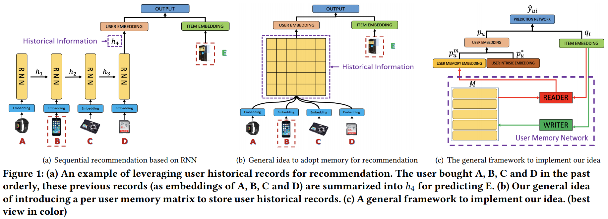
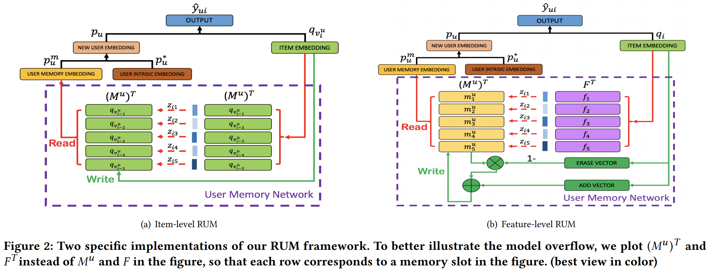

# Sequential Recommendation with User Memory Networks

[1] Chen, Xu, Hongteng Xu, Yongfeng Zhang, Jiaxi Tang, Yixin Cao, Zheng Qin, and Hongyuan Zha. “Sequential Recommendation with User Memory Networks.” In Proceedings of the Eleventh ACM International Conference on Web Search and Data Mining - WSDM ’18, 108–16. Marina Del Rey, CA, USA: ACM Press, 2018. https://doi.org/10.1145/3159652.3159668.

## 摘要

User preferences are usually dynamic in real-world recommender systems, and a user’s historical behavior records may not be equally important when predicting his/her future interests. Existing recommendation algorithms – including both shallow and deep approaches – usually embed a user’s historical records into a single latent vector/representation, which may have lost the per item- or
feature-level correlations between a user’s historical records and future interests. In this paper, we aim to express, store, and manipulate users’ historical records in a more explicit, dynamic, and effective manner. To do so, we introduce the memory mechanism to recommender systems. Specifically, we design a memory-augmented neural network (MANN) integrated with the insights of collaborative filtering for recommendation. By leveraging the external memory matrix in MANN, we store and update users’ historical records explicitly, which enhances the expressiveness of the model. We further adapt our framework to both item- and feature-level versions, and design the corresponding memory reading/writing operations according to the nature of personalized recommendation
scenarios. Compared with state-of-the-art methods that consider users’ sequential behavior for recommendation, e.g., sequential recommenders with recurrent neural networks (RNN) or Markov
chains, our method achieves significantly and consistently better performance on four real-world datasets. Moreover, experimental analyses show that our method is able to extract the intuitive patterns of how users’ future actions are affected by previous behaviors.

## 贡献

- 以前的方法是没有考虑到每个历史数据对预测的贡献，然后考虑使用了记忆网络还是内存网络来作为辅助。然后还设计了两种级别的方法来建模历史记录数据（item-level 和 feature-level）

- 还是第一次将记忆网络应用到序列推荐上的。其实主要还是类似于注意力的玩意

## 模型

### RUM: RECOMMENDATION WITH USER MEMORY NETWORKS

主要是利用一个内存矩阵来获得用户的个性化嵌入，然后在和不受影响的内在偏好的自由向量组合得到整体的嵌入

## 感想

- 一直么看这篇论文，最近也比较忙看的比较粗糙。还以为是自己提出的新idea，后来发现不是，也是借鉴别人的，不过还挺简单的。

## 结论

In this paper, we proposed to leverage external memory networks integrated with collaborative filtering for sequential recommendation. To do so, we designed the RUM sequential recommendation framework, and provided the item-level and feature-level specifications of the framework. Quantitative experimental analyses verified the effectiveness of our framework, and qualitative analyses verified the intuition behind our framework.

This is a first step towards our goal for recommendation based on explicit user memory modeling, and there is much room for further improvements. By introducing side information such as user reviews and product images, we can align the memory units in feature-level RUM with different semantics, and thus we can build a more explainable recommender system. Besides, our RUM model is a framework with the ability of flexible generalizations, as a result, we can study other types of memory network designs to
adapt our framework to different application scenarios.
