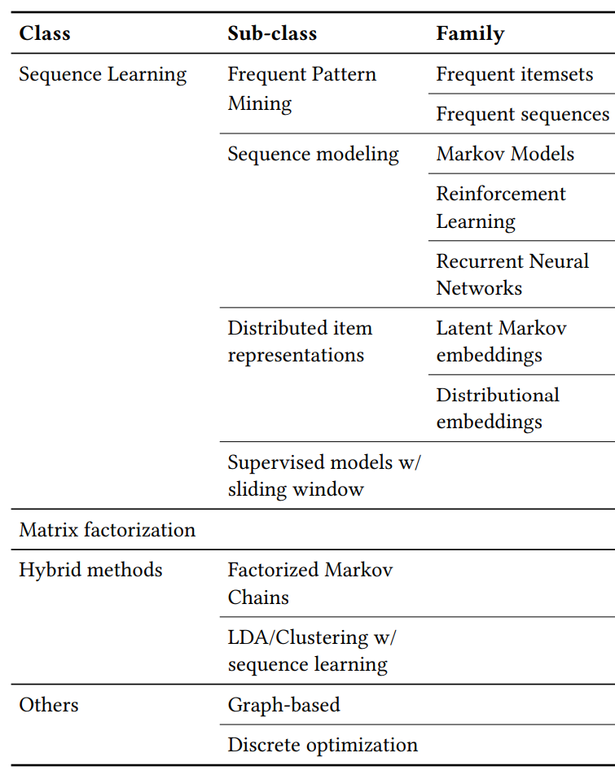
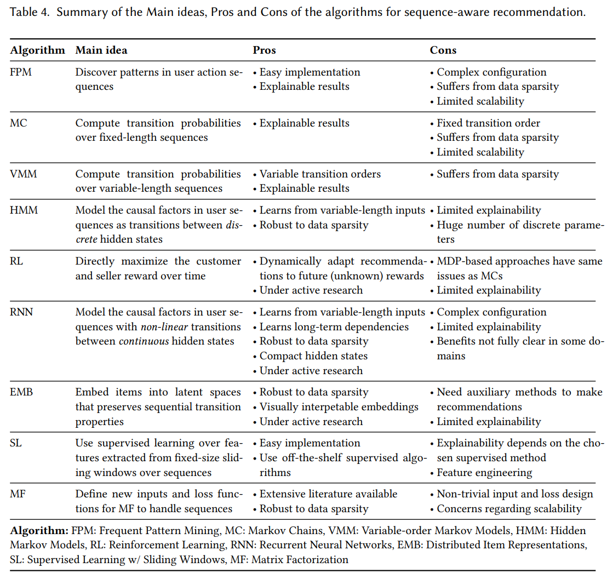

# Sequence-Aware Recommender Systems

[1] Quadrana, Massimo, Paolo Cremonesi, and Dietmar Jannach. “Sequence-Aware Recommender Systems.” ArXiv:1802.08452 [Cs], February 23, 2018. http://arxiv.org/abs/1802.08452.

# Abstract

Recommender systems are one of the most successful applications of data mining and machine learning
technology in practice. Academic research in the field is historically often based on the matrix completion problem formulation, where for each user-item-pair only one interaction (e.g., a rating) is considered. In many application domains, however, multiple user-item interactions of different types can be recorded over time. And, a number of recent works have shown that this information can be used to build richer individual user models and to discover additional behavioral patterns that can be leveraged in the recommendation process.

In this work we review existing works that consider information from such sequentially-ordered user-item interaction logs in the recommendation process. Based on this review, we propose a categorization of the corresponding recommendation tasks and goals, summarize existing algorithmic solutions, discuss methodological approaches when benchmarking what we call sequence-aware recommender systems, and outline open challenges in the area.

# Main Contributions

- 主要是介绍了序列感知推荐

# Model

## Introduction

序列感知推荐问题其实挺复杂的，我们研究的都是一些简单的基础的情况。用户的行为也是有很多类型的，以前都没有考虑过我。现有研究还是挺不统一的，者在研究中也发现了，应该针对某个具体的问题去研究。

## characterizing sequence-aware recommender systems

问题定义如图所示：

- inputs
- outputs
- abstract characterization

$$\forall c \in C, l_{c}^{'} = \mathop{\arg\min}\limits_{l\in L^*} u(c,l)$$

$c\in C$ 表示用户，$l\in L$ 表示序列

### 和其他领域的关系

- Implicit-Feedback Recommender Systems
  - 考虑为隐式反馈推荐。主要是有评分，没有考虑多次交互或者评分的时间戳顺序可能会误导推荐效果，怎么说呢，比如一般在注册的时候让你打分，即用户评分的时间点和消费交互的时间点不匹配
- Context-Aware and Time-Aware Recommender Systems
  - 在会话推荐中，用户的短期兴趣特备是最后一个或几个将是关键的上下文信息；时间感知推荐系统（TARS）通常考虑与过去用户操作相关的时间信息，以相应地调整推荐。顺序感知推荐器的重点通常不是过去用户交互的确切时间点，而是事件的顺序。
- 其他相关领域
  - 对话建议和兴趣转移

## A categorization of Sequence-Aware recommendation tasks

### Context Adaptation

不仅考虑了用户的一般兴趣，还考虑了用户的当前处境以及短期的兴趣。典型的可观测到的上下文因素包括：地理因素，当前的天气，今天的时间等，这些称为 representational context；还有伊西俄不能直接观测的比如用户当前购物的设置或者用户的心情等，称为 interactional context。面临一些新的或者匿名用户的问题，还有冷启动问题

Categorization based on importance of long- and short-term interactions.

- Last-N interactions based recommendation：仅仅是最后 N 个动作被考虑，主要关注于基于位置的推荐，比如 POI check-in
- Session-based recommendation：主要是序列较短，只在一个 session 中知道用户的动作，比如新闻推荐，电子商务，视频等
- Session-aware recommendation：这个考虑了短期和长期，用户的特征都知道，可以看成是我们的序列推荐，比如 app 推荐

### Trend Detection

对于给定的序列进行探索，找到一些趋势发现

- Community trends. 一些流行的 items 在不同的 domains 会随着时间的变化而变化
- Individual trends. 某个人对于特定的 items 也会发生变化。兴趣动态变化，比如别人的影响， exceptional events 或者发现了新的感兴趣的

### Repeated Recommendation

有时候推荐用户交互过的商品也很很有意义

- Identifying repeated user behavior patterns：利用过去重复的交互日志。打印机墨水，app 建议提升用户的使用体验
- Repeated recommendations as reminders：推荐以网喜欢的

可能还会需要进行一定的推理解释，为什么要推荐重复的项目；还要考虑一些推荐的时候，多久推荐等等

### Consideration of Order Constraints and Sequential Patterns

顺序很重要的，在 order 中需要考虑下面两个因素：

- 在严格的或者弱的序列中，有一些外部的领域知识需要考虑，比如选课需要考虑一门完成后才可以有下一门；电影看完一集推荐下一集但是也不是很严格的顺序
- 从用户的行为标识序列消费模式，比如下一个导航动作下一个续集等等

有一些特定的应用需要考虑：

- Importance of the order of the recommendations. 顺序可能相关也可能不相关
- Importance of the exact order of the past events. 过去动作的顺序也可能与推荐任务不相关
- Existence of implicit order constraints. 可能依赖于特定领域知识或者产品类别

## Algorithms

### Sequence learning
- Frequent Pattern Mining（FPM）：主要是学习关联规则挖掘，项目共现模式等，离线过程中操作。有时候还会有一些个性化的规则来增加精度，类似于注意力？主要的是难点是设置最小支持的值，太大太小都不好。此外如何选择哪种算法也是一个需要考虑的地方，具体问题具体分析吧
- Sequence modeling：马尔科夫链模型，强化学习，RNN。数据稀疏问题，计算复杂度问题，还有流行商品的偏置。
- Distributed Item Representations：密集、低维度的item表示。
- Supervised Learning with Sliding Windows：第一个，特征工程片段需要领域知识；windows size大小导致结果敏感；花费太久；target变量的不平衡的数据分布

### Sequence-aware Matrix Factorization

主要是从时间戳的序列中设计算法考虑矩阵分解。但是不能实时更新哈

### Hybrid methods

如何选择不同的模型及组合，考虑不同的权重

### Others methods

- 基于图的方法
- Discrete optimization methods

### Summary and Pros and Cons of Selected Approaches

## Evaluation of Sequence-Aware Recommender Systems

### Common Evaluation Approaches for Recommender Systems

- 实验室离线环境测试，一些评价指标还有多样性等
- 真实环境，在线测试 AB tests

### Offline Evaluation of Sequence-aware Recommenders

Evaluation Methodologie：

- data partitioning：event-level，session-level
- definition of the target Sequence-agnostic prediction，Given-N next-item prediction，Given-N next-item prediction with look-ahead，
- cross-validation.

Evaluation Metrics：

分类或者排序

有些排序指标也不一定很好的反映了效果，比如推荐歌单的时候，只给了排序但是没有考虑过渡，下一个到底选择哪个？需要一些NLP领域的评价指标哈哈哈

DataSets.

### On User Studies and Field Tests

有时候也需要人为的进行评价，让人工取判断推荐的好坏，但是局限性较大；其次离线测试也要继续找到好的方法，不然与实际相差较大

## Summary and Future Directions

Intent detection：查询兴趣理解，需要额外的领域知识。在错误的推荐给一些反馈

Combining short-term and longer-term profiles.

Leveraging additional data and general trends.

Toward standardized and more comprehensive evaluations.

# My Thoughts

这篇论文从基于顺序的角度来做了一篇综述，感觉跟我一起遇到的序列推荐都不太一样。更多的是关注于一个笼统的概念吧，感觉跟其他的 POI 或者其他的附加了特定的额外信息的关联较大，他们只是类似于序列结构。不过也有很多启发，现在确实需要考虑的问题有很多，要着重于一个特定的问题去考虑会变得更好一些，不然不知道自己的重点是什么。

@Author: Forrest Stone

@Email: ysbrilliant@163.com

@Github: https://github.com/Forrest-Stone

@Date: 2021-03-04 Thursday 09:38:37

