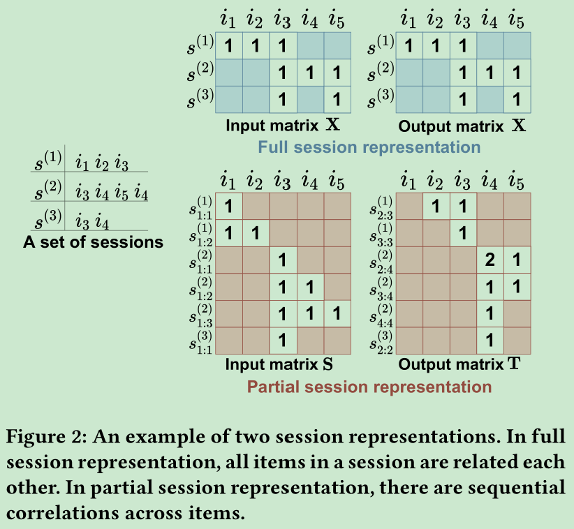

# Session-aware Linear Item-Item Models for Session-based Recommendation

[1] Choi, M., Lee, J., Shim, H., & Lee, J. (2021). Session-aware Linear Item-Item Models for Session-based Recommendation. arXiv preprint arXiv:2103.16104.

# Abstract

Session-based recommendation aims at predicting the next item given a sequence of previous items consumed in the session, e.g., one-commerce or multimedia streaming services. Specifically, session
data exhibits some unique characteristics, i.e., session consistency and sequential dep endency over items within the session, rep eated item consump tion, and session timeliness. In this paper, we propose
simple-yet-effective linear models for considering the holistic aspects of the sessions. The comprehensive nature of our models helps improve the quality of session-based recommendation. More
importantly, it provides a generalized framework for reflecting different perspectives of session data. Furthermore, since our models can be solved by closed-form solutions, they are highly scalable. Experimental results demonstrate that the proposed linear models show competitive or state-of-the-art performance in various metrics on several real-world datasets.

# Main Contributions

- 这篇论文将会话推荐的几个属性都考虑进来，并且融合在一起。
- 这篇线性的模型用一个闭环解决方案更加具有扩展性。
- 在不同的数据集上不同的评价指标上做了对比试验。

# Model

介绍了会话推荐的四个特点：

- Session consistency：会话一致性。会话内的items都是高度相关的，反映了用户的特定相关的兴趣。比如，用户听的歌单通常有一个主题，要么是相似的心情，同样类型的或者同一个专辑等等；
- Sequential dependency：序列依赖性。有一些items往往被交互在一个特定的序列下。比如电视的节目，集数都是顺序被观看的。所以在这样的情况下，当前会话的最后一个经常具有很重要的信号来预测下一个。
- Repeated item consumption：重复的项目消费。在一个会话中用户可能重复消费多次同一个item。比如一个用户重复听喜欢的歌曲很多次，或者用户选一个item跟其他的比较也会多次点击。
- Timeliness of sessions： 会话的即时性？一个会话反映用户在某个时刻的兴趣，一组这样的会话反映了用户最近的兴趣变化趋势。例如，许多用户倾向于更频繁地观看新发行的音乐视频。因此，与过去的会话相比，最近的会话可能是预测用户当前兴趣的更好指标。换句话看也就是说要关注一下会话间的关系？并且最后的会话占比重要性越大？

RNN 或者 attention 更关注于 sequential dependency，GNN 除了上面的 SD 还考虑了 session consistency。一些 attention 如 repeatnet 关注于重复的，即时性则是权重值加和方法。

介绍了会话的两种表示：

- Full session representation：其实也就是对所有的 session 里面的 items 进行 multi-hot 编码？输入是 整个session，预测的输出还是 整个session。
- Partial session representation：将 session 拆开来了，输入的是 session的一部分（前面的），输出是后面余下的。

提出了两种模型及融合起来：
- Session-aware Linear Item Similarity Model (SLIS).
- Session-aware Linear Item Transition Model (SLIT).
- Unifying Two Linear Models.

反正是基于线性模型的改良，要么加参数加约束。主要还是证明，实验做得还挺多的

# My Thoughts

- 当时看到这篇论文题目是使用的线性模型（还以为是我上次投稿的那篇一样的想法），没想到竟然就是线性模型的改良，原来还有人专门的研究这个方法，真的是自己孤陋寡闻，知道的太少了。
- 文章中提到的 session 的四个特点，总结的还挺好的。这里也才明白了序列推荐和绘画推荐的不同。现在大家总是把他们看成一样的，虽说没错吧，但还是不够严谨。虽然序列推荐也都有上面的特点，如果人为加入 session 的概念的话，但是序列推荐更关注的是序列依赖，长时间的序列长度吧。虽说方法可以通用
- 文章的实验是真的充分，分析了不同数据集的适用条件和情形。关键是还有证明

# Conclusion

This paper presents Session-aware Linear Item Similarity/Transition model (SLIST) to tackle session-based recommendation. To complement the drawback of existing models, we unify two linear models
with different perspectives to fully capture various characteristics of sessions. To the best of our knowledge, our model is the first work that adopts the linear item-item models to fully utilize various characteristics of sessions. Owing to its closed-form solution, SLIST is also highly scalable. Through comprehensive evaluation, we demonstrate that SLIST achieves comparable or state-of-the-art accuracy over existing DNN-based and neighborhood-based models on multiple benchmark datasets.

@Author: Forrest Stone

@Email: ysbrilliant@163.com

@Github: https://github.com/Forrest-Stone

@Date: 2021-04-11 Sunday 15:45:25

