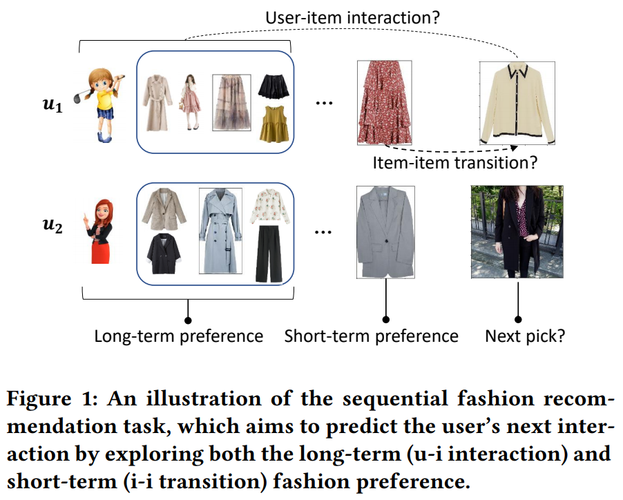
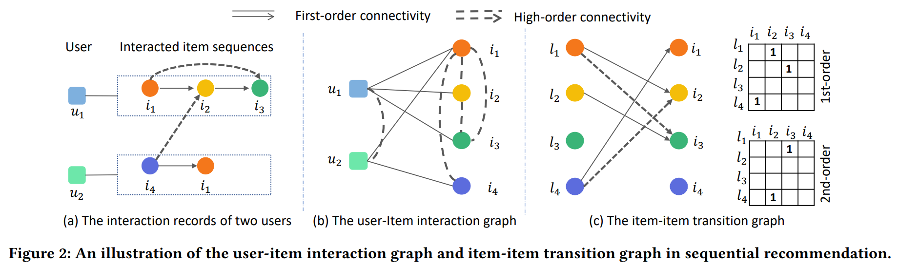
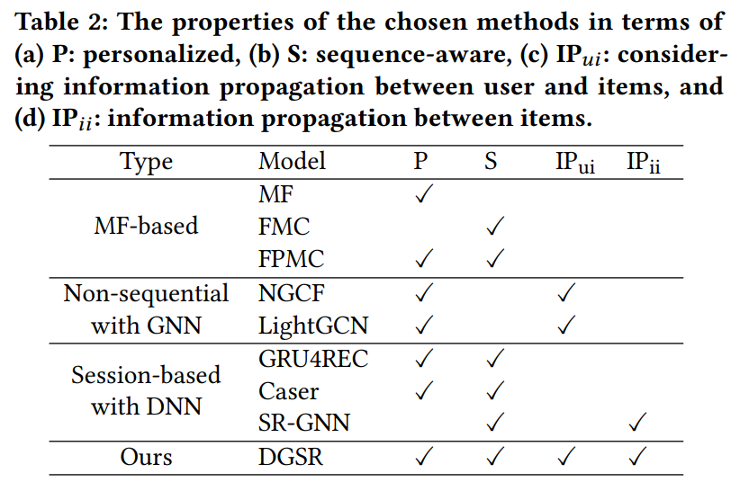

# Leveraging Two Types of Global Graph for Sequential Fashion Recommendation

[1] Ding, Yujuan, Yunshan Ma, Wai Keung Wong, and Tat-Seng Chua. “Leveraging Two Types of Global Graph for Sequential Fashion Recommendation.” ArXiv:2105.07585 [Cs], May 17, 2021. http://arxiv.org/abs/2105.07585.

[2] He, Xiangnan, Kuan Deng, Xiang Wang, Yan Li, Yongdong Zhang, and Meng Wang. “LightGCN: Simplifying and Powering Graph Convolution Network for Recommendation.” ArXiv:2002.02126 [Cs], February 6, 2020. http://arxiv.org/abs/2002.02126.

  https://github.com/kuandeng/LightGCN
  https://github.com/gusye1234/LightGCN-PyTorch

# Abstract

Sequential fashion recommendation is of great significance in online fashion shopping, which accounts for an increasing portion of either fashion retailing or online e-commerce. The key to building an effective sequential fashion recommendation model lies in capturing two types of patterns: the personal fashion preference of users and the transitional relationships between adjacent items. The two types of patterns are usually related to user-item interaction and item-item transition modeling respectively. However, due to the large sets of users and items as well as the sparse historical interactions, it is difficult to train an effective and efficient sequential fashion recommendation model. To tackle these problems, we propose to leverage two types of global graph, i.e., the user-item interaction graph and item-item transition graph, to obtain enhanced user and item representations by incorporating higher-order connections over the graphs. In addition, we adopt the graph kernel of LightGCN [9] for the information propagation in both graphs and propose a new design for item-item transition graph. Extensive experiments on two established sequential fashion recommendation datasets validate the effectiveness and efficiency of our approach.

# Main Contributions

- 利用了两种类型的图（u-i, i-i）来缓解数据稀疏的问题
- 提出了一种新的图设计方案针对两个图都采用了 LightGCN 的图内核

# Introduction

时装序列推荐主要的建模对象是：一个是用户的个性化时装兴趣，一个是项目转化模式。不仅要预测 u-i 交互，与长期记忆相关；也要预测 i-i 交互。虽然论文提到的是 i-i 的短期交互，其实也考虑的 i-i 长期的？

建模这两个面临的问题：
- 交互数据非常稀疏
- 现在建立的 i-i 图要么不合适，要么太复杂的 graph kernels

# Model

## Basic Sequential Recommendation Framework

$$y_{u,l,i}=e_u^Ue_i^{IU}+e_l^L+e_i^{IL}$$

Note that although all the $E_i^{IU}$, $E_l^L$ and $E_i^{IL}$ are for item embedding lookup, they are individually initialized and optimized for different purposes. 终于见到有人说这个的了，难道是常识？input items， output items 这些外人看论文搞不懂的概念。第一块其实就是矩阵分解，协同过滤了，user 和 target items 的内积反映出来的是长期兴趣；第二块就是类似于项目共线的木块了，反映的是用户的短期兴趣

## User-Item Interaction Graph

- Graph Construction：建图跟 NGCF 和 LightGCN 一样建成二部图
- Graph Convolution：也是直接采用 LightGCN 的实现

$$

\left\{\begin{matrix}
e_u^{(k)}= \sum_{i \in \mathcal{N}_u} \frac{1}{\sqrt{|\mathcal{N}_u|}\sqrt{|\mathcal{N}_i|}}e_i^{(k-1)} \\

e_i^{(k)}= \sum_{i \in \mathcal{N}_i} \frac{1}{\sqrt{|\mathcal{N}_i|}\sqrt{|\mathcal{N}_u|}}e_u^{(k-1)} \\

\end{matrix}\right.

$$

这里的 $e_i$ 就是 $e_i^{IU}$ 的简写，对称的正则项按照 GCN 的处理

- Layer Combination

$$e_u^{U*}=\sum_{k=0}^{K}e_u^k, e_i^{IU*}=\sum_{k=0}^{K}e_i^k$$

## Item-Item Transition Graph

- Graph Construction：建图一样建成二部图，不同的是 anchor（input items）和 target items（output items）建成图。不过还有一阶图和高阶图，然后高阶图就可以捕获 cross-session i-i transitions。
- Graph Convolution：也是直接采用 LightGCN 的实现

$$

\left\{\begin{matrix}
e_l^{(k)}= \sum_{i \in \mathcal{N}_l} \frac{1}{\sqrt{|\mathcal{N}_l|}\sqrt{|\mathcal{N}_i|}}e_i^{(k-1)} \\

e_i^{(k)}= \sum_{i \in \mathcal{N}_i} \frac{1}{\sqrt{|\mathcal{N}_i|}\sqrt{|\mathcal{N}_u|}}e_l^{(k-1)} \\

\end{matrix}\right.

$$

这里的 $e_i$ 和 $e_l$ 就是 $e_i^{IL}$ 和 $e_l^L$ 的简写，对称的正则项按照 GCN 的处理

- Layer Combination

$$e_l^{L*}=\sum_{k=0}^{K}e_l^k, e_i^{IL*}=\sum_{k=0}^{K}e_i^k$$

## Prediction and Optimization

$$y_{u,l,i}^*=e_u^{U*}e_i^{IU*}+e_l^L+e_i^{IL*}$$

# My Thoughts

- 第一次知道还有专门的时装推荐的论文，哈哈哈孤陋寡闻了。然后总感觉四不像，既不想传统论文，又不像序列推荐。不过论文的方法确实很容易想到，而且跟 LightGCN 的论文也太。。。如果是专门研究序列推荐的话不会这样干，应该是从通用推荐转移到这上面的。不过抛弃了以前的小序列分割的短期兴趣不知道会不会有影响，，，
- 论文写作很好，最后一张图说明了一切

# Conclusion

We worked on the problem of sequential fashion recommendation in this paper, aiming to model both the interaction between user-item and the transition between items. To tackle the specific challenges of data sparsity and make the model simple to learn, we proposed a DGSR model. DGSR leverages two types of graphs, namely the user-item interaction graph and the item-item transition graph, to better model the CF signals and the item transitional patterns and enhance the user and item embeddings. Extensive experiments on two datasets demonstrated the effectiveness of the proposed method and all technical contributions. In future work, we shall improve this work in the following directions. First, we plan to incorporate additional information besides the implicit feedback to enrich the graph building. By considering more content information such as attributes or visual features, the connectivity between the user and items or item and items can be richer and thus further help to alleviate the interaction sparsity issue. Second, more fashion domain knowledge can be introduced in the model to further enhance the user and item representation learning to achieve better recommendation performance.

@Author: Forrest Stone
@Email: ysbrilliant@163.com
@Github: https://github.com/Forrest-Stone
@Date: 2021-05-31 Monday 19:39:57
