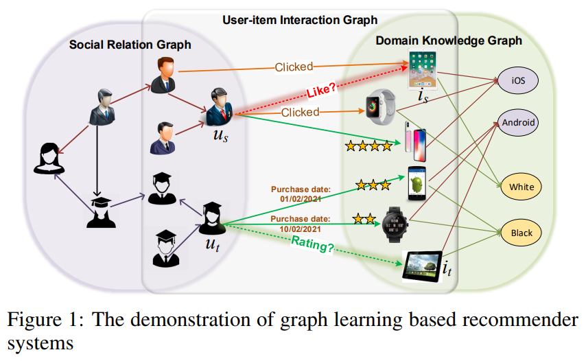
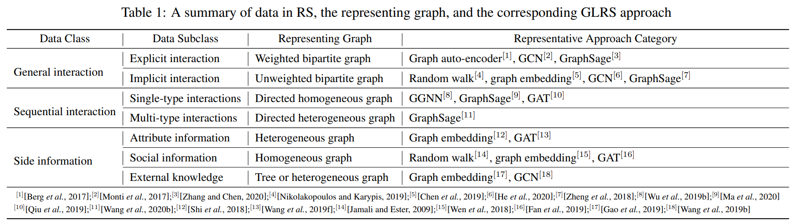
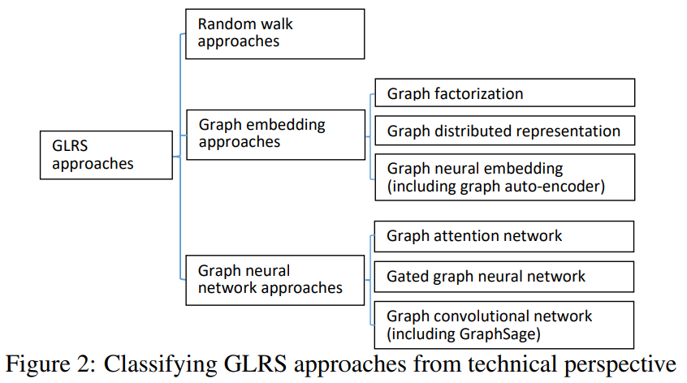
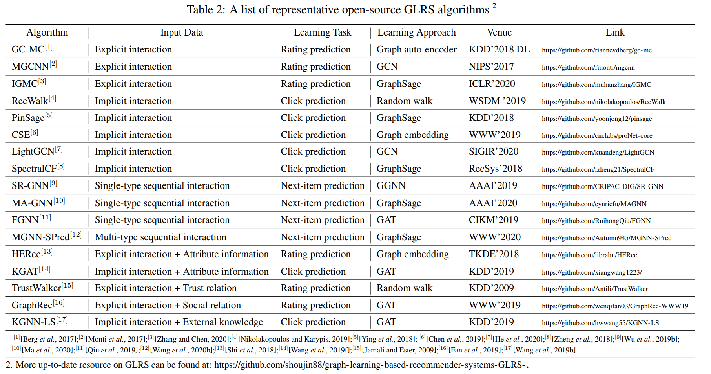
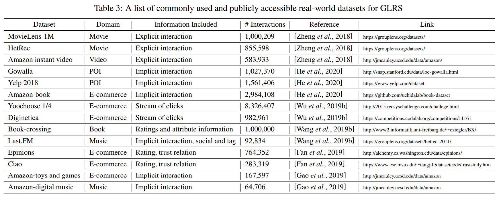

# Graph Learning based Recommender Systems: A Review

[1] Wang, Shoujin, Liang Hu, Yan Wang, Xiangnan He, Quan Z Sheng, Mehmet Orgun, Longbing Cao, Francesco Ricci, and Philip S Yu. “Graph Learning Based Recommender Systems: A Review,” n.d., 10.

# Abstract

Recent years have witnessed the fast development of the emerging topic of Graph Learning based Recommender Systems (GLRS). GLRS employ advanced graph learning approaches to model users’ preferences and intentions as well as items’ characteristics for recommendations. Differently from other RS approaches, including content based filtering and collaborative filtering, GLRS are built on graphs where the important objects, e.g., users, items, and attributes, are either explicitly or implicitly connected. With the rapid development of graph learning techniques, exploring and exploiting homogeneous or heterogeneous relations in graphs are a promising direction for building more effective RS. In this paper, we provide a systematic review of GLRS, by discussing how they extract important knowledge from graph-based representations to improve the accuracy, reliability and explainability of the recommendations. First, we characterize and formalize GLRS, and then summarize and categorize the key challenges and main progress in this novel research area.

# Main Contributions

- 提出挑战并且从数据的视角分许
- 系统总结了现有的方法
- 提出了未来的展望方向

# Introduction

Motivation: why graph learning for RS?

- Most of the data in RS has essentially a graph structure.

- Graph learning has the capability to learn complex relations.

# Data Characteristics and Challenges

- general interaction data
- sequential interaction data
- side information data

## GLRS Built on General Interaction Data

交互数据：显式数据和隐式数据。可看成是矩阵完成任务，换成图的话就是 u-i 二部图，可以变成带权二部图和无权二部图。

主要的挑战是：如何有效地聚合信息，简直是废话

## GLRS Built on Sequential Interaction Data

单一类型地交互数据（仅仅是交互）和多类型的交互数据（观察，点击，购买等）。建成有向图，对于多类型地话可能包含环。

主要挑战是：如何最小化损失信息损失构图，并且如何聚集信息甚至是在复杂的转换上

## GLRS Incorporating Side Information Data

缓解数据稀疏地问题

### GLRS Incorporating Attribute Information

用户属性信息和项目属性信息。构成异质图，结点类型有多种，很复杂。

主要挑战是：如何聚集有用的属性信息提升效果

### GLRS Incorporating Social Information

- Social recommendation：一个是 u-i 二部图，一个是社交关系图。几阶邻居需要考虑，如何正确地建模邻居的影响等
- Friend recommendation：如何正确的建模用户间的多种影响

### GLRS Incorporating External Knowledge

知识图谱异构图等

- GLRS Incorporating External Knowledge：分层的树状结构，如何从这个分层树状图提取多少层的偏好聚合信息
- GLRS incorporating common knowledge：如何从不同类型的连接聚合不同类型的信息

# Graph Embedding Approach

## Random Walk Approach

通常，基于随机游走的 RS 首先让随机游走者以每个步骤的预定义转移概率在给定的图上行走，以便对用户 和或 项目之间的隐式偏好或交互传播进行建模，然后依据在某些步骤后 walker 降落在节点上的概率，对这些候选节点进行排名以供推荐。基于随机游走的 RS 特别适用于捕获图上各种类型节点（例如，用户和项目）之间的复杂、高阶和间接关系，因此可以解决 GLRS 的重要挑战，尤其是那些建立在异构图上的挑战。

缺点：
- 需要为每个用户在每一步的所有候选项目上生成排名分数，导致效率低下；
- 与大多数基于学习的范式不同，它们是基于启发式的，缺乏优化推荐目标的模型参数。

## Graph Embedding Approach

- Graph Factorization based RS (GFRS). GFRS 基于图上的元路径分解节点间交换矩阵以获得每个节点（例如，用户或项目）的嵌入，然后将其用作后续推荐任务的输入。
- Graph Distributed Representation based RS (GDRRS). 与 GFRS 不同，GDRRS 通常遵循 Skip-gram 模型以学习图中每个用户或项目的分布式表示。他们将有关用户或项目及其相邻关系的信息编码为一个低维向量，然后用于后续的推荐步骤。 具体来说，GDRRS 通常首先使用随机游走来生成在一个元路径中共同出现的一系列节点，然后使用 skip-gram 或类似模型来生成用于推荐的节点表示。通过利用其强大的能力对图中的节点间连接进行编码，GDRRS 被广泛应用于同构图和异构图，以捕获由 RS 管理的对象之间的关系。
- Graph Neural Embedding based RS (GNERS).GNERS 利用多层感知器、自动编码器等神经网络来学习用户或项目嵌入。 神经嵌入模型易于与其他下游神经推荐模型集成。GNERS 已广泛应用于各种图，如属性图、与知识图谱相结合的交互。

## Graph Neural Network Approach

- Graph ATtention network based RS (GATRS). 图注意力网络 (GAT) 将注意力机制引入 GNN，以有区别地学习关于给定的用户或者项目的其他用户或项目的不同相关性和影响程度。应用在社交网络，项目会画图以及知识图上面。
- Gated Graph Neural Network based RS (GGNNRS). 门控图神经网络 (GGNN) 将门控循环单元 (GRU) 引入 GNN，通过迭代吸收图中其他节点的影响来学习优化的节点表示，从而全面捕捉节点间关系。应用在时装推荐。
- Graph Convolutional Network based RS (GCNRS). 图卷积网络 (GCN) 通常通过利用图结构和节点特征信息来学习如何从局部图邻居节点迭代聚合特征信息。由于强大的特征提取和学习能力，特别是它们在结合图结构和节点内容信息方面的优势，GCN 被广泛应用于 RS 中的各种图。社交推荐，知识图谱等。

# GLRS Algorithms and Datasets

# Open Research Directions

- Self-evolutionary RS with dynamic-graph learning：在现实世界的 RS 中，用户、物品以及它们之间的交互会随着时间的推移而不断发展。这产生了具有动态拓扑结构的图，这种动态可能对用户和需求建模产生直接影响，甚至会导致推荐结果随时间发生明显变化。
- Explainable RS with causal graph learning：因果推理是一种用于发现对象或动作之间因果关系的主要技术。尽管在可解释的 RS 方面取得了一些进展，但我们离完全理解用户选择行为背后的原因和意图还很远，这是做出可靠和可解释的推荐的关键步骤。
- Cross-domain RS with multiplex graph learning：实际上，推荐的数据和交互可以来自多个领域，包括各种来源、系统和模式。这些是相互关联的，必须共同为建议做出贡献。 因此，跨域 RS 中的交互可以用多路复用网络来表示，其中节点可能会或可能不会与其他层中的其他节点互连。
- High-efficiency online RS with large-scale graph learning：实际 RS 中一个不可避免的问题是数据的规模，这往往很大，导致在时间和空间方面的成本都很高。

# My Thoughts

- 本来以为写作思路怎么跟 ijcai19 的那篇关于序列推荐的文章那么像，然后发现是同一批作者。
- 可能页数比较少，对图方法的整理还可以比较全面，有很多以前都没有关注的方法。
# Conclusion

As one of the most important applications of Artificial Intelligence (AI), Recommender Systems (RS) can be found nearly at every corner of our daily lives. Graph Learning (GL), as one of the most promising AI techniques, has shown a great capability to learn the complex relations among the various objects managed by an RS. This has launched a totally new RS paradigm: Graph Learning based Recommender Systems (GLRS), which is of great potential to be the next-generation of RS. It is our hope that this review has provided a comprehensive and self contained overview of the recent progress, challenges as well as future research directions in GLRS to both the academia and industry.

@Author: Forrest Stone
@Email: ysbrilliant@163.com
@Github: https://github.com/Forrest-Stone
@Date: 2021-06-01 Tuesday 20:06:45
