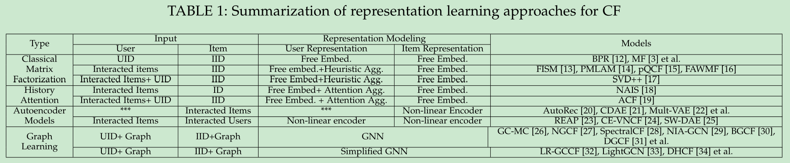
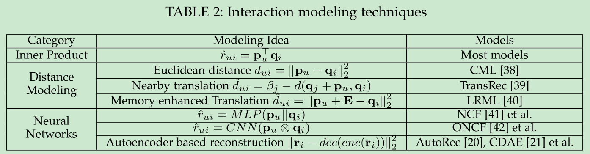
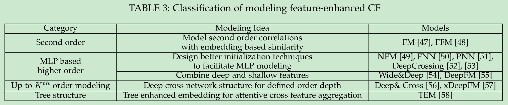
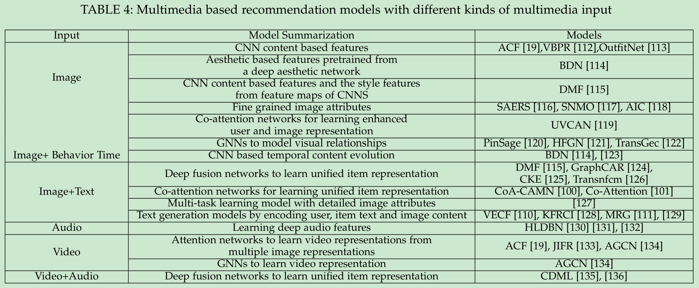
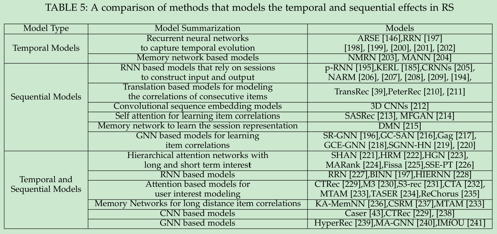

# A Survey on Neural Recommendation: From Collaborative Filtering to Content and Context Enriched Recommendation

[1] Wu, Le, Xiangnan He, Xiang Wang, Kun Zhang, and Meng Wang. “A Survey on Neural Recommendation: From Collaborative Filtering to Content and Context Enriched Recommendation.” ArXiv:2104.13030 [Cs], April 27, 2021. http://arxiv.org/abs/2104.13030.

# Abstract

Influenced by the stunning success of deep learning in computer vision and language understanding, research in recommendation has shifted to inventing new recommender models based on neural networks. In recent years, we have witnessed progress in developing neural recommender models, which generalize and surpass traditional recommender models owing to the strong representation power of neural networks. In this survey paper, we conduct a systematic review on neural recommender models, aiming to summarize the field to facilitate future progress. Distinct from existing surveys that categorize existing methods based on the taxonomy of deep learning techniques, we instead summarize the field from the perspective of recommendation modeling, which could be more instructive to researchers and practitioners working on recommender systems. Specifically, we divide the work into three types based on the data they used for recommendation modeling: 1) collaborative filtering models, which leverage the key source of user-item interaction data; 2) content enriched models, which additionally utilize the side information associated with users and items, like user profile and item knowledge graph; and 3) context enriched models, which account for the contextual information associated with an interaction, such as time, location, and the past interactions. After reviewing representative works for each type, we finally discuss some promising directions in this field, including benchmarking recommender systems, graph reasoning based recommendation models, and explainable and fair recommendations for social good.

# Introduction

- Differences with Existing Surveys.
- Scope and Organization of This Survey.

- collaborative filtering models：用 ID 和交互历史去建模
- content-enriched models：CF 加上附加信息，比如用户的资料，社交网络，知识图谱和项目的属性等
- context-aware models：加上上下文数据，比如时间，地理位置，以及历史序列等

# COLLABORATIVE FILTERING MODELS

## Representation Learning

用户和项目的交互行为是非常稀疏的

- History Behavior Attention Aggregation Models：主要是为历史的行为分配权重，包括用户和项目之间或者项目项目之间
- Autoencoder based Representation Learning：编码器和解码器
- Graph based Representation Learning：利用图去捕获聚集的依赖行为

## Interaction Modeling

向前的内积的方法有两个缺点：
- 违反了三角不等式。也就是说，内积仅鼓励用户和历史项目的表示相似，但缺乏对用户-用户和项目-项目关系之间相似性传播的保证。
- 其次，它对线性交互进行建模，可能无法捕捉用户和物品之间的复杂关系。

- Distance based Metrics
- Neural network based Metrics

# CONTENT-ENRICHED RECOMMENDATION

## Modeling General Feature Interactions

FM 建模了高阶交互，但是对噪音特征处理不是很好

- MLP based High Order Modeling.
- Cross Network for K-th Order Modeling.
- Tree Enhanced Modeling.

## Modeling Textual Content

- Autoencoder based Models.
- Leveraging Word Embeddings for Recommendation.
- Attention Models.
- Text Explanations for Recommendation.

## Modeling Multimedia Content

### Modeling Image Information

- Image Content based Models.
- Hybrid Recommendation Models.

### Video Recommendation

## Modeling Social Network

- Social Correlation Enhancement and Regularization.
- GNN Based Approaches.

## Modeling Knowledge Graph

- Path Based Methods. 需要领域知识去构建路径，耗时耗力；参数多，效率低下
- Regularization Based Methods
- GNN Based Methods.

## TEMPORAL/SEQUENTIAL MODELS

- Temporal based recommendation
- Session based recommendation
- Temporal and session based recommendation

# My Thoughts

- 清晰明了，简单概括可见功底深厚
- 不过覆盖面不是很广，因为篇幅原因？

# Conclusion

We hope this survey will give researchers a comprehensive picture of state-of-the-art models for neural network based recommendation. The foregoing various neural network based recommendation models have demonstrated the superior recommendation quality. Meanwhile, we realize that current solutions for recommendation are far from satisfactory, and there are still much opportunities in this area. We discuss some possible directions that deserve more research efforts from the basics, modeling and applications perspectives.

- Basics: Recommendation Benchmarking.
- Models: Graph Reasoning based Recommendation.
- HCI: Conversational Recommendation.

@Author: Forrest Stone
@Email: ysbrilliant@163.com
@Github: https://github.com/Forrest-Stone
@Date: 2021-07-22 Thursday 16:11:21
