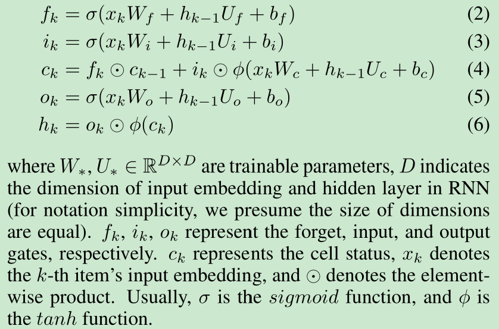
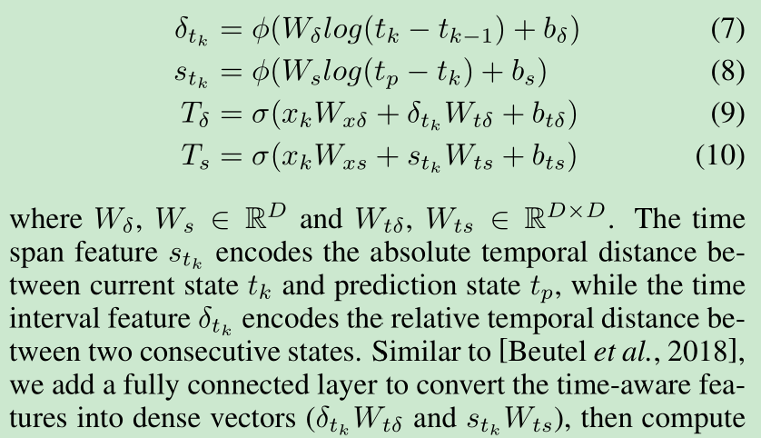
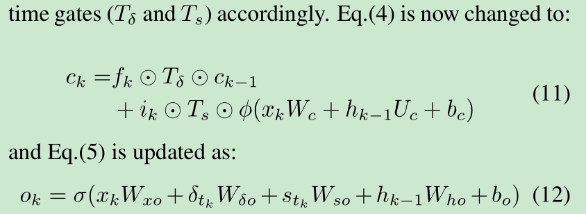
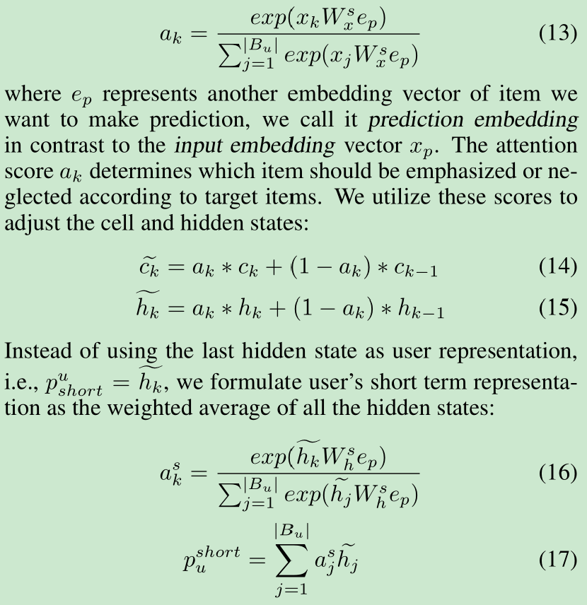
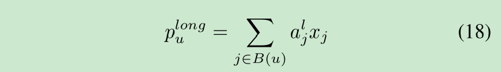
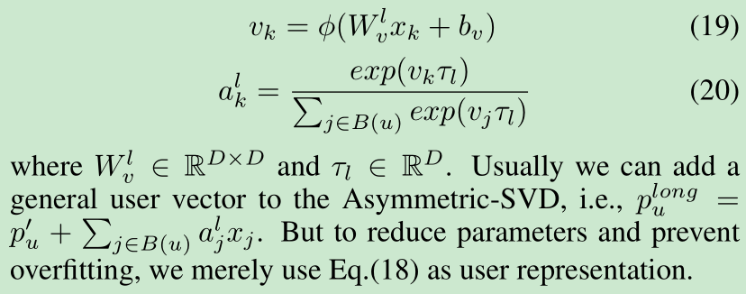
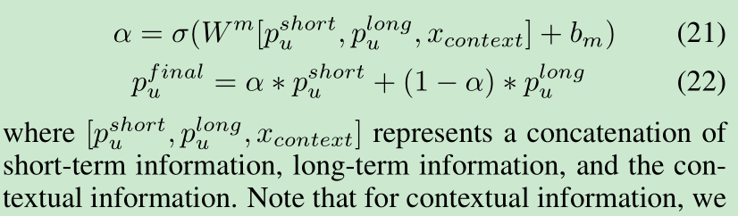

# Adaptive User Modeling with Long and Short-Term Preferences for Personalized Recommendation

[1] Yu, Zeping, Jianxun Lian, Ahmad Mahmoody, Gongshen Liu, and Xing Xie. “Adaptive User Modeling with Long and Short-Term Preferences for Personalized Recommendation.” In Proceedings of the Twenty-Eighth International Joint Conference on Artificial Intelligence, 4213–19. Macao, China: International Joint Conferences on Artificial Intelligence Organization, 2019. https://doi.org/10.24963/ijcai.2019/585.

 https://github.com/zepingyu0512/sli_rec

# Abstract

User modeling is an essential task for online recommender systems. In the past few decades, collaborative filtering (CF) techniques have been well studied to model users’ long term preferences. Recently, recurrent neural networks (RNN) have shown a great advantage in modeling users’ short term preference. A natural way to improve the recommender is to combine both long-term and short-term modeling. Previous approaches neglect the importance of dynamically integrating these two user modeling paradigms. Moreover, users’ behaviors are much more complex than sentences in language modeling or images in visual computing, thus the classical structures of RNN such as Long Short-Term Memory (LSTM) need to be upgraded for better user modeling. In this paper, we improve the traditional RNN structure by proposing a time-aware controller and a content-aware controller, so that contextual information can be well considered to control the state transition. We further propose an attention-based framework to combine users’ long-term and short-term preferences, thus users’ representation can be generated adaptively according to the specific context. We conduct extensive experiments on both public and industrial datasets. The results demonstrate that our proposed method outperforms several state-of-art methods consistently.

# Motivation

- 第一个是结合用户的短期兴趣和长期兴趣以及如何结合，以前的方法忽略了动态集成这两个部分
- 直接将 RNN 用进来不太好，因为用户的行为比句子啊单词等更复杂，所以需要特殊考虑

# Main Contributions

- time-aware controller：利用经典 LSTM 中的门控机制，它能够根据时间上下文控制信息应该在多大程度上转换到未来阶段。
- content-aware controller：采用注意力机制来动态过滤用户行为序列中不相关的动作。
- 通过与时间感知和内容感知机制的联合训练，TC-SeqRec 对于短期用户建模更加有效和稳健。

# Introduction

两种推荐：

- 通用推荐：主要是学习用户的长期兴趣，认为是静态的或者是的随着时间变化很慢很慢的.然而，用户行为的意图具有内在的可变性，在一定时间段内会受到兴趣演变、即时需求和全球主流时尚等多种因素的影响。
- 序列推荐：主要是捕获用户的短期兴趣，关注于 item-to-item 的序列关系。

传统的（vanilla）RNN 假设序列中连续项目之间的分布模式是均匀的。例如，在 NLP 应用中，一个句子中任意两个连续单词之间的间隔可以被认为是相等的，并且整个句子被组织起来以表达相同的（语义）主题。但是真实世界中的用户行为是很复杂的。

- dynamic time intervals：动态时间间隔表明用户连续操作之间的时间间隔可能会有所不同。例如，他/她的下一个动作可能发生在第二天或下周。 直觉上，短时间间隔内的两个动作往往比长时间间隔内的两个动作共享更密切的关系。 因此，这种时间距离值得特殊处理。
- dynamic latent intent：动态潜在意图问题表示一种语义距离。客户意图，也称为用户行为背后的主要目的，通常会随着会话而变化。不相关的动作对于预测用户的某些未来动作是无用的。

通常我们不仅仅依赖 RNN 来构建序列推荐系统。尽管用户的兴趣可能会随时间变化，但仍然存在一些影响用户行为的静态组件，这反映了他们的长期偏好。这就是为什么现有的方法倾向于将短期和长期互动结合起来。提出了一种基于注意力的融合方法来自适应地结合特定情况下的短期和长期偏好，例如何时（如果下一个动作发生在上一个动作之后不久，则短期信息可能在预测中起主要作用；否则， 我们应该将更多的权重转移到长期组件上）和什么（如果最近的动作共享一个不同的意图，那么下一个动作可能有更高的概率共享同一意图）。

# Model

## Short-Term Modeling

传统的 LSTM 如下：

考虑到直接用不太合适，与 NLP 领域中句子的单词可以视为均匀间隔和语义一致的项目不同，用户行为的序列要复杂得多。

所以有两个挑战：
- 时间不规律（Time irregularity）
- 语义不规则（Semantic irregularity）

Time irregularity 解决方法：

Semantic irregularity 解决方法：

## Long-Term Modeling

## Adaptive Fusion Approach

动机是哪个组件应该发挥更重要的作用由特定的上下文决定，例如何时（如果在之前的行为之后不久采取下一步行动，那么短期偏好可能会提供更多信息）和什么（某些类别的项目 例如手机可以更好地从长期偏好中推断出来，而某些类别（例如手机配件）可以更好地从短期信息中推断出来）:

# My Thoughts

- 我还在想，融合两种兴趣的想法怎么会没人想过，也有可能是因为我只关注于图的论文？。看来还是要读一读近三五年的 paper，而不是都最新的。也写了几次论文了，发现写作真是一个非常重要的点，为什么别人就可以把一个东西写的这么好。
- 算是我正式读的第一篇把时间因素用上的论文吧，感觉也就一般般。以前总觉得时间因素会很复杂，就是还没看代码不知道数据处理那块会不会有些处理啥的。
- 导师一直说让我们专心找一篇论文去研究，我也想啊，可是发现其实很多问题别人都已经解决了怎么办。不过以前确实很少关注 RNN 的论文都是一下子给扔掉了，根本没去看过。

# Conclusion

In this paper, we have proposed the novel SLi-Rec model for integrating both the short-term and long-term preference for better user modeling. We observe that users’ behavior sequences are much more complex and challenging than sequences in other application domains (such as sentences in NLP), thus we propose the time-aware and content-aware controllers to make the classical LSTM more suitable for user behavior modeling. We further propose an attention-based fusion method to adaptively combine the long-term and short-term preference according to the specific context. We have conduct extensive experiments on both public dataset and industrial dataset, experiments demonstrate that our proposed model outperforms state-of-the-art methods consistently.

@Author: Forrest Stone
@Email: ysbrilliant@163.com
@Github: https://github.com/Forrest-Stone
@Date: 2021-07-11 Sunday 10:26:58
