# Sequential Recommendation with Graph Neural Networks

[1] Chang, Jianxin, Chen Gao, Yu Zheng, Yiqun Hui, Yanan Niu, Yang Song, Depeng Jin, and Yong Li. “Sequential Recommendation with Graph Neural Networks.” ArXiv:2106.14226 [Cs], June 27, 2021. http://arxiv.org/abs/2106.14226.

# Abstract

Sequential recommendation aims to leverage users’ historical behaviors to predict their next interaction. Existing works have not yet addressed two main challenges in sequential recommendation. First, user behaviors in their rich historical sequences are often implicit and noisy preference signals, they cannot sufficiently reflect users’ actual preferences. In addition, users’ dynamic preferences often change rapidly over time, and hence it is difficult to capture user patterns in their historical sequences. In this work, we propose a graph neural network model called SURGE (short for SeqUential Recommendation with Grap h neural nEtworks) to address these two issues. Specifically, SURGE integrates different types of preferences in long-term user behaviors into clusters in the graph by re-constructing loose item sequences into tight item-item interest graphs based on metric learning. This helps explicitly distinguish users’ core interests, by forming dense clusters in the interest graph. Then, we perform cluster-aware and query-aware graph convolutional propagation and graph pooling on the constructed graph. It dynamically fuses and extracts users’ current activated core interests from noisy user behavior sequences. We conduct extensive experiments on both public and proprietary industrial datasets. Experimental results demonstrate significant performance gains of our proposed method compared to state-of-the-art methods. Further studies on sequence length confirm that our method can model long behavioral sequences effectively and efficiently.

# Motivation

- 首先，丰富的历史序列中的用户行为往往是隐式的和嘈杂的偏好信号，它们不能充分反映用户的实际偏好。
- 此外，用户的动态偏好通常会随时间快速变化，因此很难在其历史序列中捕捉用户​​模式。

# Main Contributions

- 我们通过考虑隐式信号行为和快速变化的偏好，从一个新的角度来处理顺序推荐。
- 我们通过在构建的项目-项目兴趣图上设计基于图神经网络的模型，将来自用户行为的隐式信号聚合为显式信号。 然后我们设计动态池来过滤和保留激活的核心偏好以供推荐。

# Introduction

对快速变化的短期偏好进行建模的重要性：
- 早期采用人为设计的规则或注意机制来为历史交互项目分配时间衰减权重
- 利用循环神经网络来总结行为序列，但由于难以对长期依赖进行建模，因此它们在捕捉用户的动态兴趣方面遇到了短期瓶颈
- 最近联合建模长期和短期利益以避免忘记长期利益，但长期/短期利益的划分和整合仍然具有挑战性

简而言之，上述工作通常更关注近期用户的行为，无法充分挖掘旧的行为序列来准确估计他们当前的兴趣。 因此，顺序推荐中存在以下两个尚未得到很好解决的主要挑战。

- User behaviors in long sequences reflect implicit and noisy preference signals：用户可能会与许多带有隐式反馈的项目进行交互，例如点击和观看。与可以推断用户偏好（例如喜欢和收藏）的显式反馈不同，单一的隐式反馈不能反映用户偏好。用户大部分时间可能会点击他们不感兴趣的项目，之后不会选择类似的项目进行交互。然而，这些记录将作为用户行为历史中的噪音，恶化他们真实兴趣的建模。
- User preferences are always drifting over time due to their diversity：正如我们所提到的，用户偏好正在发生变化，无论是慢还是快。给定一个时间点，一些偏好可能仍被激活而一些其他偏好可能已被停用。因此，即使我们从隐含的和嘈杂的行为中提取了用户偏好，对它们在历史中的变化进行建模并估计当前时间激活的偏好仍然具有挑战性，这是推荐模型的核心。

# Model

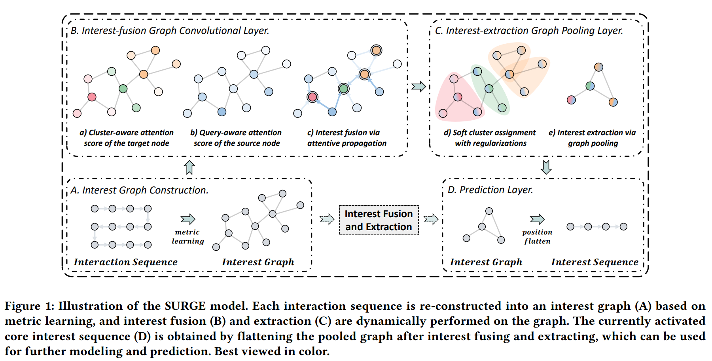

## Interest Graph Construction

通过基于度量学习将松散的项目序列重新构建为紧密的项目-项目兴趣图，我们明确地整合和区分了长期用户行为中不同类型的偏好。为什么要用度量学习呢？因为简单的办法就是利用项目之间的共现关系来构建图，但是这样的话那图太稀疏。所以基于度量学习文章提出了一种为每个交互记录序列自动建图的方法。

### Raw graph construction.

跟以前的方法一样直接构图了，刚看到怎么确定 i 和 j 相关呢，后面就提到了。不过初始化这里也不知道咋样子搞得，也不知道有没有代码。

通过将每个用户的交互历史表示为图表，更容易区分他/她的核心兴趣和外围兴趣。核心兴趣节点由于连接更多相似兴趣而具有比外围兴趣节点更高的度数，并且相似兴趣的频率越高导致子图越密集越大。这样就构建了一个先验框架，即邻居节点相似，稠密子图是用户的核心兴趣。

### Node similarity metric learning.

论文里说为了平衡时间和效率，所以采用了权重 cos 相似计算：

$$M_{i,j}=cos(\vec{\mathbb{w}} \odot \vec{h_i}, \vec{\mathbb{w}} \odot \vec{h_j})$$

请注意，学习到的图结构随着项目嵌入的更新而不断变化。

然后感觉类似于 GAT 的节奏，也有多头度量。

$$M_{i,j}^{\delta}=cos(\vec{\mathbb{w}}_{\delta} \odot \vec{h_i}, \vec{\mathbb{w}}_{\delta} \odot \vec{h_j})$$

$$M_{ij}=\frac{1}{\delta}\sum_{\delta = 1}^{\phi}M_{ij}^{\delta}$$

### Graph sparsification via $\varepsilon$-sparseness.

因为考虑到了邻接矩阵的元素是非负的，但是利用 cos 的值在 [-1,1] 之间，所以简单地对其进行归一化不会对图的稀疏性施加任何约束，并且可以产生一个完全连接的邻接矩阵。 这在计算上是昂贵的，并且可能会引入噪声（即不重要的边），并且它不够稀疏以至于后续的图卷积无法专注于图的最相关方面。

因此，我们通过仅考虑具有最重要连接的节点对，从 $M$ 中提取对称稀疏非负邻接矩阵 $A$。 为了使提取阈值的超参数不敏感且不破坏图的稀疏分布，我们采用了整个图的相对排序策略。具体来说，我们屏蔽 $M$ 中那些（即设置为零）小于非负阈值的元素，该阈值是通过对 $M$ 中的度量值进行排序获得的。

$$A_{ij}=
\begin{cases}
1& M_{ij} >= \textbf{Rank}_{\varepsilon n^2}(M)\\
0& otherwise.
\end{cases}$$
其中 $\textbf{Rank}_{\varepsilon n^2}(M)$ 返回度量矩阵 $M$ 中第 $\varepsilon n^2$ 的最大值的值。$n$ 是节点数，$\varepsilon$ 控制生成图的整体稀疏性。

它不同于整个图邻居的绝对阈值策略和节点邻域的相对排序策略。 前者设置了一个绝对阈值来去除邻接矩阵中的较小元素。当超参数设置不当时，随着嵌入的不断更新，度量值分布也会发生变化，可能无法生成图或生成完整图。后者返回邻接矩阵中每一行的固定数量的最大值的索引，这将使生成的图的每个节点具有相同的度。 强制均匀稀疏分布会使下游 GCN 无法充分利用图的稠密或稀疏结构信息。

## Interest-fusion Graph Convolution Layer

构建的兴趣图上的图卷积传播动态融合用户的兴趣，强化重要行为，弱化噪声行为。

### Interest fusion via graph attentive convolution.

我们提出了一个集群和查询感知的图形注意卷积层，它可以在信息聚合期间感知用户的核心兴趣（即位于集群中心的项目）和与查询兴趣相关的兴趣（即当前目标项目）。

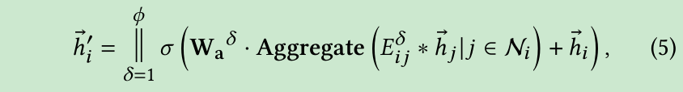

### Cluster- and query-aware attention.

为了在整合兴趣时加强重要信号并削弱噪声信号，我们提出了一种集群和查询感知注意机制。我们使用注意力系数在消息传递过程中重新分配边缘信息的权重。

首先，我们假设目标节点 $v_i$ 的邻域将形成一个簇，并将图中的目标节点 $v_i$ 视为簇 $c(v_i)$ 的中心点。我们将目标节点 $v_i$ 的 $k$ 跳邻域定义为集群的感受野。集群中所有节点嵌入的平均值 $\vec{h}_{i_c}$ 表示集群的平均信息。为了识别目标节点是否是簇的中心，使用目标节点嵌入及其簇嵌入来计算以下注意力分数：

其次，为了服务于下游的动态池化方法，学习用户兴趣对不同目标兴趣的独立演化，还应该考虑源节点嵌入 $\vec{h_j}$ 和目标项嵌入 $\vec{h_t}$ 之间的相关性。如果源节点与查询项的相关性更高，则其在对目标节点的聚合中的权重将更显着，反之亦然。由于只有相关行为才能在最终预测中发挥作用，所以我们只保留相关信息，聚合时会丢弃不相关的信息。

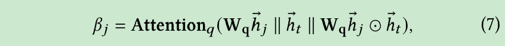

## Interest-extraction Graph Pooling Layer

考虑到用户在不同时刻的不同偏好，进行动态图池化操作，自适应保留动态激活的核心偏好。

### Interest extraction via graph pooling

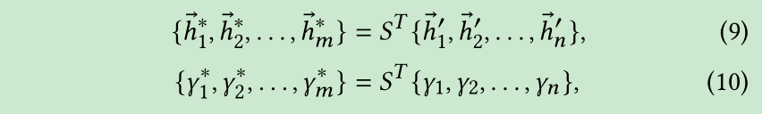
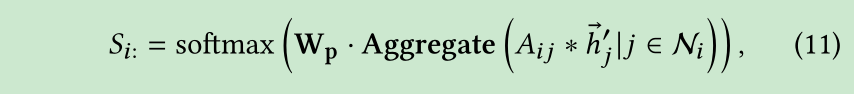

### Assignment regularization

然而，仅使用来自下游推荐任务的梯度信号很难训练集群分配矩阵 $S$。非凸优化问题使得在早期训练阶段很容易陷入局部最优。此外，嵌入在 $h'$ 中的每个节点的相对位置对应于交互的时间顺序。但是在池化簇嵌入矩阵 $h^*$，难以保证反映用户兴趣的集群之间的时间顺序。因此，我们使用三个正则化项来缓解上述问题。

- Same mapping regularization.
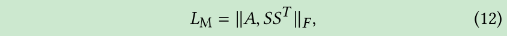
- Single affiliation regularization.
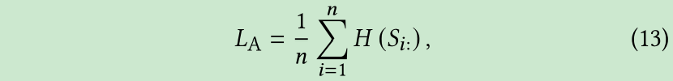
- Relative position regularization.
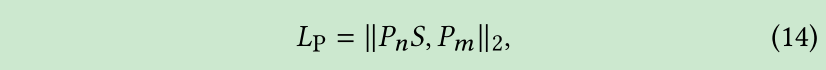

### Graph readout

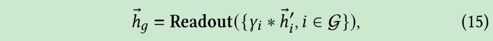

## Prediction Layer

在合并的图被压平成减少的序列后，我们对增强的兴趣信号的演变进行建模，并预测用户很有可能与之交互的下一个项目。

### Interest evolution Modeling

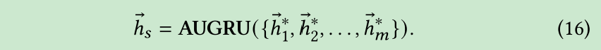

### Prediction

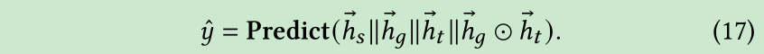
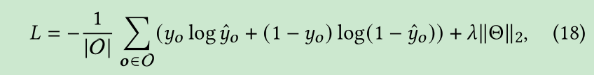

# My Thoughts

- 本来这篇论文在前面看着还挺感兴趣的，毕竟很少有 GNN 用到 SR 中的文章，而且名称这么朴素，谁知道看到最后越来越弃坑了，这论文好难搞啊，数学公式这么多。。。。本来看着模型图也挺简单的啊
- 理解起来确实很简单，想法也很朴素，就是做法真的头大。。。先不搞了，以后有代码时间再细看吧

# Conclusion

In this work, we studies the task of sequential recommender systems. We propose a graph-based solution that re-constructs loose item sequences into tight item-item interest graphs. The model utilizes graph neural network’s powerful ability to dynamically fuse and extract users’ activated core interests from noisy user behavior sequences. Extensive experiments on both public and proprietary industrial datasets demonstrate the effectiveness of our proposal. Further studies on sequence length confirm that our method can model long behavioral sequences effectively and efficiently. As for future work, we plan to conduct A/B tests on the online system to further evaluate our proposed solution’s recommendation performance. We also plan to consider using multiple types of behaviors, such as clicks and favorites, to explore fine-grained multiple interactions from noisy historical sequences.

@Author: Forrest Stone
@Email: ysbrilliant@163.com
@Github: https://github.com/Forrest-Stone
@Date: 2021-07-11 Sunday 09:59:08
