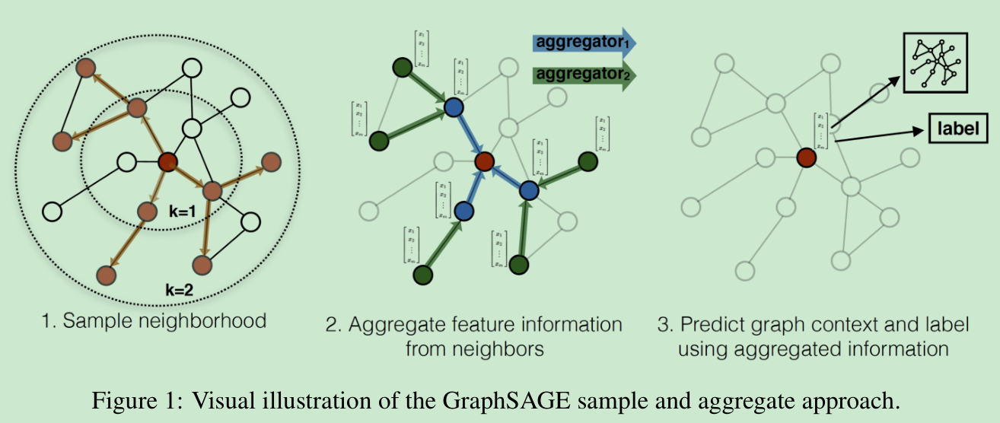
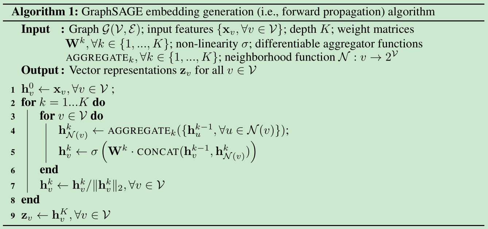
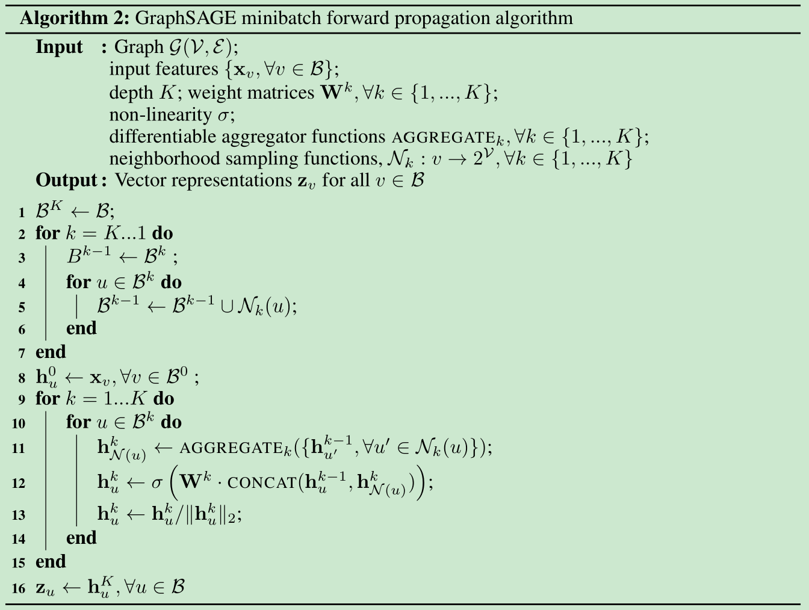
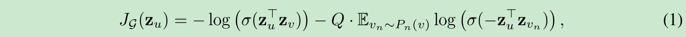
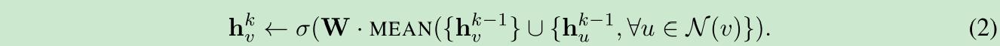
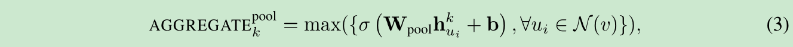

# Inductive Representation Learning on Large Graphs

[1] Hamilton, William L., Rex Ying, and Jure Leskovec. “Inductive Representation Learning on Large Graphs.” ArXiv:1706.02216 [Cs, Stat], September 10, 2018. http://arxiv.org/abs/1706.02216.

  http://snap.stanford.edu/graphsage/

# Abstract

Low-dimensional embeddings of nodes in large graphs have proved extremely useful in a variety of prediction tasks, from content recommendation to identifying protein functions. However, most existing approaches require that all nodes in the graph are present during training of the embeddings; these previous approaches are inherently transductive and do not naturally generalize to unseen nodes. Here we present GraphSAGE, a general inductive framework that leverages node feature information (e.g., text attributes) to efficiently generate node embeddings for previously unseen data. Instead of training individual embeddings for each node, we learn a function that generates embeddings by sampling and aggregating features from a node’s local neighborhood. Our algorithm outperforms strong baselines on three inductive node-classification benchmarks: we classify the category of unseen nodes in evolving information graphs based on citation and Reddit post data, and we show that our algorithm generalizes to completely unseen graphs using a multi-graph dataset of protein-protein interactions.

# Motivation

- 大多数现有方法要求在嵌入训练期间图中的所有节点都存在；这些以前的方法本质上是直推式的（transductive），不能自然地推广到看不见的节点。即以前方法都是为图中所有节点计算嵌入，遇见新图（特别是大图）新节点不能很好的泛化，要重新进行训练，耗费时间。可不可以学习一个节点的表示方法，利用节点的特征学习节点的表示，这样可以很好的泛化到新的节点表示上。

# Main Contributions

- 提出了一个归纳式的结点嵌入学习框架，利用节点特征（文本属性，结点配置信息，节点的度等）来学习结点的一个嵌入函数以便更好地泛化到看不见的节点。
- 还研究了不同的聚合函数的效果，此外还有监督学习和无监督学习等等，总的来说，是一个可以适配很多任务的框架

# Introduction

首先解释下什么是 transductive 和 inductive：

- transductive：直推式。训练之前图就包含了要预测的结点，即要对整张图进行训练，不能泛化到不在图里面的结点。另一个角度就是测试集是固定的
- inductive：归纳式。不必对所有的结点单独训练学习到一个嵌入表示，而是为了学习一种节点表示方法，可以识别结点的领域属性（该节点在图中的局部角色以及在图中的位置），从而可以泛化到看不见的结点。

如下图：

GraphSAGE（SAmple and aggreGatE）：为每个顶点训练一组可以聚合顶点领域信息的聚合函数（aggregator functions）。每个聚合函数学习一个不同hop或查找深度的邻域信息。这样，在测试或推理时，使用训练好的的系统，通过学习到的的聚合函数为完全未知的顶点生成embedding向量。

# Model

## Embedding generation (i.e., forward propagation) algorithm

假设模型已经被训练，并且让参数固定。具体的算法伪代码如下：

小批量处理的在下面：

这里要缕清的是：批处理的时候要先采样，而本层结点的表示仅仅跟本层的节点有关，跟其余层的节点无关。采样的是 K->1，聚集的是 1->K。在采样的时候，先对图需要嵌入的结点采样，然后再去其邻居采样，依次逐层。聚集的时候要从最外层的邻居聚集，然后一层一层的聚集

采样的时候细节的邻居定义，是均匀采样固定大小数量的邻居，为什么？因为节点度不一样，为了计算方便，如果结点的度太小小于采样的数量呢，那就又放回的继续采样。

## Learning the parameters of GraphSAGE

可使用有监督学习和无监督学习来训练

无监督：让学习到的相邻结点嵌入更相似，不想关的结点更不相似，所以有了下面的损失函数：

注意 $z_u$ 是学习到的包含领域信息的结点表示

如果考虑下游任务，直接根据下游任务定义就好了，比如 CE

## Aggregator Architectures

聚合函数主要考虑的是：是对称的，同时可训练，且具有很高的表示能力。

排列不变性（permutation invariance）：指输入的顺序改变不会影响输出的值。

- Mean aggregator

这里换成文中的聚合函数，可以看成是 inductive GCN 版本

- LSTM aggregator

虽然表达力抢，但是序列没有顺序啊？随机排序

- Pool aggregator

实验效果来看，确实后两个比较好。

## 理论证明

略

# My Thoughts

- 这篇论文看了好久，思路什么的都挺简单的，感觉有点被唬住了。（应该是看着许多的理论证明啥的把），而且自己也是第一次看这种的论文，因为是上次面试问到了想着把他搞明白。
- 作者写的很丰富，可能是21年了回头看是挺简单的，不过站在但是还是很丰富的，而且论文的细节给满分，包括数据集的处理，各种分析都很不错
- 其实还是要知道，对于新加的几个点对学到的节点表示影响不大，但是如果很多新的结点就还是要从新训练？而且感觉作者说的学习的是一个结点的表示方法，其实就是 $W^k$? 就是嵌入的参数而已吧，我个人理解。那 GCN 或者其他的 GAT 这样的学习到的不也是参数，也可以理解为是一种节点的表示方法吧。理解角度不同，说法也不同。不过还是主要是在于对于大图的新节点的泛化吧
- 终于看完了这篇文章，松了一口气。
- 对了，这个分批训练的思想也挺好的，如果全部采样那不就是更慢了

# Conclusion

We introduced a novel approach that allows embeddings to be efficiently generated for unseen nodes. GraphSAGE consistently outperforms state-of-the-art baselines, effectively trades off performance and runtime by sampling node neighborhoods, and our theoretical analysis provides insight into how our approach can learn about local graph structures. A number of extensions and potential improvements are possible, such as extending GraphSAGE to incorporate directed or multi-modal graphs. A particularly interesting direction for future work is exploring non-uniform neighborhood sampling functions, and perhaps even learning these functions as part of the GraphSAGE optimization.

@Author: Forrest Stone
@Email: ysbrilliant@163.com
@Github: https://github.com/Forrest-Stone
@Date: 2021-08-07 Saturday 15:51:36
