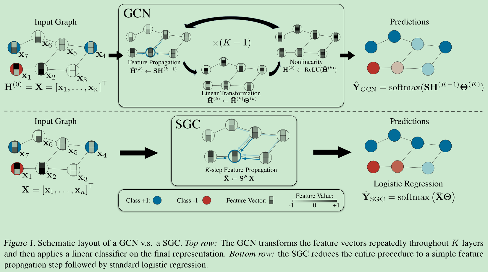
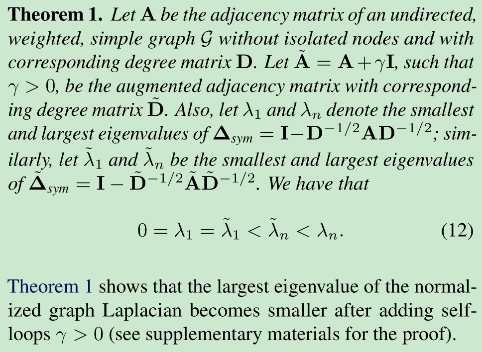

# Simplifying Graph Convolutional Networks

[1] Wu, Felix, Tianyi Zhang, Amauri Holanda de Souza Jr., Christopher Fifty, Tao Yu, and Kilian Q. Weinberger. “Simplifying Graph Convolutional Networks.” ArXiv:1902.07153 [Cs, Stat], June 20, 2019. http://arxiv.org/abs/1902.07153.

  https://github.com/Tiiiger/SGC

# Abstract

Graph Convolutional Networks (GCNs) and their variants have experienced significant attention and have become the de facto methods for learning graph representations. GCNs derive inspiration primarily from recent deep learning approaches, and as a result, may inherit unnecessary complexity and redundant computation. In this paper, we reduce this excess complexity through successively removing nonlinearities and collapsing weight matrices between consecutive layers. We theoretically analyze the resulting linear model and show that it corresponds to a fixed low-pass filter followed by a linear classifier. Notably, our experimental evaluation demonstrates that these simplifications do not negatively impact accuracy in many downstream applications. Moreover, the resulting model scales to larger datasets, is naturally interpretable, and yields up to two orders of magnitude speedup over FastGCN.

# Motivation

- 复杂的模型可能继承了不必要的复杂性和多余的计算。

# Main Contributions

- 提出了 GCN 的简化版本，去掉了非线性激活层，并且折叠连续层之间的权重矩阵来减少这种多余的复杂性。
- 理论还分析了和低通滤波器的关联，做了丰富的实验去验证可扩展性

# Introduction

以前的方法是简单的线性模型，可解释比较好。随着模型越来越复杂，是不是要返璞归真一下？复杂的东西一定是好的吗？会不会有一些冗余的计算呢。特别是对于 GCN 来说，可能某些任务并不需要这么复杂的计算操作就可以很好的处理了。

# Model

## Graph Convolutional Networks

- Feature propagation.

$$S=\tilde{D}^{-\frac{1}{2}}\tilde{A}\tilde{D}^{-\frac{1}{2}}$$

$$\bar{H}^{(k)}\leftarrow\bar{H}^{(k-1)}$$

- Feature transformation and nonlinear transition.

$$H^{(k)}\leftarrow ReLU(\bar{H}^{(k)}\Theta^{(k)})$$

- Classifier.

$$\hat{Y}_{GCN}=softmax(SH^{(K-1)}\Theta^{(K)})$$

## Simple Graph Convolution

GCN 的在每一层都聚合邻居的平均信息，k 层就相当于在 K 跳的结点获得了特征信息，类似于卷积网络的感受野。但是会遇到过平滑现象，3层以上表现不好

论文假设 GCN 层之间的非线性并不重要，但大部分好处来自局部平均。因此去除了每一层之间的非线性转换函数，只保留最终的 softmax（以获得概率输出）。结果模型是线性的，但仍然具有与 K 层 GCN 相同的增加的 “感受野”。

- Linearization.

$$\hat{Y}=softmax(S...SSX\Theta^{(1)}\Theta^{(2)}...\Theta^{(K)})$$

简化表示为：

$$\hat{Y}_{SGC}=softmax(S^KX\Theta)$$

- Logistic regression.

$$\bar{X}=S^KX$$

$$\hat{Y}=softmax(\bar{X}\Theta)$$

本质上就是相当于是对于预处理的特征 $\bar{X}$ 进行逻辑回归

## Spectral Analysis

# My Thoughts

- 论文的想法是非常好的，但是总感觉解释的有点不太完美。虽然理论上也证明了，但是还是差点意思感觉。可能还是我只关注与论文的那一点内容，没有具体去看理论分析把。
- 这几天其实看了几篇关于 GNN 的综述，其实感觉 GNN 从早期的图嵌入方法，还有谱域方法感觉比较复杂，到现在的时域方法，形式上是统一的，但是其实还是比较简单的。
- 今个不知道在哪看到了别人说写论文的事，说到写论文不要写好几个点，就针对一个创新点说及可以了，深有体会。现在回想一下所看的论文，确实都是针对于一个点来讲的，可以降低被审稿人针对的概率哈哈哈
- 以前也看到过关于去掉激活层的 GCN 的方法，不知道他们是不是通过气，怎么都是 19 年这么多

# Conclusion

In order to better understand and explain the mechanisms of GCNs, we explore the simplest possible formulation of a graph convolutional model, SGC. The algorithm is almost trivial, a graph based pre-processing step followed by standard multi-class logistic regression. However, the performance of SGC rivals — if not surpasses — the performance of GCNs and state-of-the-art graph neural network models across a wide range of graph learning tasks. Moreover by precomputing the fixed feature extractor SK, training time is reduced to a record low. For example on the Reddit dataset, SGC can be trained up to two orders of magnitude faster than sampling-based GCN variants.

In addition to our empirical analysis, we analyze SGC from a convolution perspective and manifest this method as a low-pass-type filter on the spectral domain. Low-pass-type filters capture low-frequency signals, which corresponds with smoothing features across a graph in this setting. Our analysis also provides insight into the empirical boost of the “renormalization trick” and demonstrates how shrinking the spectral domain leads to a low-pass-type filter which underpins SGC.

Ultimately, the strong performance of SGC sheds light onto GCNs. It is likely that the expressive power of GCNs originates primarily from the repeated graph propagation (which SGC preserves) rather than the nonlinear feature extraction (which it doesn’t.)

Given its empirical performance, efficiency, and interpretability, we argue that the SGC should be highly beneficial to the community in at least three ways: (1) as a first model to try, especially for node classification tasks; (2) as a simple baseline for comparison with future graph learning models; (3) as a starting point for future research in graph learning — returning to the historic machine learning practice to develop complex from simple models.

@Author: Forrest Stone
@Email: ysbrilliant@163.com
@Github: https://github.com/Forrest-Stone
@Date: 2021-08-23 Monday 18:56:33
