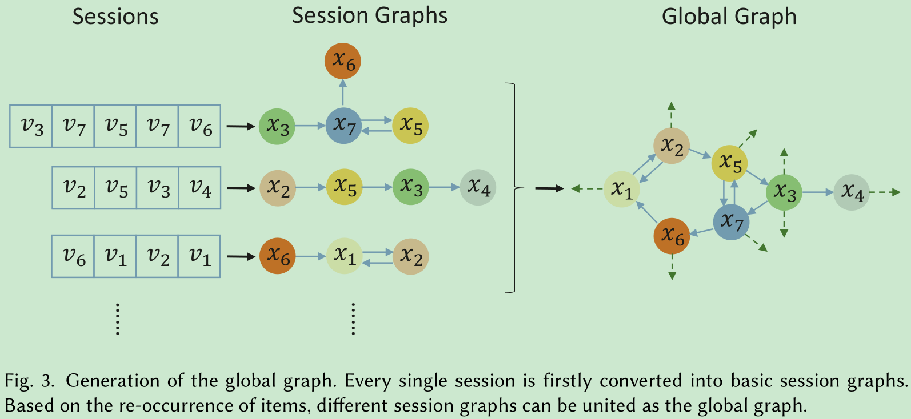
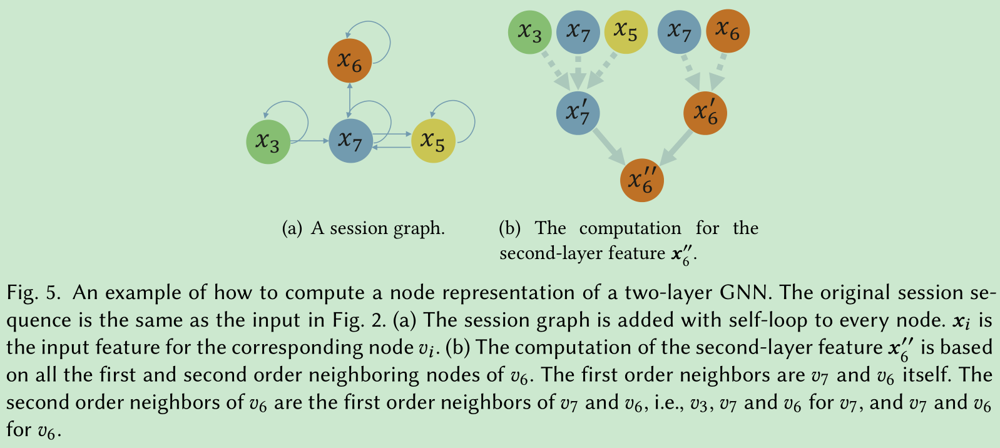

# Exploiting Cross-Session Information for Session-based Recommendation with Graph Neural Networks

[1] Qiu, Ruihong, Zi Huang, Jingjing Li, and Hongzhi Yin. “Exploiting Cross-Session Information for Session-Based Recommendation with Graph Neural Networks.” ACM Transactions on Information Systems 38, no. 3 (June 26, 2020): 1–23. https://doi.org/10.1145/3382764.

[2] Ruihong, Qiu, Li Jingjing, Huang Zi, and Yin Hongzhi. “Rethinking the Item Order in Session-Based Recommendation with Graph Neural Networks.” Proceedings of the 28th ACM International Conference on Information and Knowledge Management, November 3, 2019, 579–88. https://doi.org/10.1145/3357384.3358010.

# Abstract

Different from the traditional recommender system, the session-based recommender system introduces the concept of the session, i.e., a sequence of interactions between a user and multiple items within a period, to preserve the user’s recent interest. The existing work on the session-based recommender system mainly relies on mining sequential patterns within individual sessions, which are not expressive enough to capture more complicated dependency relationships among items. In addition, it does not consider the cross-session information due to the anonymity of the session data, where the linkage between different sessions is prevented. In this paper, we solve these problems with the graph neural networks technique. First, each session is represented as a graph rather than a linear sequence structure, based on which a novel Full Graph Neural Network (FGNN) is proposed to learn complicated item dependency. To exploit and incorporate cross-session information in the individual session’s representation learning, we further construct a Broadly Connected Session (BCS) graph to link different sessions and a novel Mask-Readout function to improve session embedding based on the BCS graph. Extensive experiments have been conducted on two e-commerce benchmark datasets, i.e., Yoochoose and Diginetica, and the experimental results demonstrate the superiority of our proposal through comparisons with state-of-the-art session-based recommender models.

# Motivation

- 会话中复杂的项目依赖关系没有学习的很好，用 GNN 去捕获
- 最重要的是，由于用户的匿名性，跨会话的信息没有考虑到

# Main Contributions

- 提出了一个 Broad Connected Session (BCS) 图将跨会话的信息融合到图里面去
- 也提出了一个 Mask-Readout 模块，当跨会话信息融合到 FGNN 的时候，用来生成会话的嵌入

# Introduction

以前的基于内容的推荐以及协同过滤都主要关注于所有的历史交互数据也就是长期兴趣。但是基于会话的推荐要更加考虑用户当前的交互项目，也就是短期兴趣。会话指的是在一个时期内（一般很短）和一个用户交互的多个项目的序列。

为什么跨会话的信息会有用呢？共享至少一个项目的会话之间的皮尔森相关系数的分布表明基准数据集的会话存在强的正相关。跨会信息可以有助于解决数据稀疏问题。

当前利用跨会话信息的方法都假定每个会话的用户 ID 可用，以便它们可用可以链接属于同一用户的会话。但是他们不适用于没有用户 ID 信息的匿名会话数据。

第一个 motivation 解决过了，看论文 FGNN[2]，本文的重点在于如何把跨会话信息融合到 FGNN 中去。而且提出的 mask-readout 模块生成会话的嵌入，更多的关注于原始会话图中的项目，而保证学习到的会话嵌入不被跨会话信息所分散。

# Model

请注意，会话中的项目可能会重复出现

## BCS Graph

### Basic Session Graph

构建带权有向图，边的权重依旧是边发生的频率。并且还给自己加了环，权重为 1。

### BCS Graph

以前都是针对单个会话里的项目来构建图，但是现在要利用到额外的跨会话信息就需要另想办法了。如何利用不同会话间的信息呢，以前需要计算相似性，但是现在我可以直接构建一个大图，从大图里面直接拿来相关的信息。Global Graph 的构建如下：

其实就是将所有的会话结合起来构建了一个带权有向图，权重也还是以前的方法。

如何为每个会话构建图呢，是根据会话中的项目从大图中采样。当然为了更广泛的利用到跨会话的信息，可以对 n 阶邻居进行采样，如下图：

对于一些流行的物品，他们可以出现在大量的会话中。如果我们对其整个邻居节点进行采样会大大增加 BCS 图表的大小。因此，在邻居级别中，采样过程在相邻节点上执行随机选择以控制 BCS 图的比例。 采样基于边缘权重，表示以下节点的流行度。

所以在包含了丰富跨会话信息的同时也不用计算会话间的相似性来决定哪些信息是相关的

## Weighted Graph Atentional Layer

现在的 GCN 和 GAT 都很适合无权图和无向图，针对有向带权图不能直接引用并且不引起信息损失。

利用 WGAT 聚合信息的过程如下所示：

$$e_{ij}=Att(Wx_i,Wx_j,w_{ij})$$

$$\alpha_{ij}=softmax(e_{ij})=\frac{exp(e_{ij})}{\sum_{k \in \mathcal{N}_(i)}exp(e_{ik})}$$

$$\alpha_{ij}=\frac{exp(LeakyRelu(W_{att}[Wx_i||Wx_j||w_{ij}]))}{\sum_{k \in \mathcal{N}_(i)}exp(LeakyRelu(W_{att}[Wx_i||Wx_k||w_{ik}]))}$$

$$x_i^{'}=\sigma(\sum_{j \in \mathcal{N}(i)}\alpha_{ij}Wx_j)$$

再加上多头：

$$x_i^{'}=\begin{matrix}K\\ ||\\ k=1\end{matrix}\sigma(\sum_{j \in \mathcal{N}(i)}\alpha_{ij}^kW^kx_j)$$

$$x_i^{'}=\sigma(\frac{1}{K}\sum_{k=1}^{K}\sum_{j \in \mathcal{N}(i)}\alpha_{ij}^kW^kx_j)$$

## Mask-Readout Function

Mask-Readout 需要学习项目依赖关系的描述，以避免时序的偏差和最后一个输入项上的自我注意力的不准确性。

$$q_t=GRU(q_{t-1}^*)$$
$$e_{i,t}=f(x_i,q_t)$$
$$a_{i,t}=\frac{exp(e_{i,t})}{\sum_jexp(e_{j,t})}$$
$$r_t=\sum_ia_{i,t}x_i$$
$$q_t^*=q_t||r_t$$

查询向量 $q_t$ 控制从节点嵌入的读取的内容，该嵌入式实际上提供了一种处理所有节点的顺序，如果我们递归地应用读出功能。

通常，对于读出函数在 BCS 图中的所有节点上进行计算没有限制。然而，基于SBR的目的，当前会话被委派以反映用户的最新偏好，而不是以前或其他用户的会话。因此，在生成图嵌入时，有必要在 BCS 图中保留原始会话信息。为了实现这一目标，Mask-readout 屏蔽了所有超出范围的一阶邻居的节点，如下图：

## Recommendation

图分类任务

$$\hat{z}=(W_{out}q_t^*)^TX^0$$
$$\hat{y}=softmax(\hat{z})$$

## Objective Function

$$L=-\sum_{i=1}^{l}one-hot(v_{label,i})log(\hat{y}_i)$$

# My Thoughts

- 这么长的篇幅我以为是类似于综述的文章，包括下一篇要看的文章都是同一批人写的，看完摘要我发现是我多想了。哈哈哈哈。原来这样的期刊还可以公开说自己是谁。而且这篇论文是 FGNN 论文的改进，很多图都一样哈哈哈，虽然我没看过基础的文章
- 赶紧记下来，我想起来了要反思的问题是，看论文太关注于过程了，纠结那些实现上的细节，应该过多的去思考 idea 的形成和发展，去思考去思考去思考问题的原因和解决方案
- 这篇文章跟上一篇一样都是利用了所有的会话信息，我早在组会上跟老师讨论过了，但是他也没说啥，也没有去继续思考下去。哎！不够要是我搞得话，老师觉得肯定不可以。上篇文章是构建全图，这个是在全图上随机采样来构建小图。虽然方法不一样，但是都是要考虑到更多的信息，看来大家得想法都差不多
- 当然，重新阅读思考，这里的大图倒是很鸡肋的感觉，重点是在小图的构建上，把关注点放在了会话本身的嵌入身上。

# Conclusion

This paper studied the problem of the session-based recommendation on anonymous sessions in the aspect of the complicated item dependency and the cross-session information. We found that a sequence or a random set of items are insufficient to capture the relation between items. To learn the complicated item dependency, we first represented each session as a graph and then proposed an FGNN model to perform graph convolution on the session graph. Furthermore, because of the data sparsity issue of the anonymous session, it is helpful to make use of the cross-session information. To exploit and incorporate the cross-session information, we further designed a BCS graph to connect different sessions and used a Mask-Readout function to generate a more expressive session embedding with the cross-session information. Empirically, the experimental results from two large-scale benchmark datasets validated the superiority of our solution compared with state-of-the-art techniques.

@Author: Forrest Stone
@Email: ysbrilliant@163.com
@Github: https://github.com/Forrest-Stone
@Date: 2021-09-06 Monday 08:32:18
