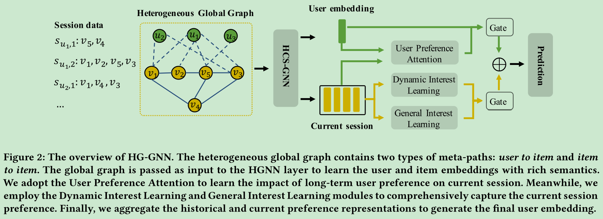
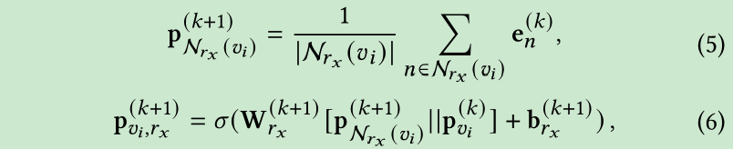
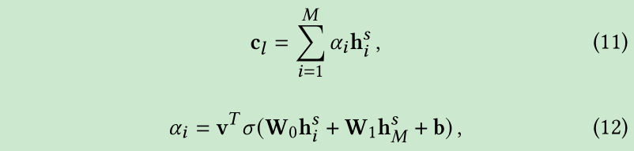
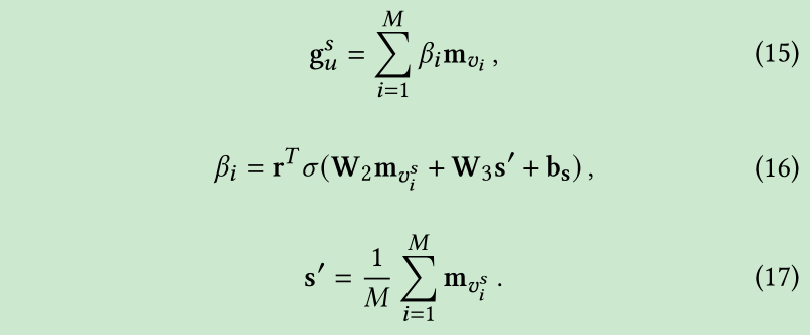
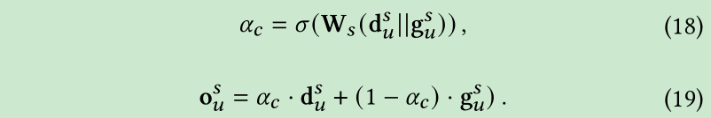
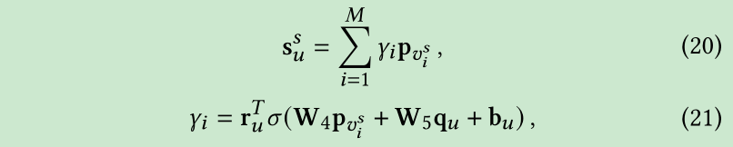

# Heterogeneous Global Graph Neural Networks for Personalized Session-based Recommendation

[1] Pang, Yitong, Lingfei Wu, Qi Shen, Yiming Zhang, Zhihua Wei, Fangli Xu, Ethan Chang, and Bo Long. “Heterogeneous Global Graph Neural Networks for Personalized Session-Based Recommendation.” ArXiv:2107.03813 [Cs], July 8, 2021. http://arxiv.org/abs/2107.03813.

# Abstract

Predicting the next interaction of a short-term interaction session is a challenging task in session-based recommendation. Almost all existing works rely on item transition patterns, and neglect the impact of user historical sessions while modeling user preference, which often leads to non-personalized recommendation. Additionally, existing personalized session-based recommenders capture user preference only based on the sessions of the current user, but ignore the useful item-transition patterns from other user’s historical sessions. To address these issues, we propose a novel Heterogeneous Global Graph Neural Networks (HG-GNN) to exploit the item transitions over all sessions in a subtle manner for better inferring user preference from the current and historical sessions. To effectively exploit the item transitions over all sessions from users, we propose a novel heterogeneous global graph that contains item transitions of sessions, user-item interactions and global co-occurrence items. Moreover, to capture user preference from sessions comprehensively, we propose to learn two levels of user representations from the global graph via two graph augmented preference encoders. Specifically, we design a novel heterogeneous graph neural network (HGNN) on the heterogeneous global graph to learn the long-term user preference and item representations with rich semantics. Based on the HGNN, we propose the Current Preference Encoder and the Historical Preference Encoder to capture the different levels of user preference from the current and historical sessions, respectively. To achieve personalized recommendation, we integrate the representations of the user current preference and historical interests to generate the final user preference representation. Extensive experimental results on three real-world datasets show that our model outperforms other state-of-the-art methods.

# Motivation

- 现有方法忽视了用户的历史会话，导致不是个性化的推荐（这个的主要原因是用户是匿名的数据吧）；这里想表达的意思应该是忽视了用户的长期兴趣（也叫通用兴趣的建模）
- 现有方法仅仅基于当前用户的当前会话，忽视了其他用户的历史会话中隐含的项目转换模式。

# Main Contributions

- 提出了一个异质全图神经网络来捕获丰富的语义信息，利用了所有用户的所有会话信息。包含项目转换，用户项目交互，基于全图共现信息的相似对构建等等
- 还在异质图的基础上从两个层面上构建了用户的兴趣并结合起来，当前兴趣编码器和历史性去编码器

# Introduction

还是解释动机，大多数的方法没有利用到历史的会话信息，以及用户的特征。还有就是仅仅基于会话，忽略了其余用户的历史会话的有用的项目转换模式。

# Model

异质全局图：组织历史的会话和提取全局信息。用户项目交互构建用户项目的边；项目边的话基于全局共现信息用相似计算对，另外会话里面的项目转换也用来构建项目边。

## Heterogeneous Global Graph Construction

异质全局图包含两种元路径：
- item-to-user
- item-to-item

其中，用户和项目的结点都是图中的结点，边的话就是元路径里的关系。

### item-to-item

项目间的转换关系包含两种：
- 会话中的邻近交互行为
- 同一会话中的频繁共现行为

本文中，会话里的项目边定义为 $(v_i, v_j, r_{in})$ 和 $(v_j, v_i, r_{out})$，然后考虑某个节点的邻近边的权重如下：用所有历史会话的频率为边分配权重。为了保证相关性，只采样最高权重的 top-S 个边。

另外，如何利用共现信息呢？基于所有的历史会话计算共现的项目，并且选择频繁与某个项目出现的 top-k 个项目：

注意：当某对 item 同时拥有 $r_{in}$ 和 $r_{similar}$ 的时候，只保留前者。为了避免过多的噪音点，对每个项目结点，用其邻近的交互项目剪掉 Top-K。

### item-to-user

直接就是用户和项目交互 $(v_j, u_i, r_{interact})$ 和 $(u_i, v_j, r_{interacted_by})$

综上，所以，异质全局图包含了：基本的会话间的项目转换对，用户项目历史交互和全局共现信息。

## Heterogeneous Global Graph Neural Network

这里没啥好说，都是很基本的：

## Current Preference Encoder

### Dynamic Interest Learning.

选取会话中的最后 $M$ 个项目作为输入

### General Interest Learning.

基于位置感知的注意力机制

基于逆序的位置嵌入如下：

然后通过门控机制结合起来：

## Historical Preference Encoder

## Prediction and Training

# My Thoughts

- 论文有一些地方写的不是很清楚感觉，比如异质图那一块怎么构图结果是啥？感觉看完之后很疑惑，也不知道具体是怎么实施的，需要看代码才可以知道。
- 论文总体感觉跟我写论文的时候一样哈哈哈，感觉有些地方比较啰嗦，解释不清楚。有点重复哈哈哈。一家之言，个人看法。
- 感觉论文的创新点也不是很大，老早之前就有了。如果是我自己这样想的话，老师必定会说别人都做过了指的是 A-PGNN 你还搞干啥。感觉更像是几个模型拼出来的。

# Conclusion

In this paper, we proposed a heterogeneous global graph neural network for personalized session-based recommendation. Contrasting with previous methods, we considered the impact of historical interactions of users and build a heterogeneous global graph that consists of historical user-item interactions, item transitions and global co-occurrence information. Furthermore, we proposed a graph augmented hybrid encoder which consists of a heterogeneous graph neural network and two different-level preference encoders to capture the user preference representation comprehensively. In the experiments, our model outperforms other state-of-the-art  session-based models, showing the effectiveness of our model.

@Author: Forrest Stone
@Email: ysbrilliant@163.com
@Github: https://github.com/Forrest-Stone
@Date: 2021-09-02 Thursday 19:56:38
