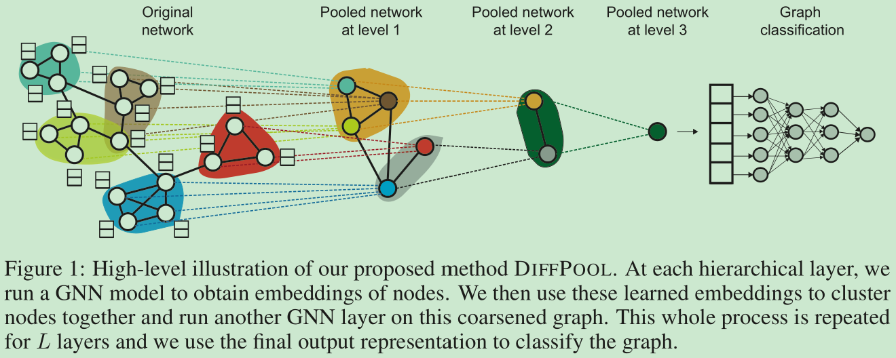

# Hierarchical Graph Representation Learning with Differentiable Pooling

[1] Ying, Rex, Jiaxuan You, Christopher Morris, Xiang Ren, William L. Hamilton, and Jure Leskovec. “Hierarchical Graph Representation Learning with Differentiable Pooling.” ArXiv:1806.08804 [Cs, Stat], February 20, 2019. http://arxiv.org/abs/1806.08804.

 https://github.com/RexYing/diffpool

# Abstract

Recently, graph neural networks (GNNs) have revolutionized the field of graph representation learning through effectively learned node embeddings, and achieved state-of-the-art results in tasks such as node classification and link prediction. However, current GNN methods are inherently flat and do not learn hierarchical representations of graphs—a limitation that is especially problematic for the task of graph classification, where the goal is to predict the label associated with an entire graph. Here we propose DIFFPOOL, a differentiable graph pooling module that can generate hierarchical representations of graphs and can be combined with various graph neural network architectures in an end-to-end fashion. DIFFPOOL learns a differentiable soft cluster assignment for nodes at each layer of a deep GNN, mapping nodes to a set of clusters, which then form the coarsened input for the next GNN layer. Our experimental results show that combining existing GNN methods with DIFFPOOL yields an average improvement of 5–10% accuracy on graph classification benchmarks, compared to all existing pooling approaches, achieving a new state-of-the-art on four out of five benchmark data sets.

# Motivation

- 现有的 GNN 模型本质上是平的，不能学习到图的层次表示

# Main Contributions

- 提出了一个可微的图池化模块，能够生成图的层次表示并且拼接到各种各样的图模型中去

# Introduction

现有的 GNN 是平的指的是他们仅仅只能通过图中的边传播信息而不能以一种分层的方式推断并且聚集信息。

将 GNN 类比于 CNN，但是 GNN 没有 CNN 的空间位置的自然概念，因为 GNN 是拓扑结构的。所以本文在每一层的 GNN 上学习了一个可微的软评估，将学习到的节点映射到一系列的簇上面去，其实也就是类似于将图中的结点打包，打包，打包最后到一个结点，一步一步来，以前是直接打包成一个。如下图所示：

# Model

图分类任务

- Graph neural networks.

$$H^{(k)}=M(A,H^{(k-1)};\theta^{(k)})$$

- Stacking GNNs and pooling layers.

$$Z=GNN(A, X)$$

我们的目标是学习如何聚类或者池化这些利用 GNN 学习到的结点，以便于用这些学习到的粗粒度的图作为输入继续到下一个 GNN 层的输入。

## Differentiable Pooling via Learned Assignments

### Pooling with an assignment matrix

学习一个聚类分配矩阵：$S^{(l)}\in \mathbb{R}^{n_l \times n_{l+1}}$。

$$X^{(l+1)}={S^{(l)}}^TZ^{(l)}\in \mathbb{R}^{n_{l+1}\times d}$$

$$A^{(l+1)}={S^{(l)}}^TA^{(l)}S^{(l)}\in \mathbb{R}^{n_{l+1}\times n_{l+1}}$$

### Learning the assignment matrix.

$$Z^{(l)}=GNN_{l,embed}(A^{(l)}, X^{(l)})$$

$$S^{(l)}=softmax(GNN_{l, pool}(A^{(l)}, X^{(l)}))$$

## Auxiliary Link Prediction Objective and Entropy Regularization

在实践中，仅使用来自图分类任务的梯度信号来训练池化 GNN 可能很困难 直观地说，我们有一个非凸优化问题，在训练早期很难将池化 GNN 推离虚假的局部最小值。为了缓解这个问题，我们使用辅助链接预测目标训练池化 GNN，该目标编码了附近节点应该池化在一起的直觉。

$$L_{LP}=||A^{(l)},S^{(l)}{S^{(l)}}^T||_F$$

$$L_e=\frac{1}{n}\sum_{i=1}^{n}H(S_i)$$

# My Thoughts

- 这篇论文也是不经意间看到的，看题目就觉得是一篇经典的论文，然后发现这类的论文，即关于 GNN 的 ICML 上面的出发点都是一个，但是说的很清晰
- 论文概念很好不错

# Conclusion

We introduced a differentiable pooling method for GNNs that is able to extract the complex hierarchical structure of real-world graphs. By using the proposed pooling layer in conjunction with existing GNN models, we achieved new state-of-the-art results on several graph classification benchmarks. Interesting future directions include learning hard cluster assignments to further reduce computational cost in higher layers while also ensuring differentiability, and applying the hierarchical pooling method to other downstream tasks that require modeling of the entire graph structure.

@Author: Forrest Stone
@Email: ysbrilliant@163.com
@Github: https://github.com/Forrest-Stone
@Date: 2021-09-18 Saturday 10:23:27
