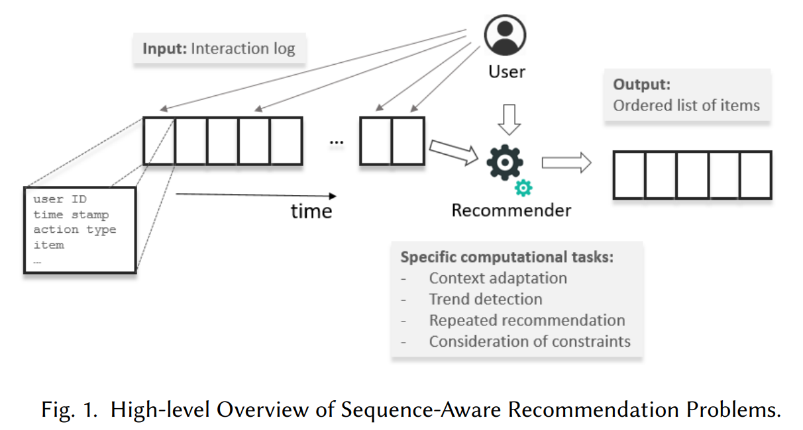

# Future Data Helps Training: Modeling Future Contexts for Session-based Recommendation

[1] Yuan, Fajie, Xiangnan He, Haochuan Jiang, Guibing Guo, Jian Xiong, Zhezhao Xu, and Yilin Xiong. “Future Data Helps Training: Modeling Future Contexts for Session-Based Recommendation.” In Proceedings of The Web Conference 2020, 303–13. Taipei Taiwan: ACM, 2020. https://doi.org/10.1145/3366423.3380116.

https://github.com/fajieyuan/grec

# Abstract

Session-based recommender systems have attracted much attention recently. To capture the sequential dependencies, existing methods resort either to data augmentation techniques or left-to-right style autoregressive training. Since these methods are aimed to model the sequential nature of user behaviors, they ignore the future data of a target interaction when constructing the prediction model for it. However, we argue that the future interactions after a target interaction, which are also available during training, provide valuable signal on user preference and can be used to enhance the recommendation quality.

Properly integrating future data into model training, however, is non-trivial to achieve, since it disobeys machine learning principles and can easily cause data leakage. To this end, we propose a new encoder-decoder framework named Gap -filling based Recommender (GRec), which trains the encoder and decoder by a gap-filling mechanism. Specifically, the encoder takes a partially-complete session sequence (where some items are masked by purpose) as input, and the decoder predicts these masked items conditioned on the encoded representation. We instantiate the general GRec framework using convolutional neural network with sparse kernels, giving con- sideration to both accuracy and efficiency. We conduct experiments on two real-world datasets covering short-, medium-, and long-range user sessions, showing that GRec significantly outperforms the state-of-the-art sequential recommendation methods. More empirical studies verify the high utility of modeling future contexts
under our GRec framework.

# Main Contributions

- 讨论了如何将未来数据利用起来而不会引起数据泄露的问题
- 设计了一个反向瓶颈连接的投影网络，增加编码和解码的带宽
- 利用CNN结合了自回归模型和双向上下文的优点

# Model

## 两种利用利用未来数据的方法

- NextItNet+：直接把正向数据反转增多训练数据，面临问题是左侧上下文和右侧上下文用同一套参数训练不太合适，而且可能导致不是最优解

- tNextItNets：这里考虑了不同的参数，从左到右和从右到左独立训练，然后连接起来。并且保证预测的时候不被更高层的神经元访问。可能导致的问题是后向的推理是无用的，因为在生成阶段，未来数据是未知的

## Gap-filling Based ED framework

模型图如下：

Embedding Layers：

包含两个输入，一个是 encoder 嵌入矩阵，一个是 decoder 的嵌入矩阵，这里不太明白的是为什么 encoder 的个数比 decoder 的多 1，前者是 n 后者是 n-1。虽然输入小的子序列都是长度为 t 的，然后 encoder 的 mask 部分都用 “_” 代替，“-1”

Encoder: Deep Bidirectional CNNs by Gap-filling：

其中的缺口填充机制是随机的和动态的，而且第一个 item 不会被 masked，这掩盖了不同批次训练中项目序列的不同部分。

Decoder: Deep Causal CNNs by Gap-predicting：

估计编码器中屏蔽 item 的概率，而不是 NextItNet 中的整个序列。

Projector: Connecting Encoder & Decoder：

是一个倒瓶颈残差架构，由上投影层、激活函数层、下投影层和一个上投影和下投影层之间的跳跃连接。

Model Training & Generating：

只考虑掩蔽位置，而不考虑完整的序列。首先执行查找表找到隐藏位置的向量表示

Connection to Existing Models：

BERT4Rec vs NextItNet

# My Thoughts

- 文章跟 BERT4Rec 还挺像的，虽然换个结构但是重点不就在于结构吗。不过， BERT4Rec 的重点是针对于 RNN 的双向吧，以前都是从左到右，再加上从右到左的训练。这篇论文对这块理解的还是很清晰的，虽然没有直接提，但是分析了 NextItNet 的两种方法，一种是单纯的从数据增强的角度加上从右到左的数据，训练参数一样；另一种是加上从右到左的数据训练参数不一样；感觉分析分体还是很深刻的，虽然我当时也做了不同参数的实验，但是怎么就没想到这个问题呢。
- 文章写的是真的好，逻辑很严谨，从信息泄漏的角度展开论文，虽然跟 BERT4Rec 处理数据的方法一样，问了下同学，NLP 里面类似的处理方法还挺多的，只是一个形式而已，以前太纠结在这上面了，可是论文的主要内容不是这个啊。
- 其实不太明白的是为什么不给一些 GNN 的方法比较，还有 BERT4Rec 等，既然提到了效率问题为什么不比较时间呢。然后就是语言是一门艺术
- 实验部分也是一个可以借鉴的地方，实验很充分。不仅对比了不同 mask 值的结果，还对比了不同变种的而且还有分析

# Conclusion

@Author: Forrest Stone

@Email: ysbrilliant@163.com

@Github: https://github.com/Forrest-Stone

@Date: 2021-03-06 Saturday 10:46:31
