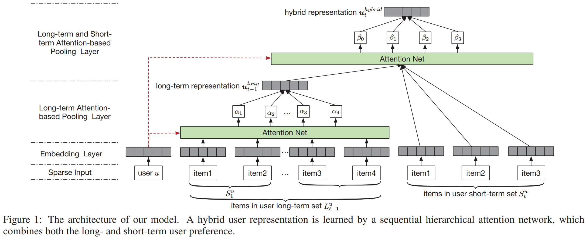
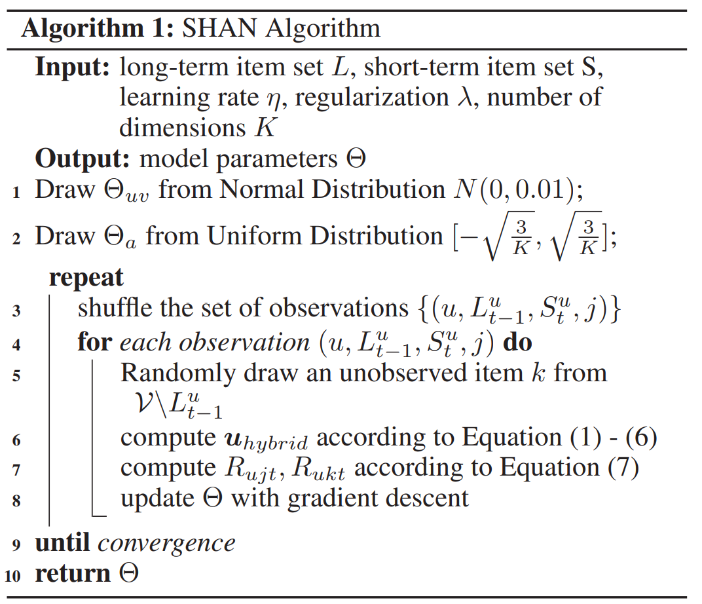

# Sequential Recommender System based on Hierarchical Attention Networks

[1] Ying, Haochao, Fuzhen Zhuang, Fuzheng Zhang, Yanchi Liu, Guandong Xu, Xing Xie, Hui Xiong, and Jian Wu. “Sequential Recommender System Based on Hierarchical Attention Networks.” In Proceedings of the Twenty-Seventh International Joint Conference on Artificial Intelligence, 3926–32. Stockholm, Sweden: International Joint Conferences on Artificial Intelligence Organization, 2018. https://doi.org/10.24963/ijcai.2018/546.

# Abstract

With a large amount of user activity data accumulated, it is crucial to exploit user sequential behavior for sequential recommendations. Conventionally, user general taste and recent demand are combined to promote recommendation performances. However, existing methods often neglect that user long-term preference keep evolving over time, and building a static representation for user general taste may not adequately reflect the dynamic characters. Moreover, they integrate user-item or item-
item interactions through a linear way which limits the capability of model. To this end, in this paper, we propose a novel two-layer hierarchical attention network, which takes the above properties into account, to recommend the next item user might be interested. Specifically, the first attention
layer learns user long-term preferences based on the historical purchased item representation, while
the second one outputs final user representation through coupling user long-term and short-term
preferences. The experimental study demonstrates the superiority of our method compared with other
state-of-the-art ones.

# Main Contributions

- 这篇文章解决的是什么问题呢？以前的方法没有考虑用户兴趣的动态变化，只用一个固定的低维向量表示。其次在融合用户项目交互和项目项目交互的时候只用一种线性的方法限制了表达力。
- 该论文用一个注意力机制来建模用户的兴趣，区分不同items的重要性。
- 该论文通过层级结构结合了用户的长短期兴趣，得到更高层的用户表达。

# Model

首先定义了什么是长期的什么是短期的

一个序列 $L^u=\{S_1^u, S_2^u, S_3^u,\dots, S_T^u\}$

长期兴趣的体现：$L_{t-1}^u=S_1^u \cup S_2^u \cup \dots \cup S_{t-1}^u$

短期兴趣的体现：$S_t^u$

## Embedding layer

用一个全连接层嵌入，UID IID（可以是 one-hot 编码）

## Long-term Attention-based Pooling layer

$$h_{1j}= \phi (W_1v_j+b_1)$$
$$\alpha_j=\frac{exp(u^Th_{1j})}{\sum_{p \in L_{t-1}^u} exp(u^Th_{1p})}$$

$v_j$是item j的嵌入表示。这里在计算注意力系数的时候把用户的嵌入也用到了。然后组合不同权重的items可以得到用户的长期兴趣表示：

$$u_{t-1}^{long}=\sum_{j \in L_{t-1}^u} \alpha_jv_j$$

## Long- and Short-term Attention-based Pooling Layer

$$h_{2j}= \phi (W_1x_j+b_2)$$
$$\beta_j=\frac{exp(u^Th_{2j})}{\sum_{p \in S_t^u \cup \{0\}} exp(u^Th_{2p})}$$

$x_j$当$j>0$ 的时候是$j\in S_t^u$里面的，当$j=0$的时候是$x_j=u_{t-1}^{long}$

最后得到用户的混合输出表示：

$$u_t^{hybrid}=\beta_0u_t^{long}+\sum_{j\in S_t^u}\beta_jv_j$$

整个算法流程如下：

# My Thoughts

- 看完这篇论文感觉有点时代倒退的感觉，因为以前没有看过18年以前的，现在来看以前的方法也都挺先进啊，还是自己思考的不够啊。
- 这篇论文里面的一些想法都是自己脑海里面出现过的，但是没有动手去做的。然后在计算attention的时候把用户的嵌入加入进去是一个不错的想法。
- 实验里面长短期也没说怎么划分的，到底长期是把所有的都用上吗？还是固定长度的。还有一个不太理解的是，他那个 $S_t^u$在模型图中是包含多个items的，这里的t这个是啥概念可能跟我以前显得不太一样

# Conclusion

In this paper, we proposed a hierarchical attention network for recommending next item problem. Specifically, we first embedded users and items into low-rank dimension spaces, and then employed a two-layer attention network to model user’s dynamic long-term taste and sequential behavior. Our
model considered not only dynamic properties in user’s long- and short-term preferences, but also high-level complex interactions between user and item factors, item and item factors. From the experiments, we observed that our model outperformed the state-of-the-art methods on two real-world
datasets in terms of Recall and AUC.

@Author: Forrest Stone

@Email: ysbrilliant@163.com

@Github: https://github.com/Forrest-Stone

@Date: 2021-03-17 Wednesday 09:43:27
