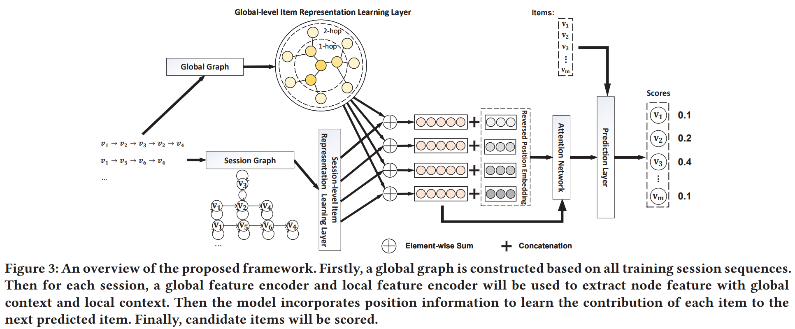

# Global Context Enhanced Graph Neural Networks for Session-based Recommendation

[1] Wang, Ziyang, Wei Wei, Gao Cong, Xiao-Li Li, Xian-Ling Mao, and Minghui Qiu. “Global Context Enhanced Graph Neural Networks for Session-Based Recommendation.” In Proceedings of the 43rd International ACM SIGIR Conference on Research and Development in Information Retrieval, 169–78. Virtual Event China: ACM, 2020. https://doi.org/10.1145/3397271.3401142.

https://github.com/CCIIPLab/GCE-GNN

# Abstract

Session-based recommendation (SBR) is a challenging task, which aims at recommending items based on anonymous behavior sequences. Almost all the existing solutions for SBR model user preference only based on the current session without exploiting the other sessions, which may contain both relevant and irrelevant item-transitions to the current session. This paper proposes a novel approach, called Global Context Enhanced Graph Neural Networks (GCE-GNN) to exploit item transitions over all sessions in a more subtle manner for better inferring the user preference of the current session. Specifically, GCE-GNN learns two levels of item embeddings from session graph and global graph, respectively: (i) Session graph, which is to learn the session-level item embedding by modeling pairwise item-transitions within the current session; and (ii) Global graph, which is to learn the global-level item embedding by modeling pairwise item-transitions over all sessions. In GCE-GNN, we propose a novel global-level item representation learning layer, which employs a session-aware attention mechanism to recursively incorporate the neighbors’ embeddings of each node on the global graph. We also design a session-level item representation learning layer, which employs a GNN on the session graph to learn session-level item embeddings within the current session. Moreover, GCE-GNN aggregates the learnt item representations in the two levels with a soft attention mechanism. Experiments on three benchmark datasets demonstrate that GCE-GNN outperforms the state-of-the-art methods consistently.

# Main Contributions

- 本文从 global-level 的层面考虑了所有会话间的项目转换的关系，学习了 global-level 的上下文信息
- 提出了一个统一的模型，利用了 session graph 和 global graph 两个图来捕获成对的项目转换信息
- 还提出了一个基于位置感知的注意力融合反转的位置信息来获得项目的嵌入

# Introduction

会话推荐是基于按时间顺序排列的匿名的行为序列来预测下一个感兴趣的项目。

以前的方法分为两类，一类是基于相似的（忽略了序列模式）一类是基于链式的（复杂度高）。面临的问题有，一些会话中会包含用户的很多选择甚至一些噪音点，其他的 SR-GNN 就是一些计算上的问题了，你把谁当成重要的。还有就是没有考虑会话间的关系，即其他会话对当前会话的影响。

如上图，session 2 作为当前的会话，可以明显看出是与电子产品有关的，所以其余的会话对其也有帮助，但是其余的会话里面也有噪音点，所以如何区分这些噪音点，并且还用到其余的会话信息是一个挑战。

## Session Graph Model

这个跟以前的方法是一样的，如图最上面所示把序列转换为图结构。不同的是作者对边定义了四种类型，也就是考虑了 i->j,j->i,i<->j,i->i 这样的关系

## Global Graph Model

主要是用来学习会话间的关系，基于所有的会话间的成对的项目交互，包含当前会话。其实也就是整个大图

先给了一个针对某个会话某个 item 的邻居的定义。其实看图我是没看太懂，他那个 $v_1$ 的邻居有 $v_5$，还有 $v_7$ 的邻居。不过代码的逻辑倒是很好懂，就是找 1-4 的邻居 ($\varepsilon = 2$)

$${\mathcal N}_{\varepsilon}(v_i^p) = \{v_j^q|v_i^p=v_{i'}^q\in S_p \cap S_q; v_j^p\in S_q; j\in [i'-\varepsilon, i'+\varepsilon]; S_p \neq S_q\}$$

$\varepsilon$ 这个参数控制了邻居的范围，所以如果太大也可以会产生一个长期的影响，当然会包含噪音点。建图的时候还考虑了边的权重，利用频率来表示。

# Model

## Global-level Item Representation Learning Layer

### Information Propagation

用一个注意力机制来区分邻居的不同重要性

$$h_{{\mathcal N}_{v_i}^g}=\sum_{v_j \in {\mathcal N}_{v_i}^g} \pi(v_i, v_j) h_{v_j}$$

不同邻居的重要性。这里设计的主要原因是：离得越近贡献越大

$$\pi(v_i, v_j)=q_1^T LeakyRelu(W_1[(s \odot h_{v_j} || w_{ij})])$$

$w_{ij} \in \mathbb{R}^1$ 是全局图中边的权重。

然后当前 session 的特征表示如下：

$$s=\frac{1}{|S|}\sum_{v_i \in S} h_{v_i}$$

归一化：

$$\pi(v_i, v_j)=\frac{exp(\pi(v_i, v_j))}{\sum_{v_k \in {\mathcal N}_{v_i}^g}exp(\pi(v_i, v_k))}$$

### Information Aggregation

$$h_v^g=relu(W_2[h_v||h_{\mathcal{N}_v^g}])$$

$${h_v^g}^{(k)}=agg({h_v}^{(k-1)}, {h_{\mathcal{N}_v^g}}^{(k-1)})$$

## Session-level Item Representation Learning Layer

$$e_{ij}=LeakyReLU(a_{r_{ij}}^T(h_{v_i} \odot h_{v_j}))$$

因为有四种关系，所以就训练四个权重向量。当然，并不是任何两个都有边，所以就只计算出现在图中的一阶邻居。

$$\alpha_{ij}=\frac{exp(LeakyReLU(a_{r_{ij}}^T(h_{v_i} \odot h_{v_j})))}{\sum_{v_k \in \mathcal{N}_{v_i}^s}exp(LeakyReLU(a_{r_{ik}}^T(h_{v_i} \odot h_{v_k})))}$$

然后这个小 session 的表示如下：

$$h_{v_i}^s=\sum_{v_j \in \mathcal{N}_{v_i}^s}\alpha_{ij}h_{v_j}$$

## Session Representation Learning Layer

合并上面的两个就可以了：

$${h_v^g}^{(k)}=dropout({h_v^g}^{(k)})$$

$$h_v'={h_v^g}^{(k)} + h_v^s$$

下面还是基于相近的共享直观上更大就同样的道理，不过这里用到了位置信息来记录。这里的位置信息是自己学习到的而不是经过什么sinx等变换得到的。 $P=[p_1,p_2,...,p_l]$

$$z_i=tanh(W_3[h_{v_i^s}'||p_{l-i+1}]+b_3)$$

这里提出了逆序位置，因为长度不一致。而且后面的越重要

最后 session 的表示如下：

$$s'=\frac{1}{l}\sum_{i=1}^{l}h_{v_i^s}'$$

然后学习对应的权重：

$$\beta_i=q_2^T\sigma(W_4z_i+W_5s'+b_4)$$

最后的话最终表示，不仅考虑了每个item的重要性，还考虑了序列的时间顺序：

$$S=\sum_{i=1}^{l}\beta_ih_{v_i^s}'$$

## Prediction Layer

$$\hat{y}_i=softmax(S^Th_{v_i})$$

# My Thoughts

- TKDE2019 [Personalizing Graph Neural Networks with Attention Mechanism for Session-based Recommendation](https://arxiv.org/abs/1910.08887) 那篇文章也考虑了本文章的重点考虑内容，也就是会话间的关系，可能都是同一时期的吧。当然方法还是不一样的
- 本文里面提出了全局的图和局部的小图就不错，然后考虑的一个比较重要的点就是后面的权重较大，而且注意力的应用都是一样的
- 本文里面提出的逆序位置也比较 interesting

# Conclusion

This paper studies the problem of session-based recommendation, which is a challenging task as the user identities and historical interactions are often unavailable due to privacy and data protection concern. It proposes a novel architecture for session-based recommendation based on graph neural network. Specifically, it first converts the session sequences into session graphs and construct a global graph. The local context information and global context information are subsequently combined to enhance the feature presentations of items. Finally, it incorporates the reversed position vector and session information to empower the proposed model to better learn the contribution of each item. Comprehensive experiments demonstrate that the proposed method significantly outperforms nine baselines over three benchmark datasets consistently.

@Author: Forrest Stone
@Email: ysbrilliant@163.com
@Github: https://github.com/Forrest-Stone
@Date: 2021-04-12 Monday 20:34:11
