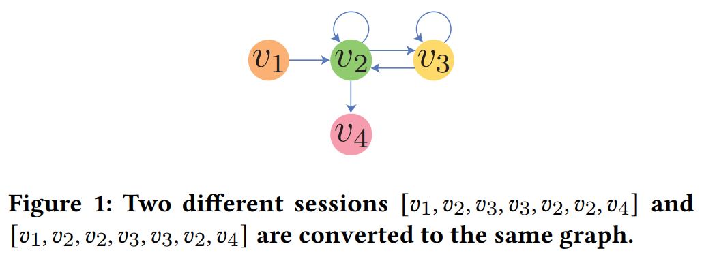
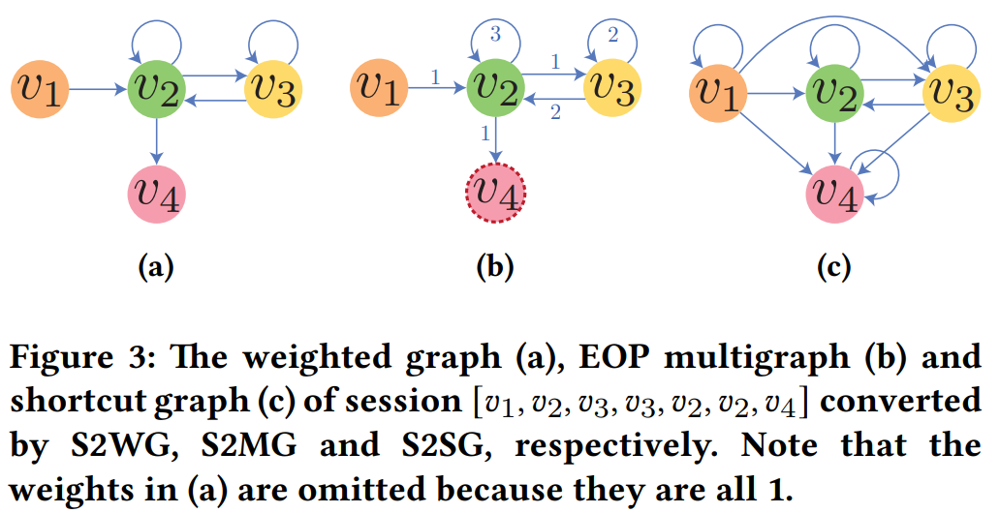
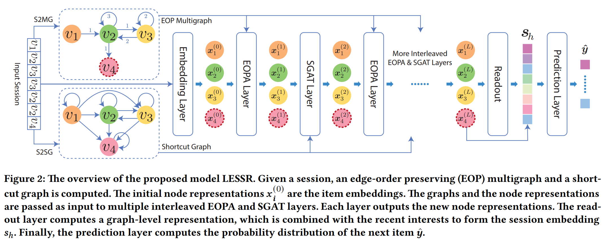

# Handling Information Loss of Graph Neural Networks for Session-based Recommendation

[1] Chen, Tianwen, and Raymond Chi-Wing Wong. “Handling Information Loss of Graph Neural Networks for Session-Based Recommendation.” In Proceedings of the 26th ACM SIGKDD International Conference on Knowledge Discovery & Data Mining, 1172–80. Virtual Event CA USA: ACM, 2020. https://doi.org/10.1145/3394486.3403170.

https://github.com/twchen/lessr

# Abstract

Recently, graph neural networks (GNNs) have gained increasing popularity due to their convincing performance in various applications. Many previous studies also attempted to apply GNNs to session-based recommendation and obtained promising results. However, we spot that there are two information loss problems in these GNN-based methods for session-based recommendation, namely the lossy session encoding problem and the ineffective long-range dependency capturing problem. The first problem is the lossy session encoding problem. Some sequential information about item transitions is ignored because of the lossy encoding from sessions to graphs and the permutation-invariant aggregation during message passing. The second problem is the ineffective long-range dependency capturing problem. Some long-range dependencies within sessions cannot be captured due to the limited number of layers. To solve the first problem, we propose a lossless encoding scheme and an edge-order preserving aggregation layer based on GRU that is dedicatedly designed to process the losslessly encoded graphs. To solve the second problem, we propose a shortcut graph attention layer that effectively captures long-range dependencies by propagating information along shortcut connections. By combining the two kinds of layers, we are able to build a model that does not have the information loss problems and outperforms the state-of-the-art models on three public datasets.

# Main Contributions

- 指出了当前 GNN 存在的信息缺失问题：一个是在得到 session 嵌入的时候会有信息损失，一个是不能捕获长期依赖不高效
- 针对 lossy session encoding 问题，提出了一个 edge-order 聚集层 (EOPA) 来无损压缩图结构
- 针对长期依赖的话，主要是体现在层数不能太多，提出了一个 shortcut 注意力层 (SGAT)

# Introduction

首先是对比了一下通常的 next-item 推荐和会话推荐的不一样。首先长度不一样，会话的话长度不一定，其他的话通常是固定的历史长度。其次，同一个会话里面的关联更大，也就是 intra-session dependence 的重要性更大于 inter-session dependence。所以，通用的 next-item 推荐可能会遭受组合不相关的 session 的问题以及提取不完整的会话的问题。也就是说，一般的你再生成序列的时候可能不是一个完整的会话，而且还考虑了不同会话间的关系。

lossy session emcoding：

首先要明白现有的方法都要先构图，一般是有向图，权重的话有些又有些无。主要是这个构图的过程引发了有损的编码，因为这个转换不是一一对应的，也就是说，根据构成的图并不能唯一确定一个序列。如下图，两个序列都建成同一个图，但是不能根据这个图重构出原始的序列。如果他们在数据集中的下一个 item 是不一样的话，就会出现问题

现有的多层 GNN 捕获多层邻居的方法经常会遭受 overfitting 和 over-smoothing 等问题。并且层数一般小于 3

# Model

## Converting Sessions to Graphs

S2G & S2WG：

- S2G：无权中的有向图
- S2WG：带权重的有向图，权重是边在会话中出现的次数

如上图，针对两个会话 $s_1=[v_1,v_2,v_3,v_3,v_2,v_2,v_4]$, $s2=[v_1,v_2,v_2,v_3,v_3,v_2,v_4]$ S2 和 S2WG 两种方法转换成图是一样的，如图 (a)，权重为 1 所以没有标注出来

### S2MG: Session to EOP Multigraph

为什么叫 multigraph，是因为定义了多种边。这个边的话表示这条转换出现的相对顺序，用一个整数表示，比如如果是 2，说明是第二次出现这个边。$s_1$ 的 S2MG 图如图 (b)。最后的 itme 也标注出来，图中用虚线表示。因为确定了最后一个 item，所以可以根据这个图重构出来原始的会话，所以是无损的

### S2SG: Session to Shortcut Graph

主要是增加了边和自环。这个增加的边是因为解决长期依赖，当这个边中间出现的是 item 的话就加边,它连接两个 item 而无需经历中间item。如图 (c)

### Our GNN Model: LESSR

#### Edge-Order Preserving Aggregation (EOPA) Layer

现有方法的话忽视了边的相对顺序，所以只适用于边的顺序信息是不太重要的情况和数据集。随意提出了这个层用 GRU 来聚合邻居的信息

用 ${OE}_{in}(i)=[(j_1,i),(j_2,i),...,(j_{d_i},i)]$ 来表示边的顺序列表，$d_i$ 是点 i 的入度。直接用整数表示的获取就可以了

从邻居聚集信息的过程如下：

$$agg_i^{(l)}=h_{d_i}^{(l)}$$

$$h_K^{(L)}={GRU}^{(l)}(f_{msg}^{(l)}(x_i^{(l)},x_{jk}^{(l)}),h_{k-1}^{(l)})$$

这里的 $\{{h_k^{(l)}: 0 \leq k \leq d_i}\}$ 表示的是 GRU 的隐藏状态，$f_{msg}^{(l)}$ 表示任何有效的消息函数从结点 $j_k$ 到结点 $i$。初始化 $h_0^{(l)}$ 初始化为零向量

将 GRU 结合起来如下：

$$x_i^{(l+1)}=W_{upd}^{(l)}(x_i^{(l)}||h_{d_i}^{(l)})$$
$$h_k^{(l)}=GRU^{(l)}(W_{msg}^{(l)}x_{jk}^{(l)},h_{k-1}^{(l)})$$

#### Shortcut Graph Attention (SGAT) Layer

过平滑指的是结点的表示会越来越相似。

聚合邻居用如下的注意力：

$$x_i^{(l+1)}=\sum_{(j,i) \in E_{in}(i)} \alpha_{ij}^{(l)}W_{val}^{(l)}x_j^{(l)}$$
$$\alpha_i^{(l)}=softmax(e_i^{(l)})$$
$$e_{ij}^{(l)}={(p^{(l)})}^T \sigma (W_{key}^{(l)}x_i^{(l)}+W_{qry}^{(l)}x_j^{(l)}+b^{(l)})$$

#### Stacking Multiple Layers

- 快捷方式图是原始会话的有损转换，因此连续堆叠多个SGAT层将引入有损会话编码问题。对于更多的SGAT层，此问题更加严重，因为信息丢失量不断累积。通过交错EOPA和SGAT层，丢失的信息可以保留在后续的EOPA层中，而SGAT层可以仅专注于捕获远程依赖关系。
- 交错两种类型的层的另一个优点是，每种类型的层都可以有效利用另一种类型的层所捕获的特征。由于EOPA层更能捕获本地上下文信息，而SGAT层更能捕获全局依赖关系，因此将两种层进行交织可以有效地结合两者的优势，并提高模型学习更复杂依赖关系的能力

为了进一步促进特征复用，引入了密集连接。原先的当前层输入只有前一层的信息，这里当前层的输入为之前所有层的输入（拼接）：

$$\{x_i^{(0)}||x_i^{(1)}||...||x_i^{(l-1)}:i \in V\}$$

#### Generating Session Embedding

当前会话的全局兴趣如下：

$$h_G=\sum_{i \in V} \beta_i x_i^{(L)}$$
$$\beta=softmax(\epsilon)$$
$$\epsilon_i=q^T \sigma(W_1x_i^{(L)}+W_2x_{last}^{(L)}+r)$$

加上局部的兴趣，也就是用最后一个拼接：

$$s_h=W_h(s_g||s_l)$$

这里的 $s_g=h_G$, $s_l=x_{last}^{(L)}$

#### Prediction and Training

$$z_i=s_h^Tv_i$$
$$\hat{y}_i=\frac{exp(z_i)}{\sum_{j \in I}exp(z_j)}$$

# My Thoughts

- 本文提出的一些视角还是不错的，以前根本没有考虑过这些方面。不过这个是针对于构图的时候合并相同结点来说的，可以解决重复推荐的问题？想法很好，包括里面一些概念的解释也帮助我从不同的角度理解了
- 不过美中不足，其实论文有一些些难懂特别是 GRU 那一块我咋感觉看的不是很明白，实验效果的话其实感觉也没提升很大，不过问题角度挺好

# Conclusion

In this paper, we identify two information loss problems in the existing GNN models for session-based recommendation, namely the lossy session encoding and the ineffective long-range dependency capturing problems. To solve the two problems, we propose the EOPA and the SGAT layers, which rely on the two conversion methods that convert sessions to graphs, including S2MG and S2SG. By combining the two kinds of layers, we build a model called LESSR that does not have the two information loss problems and the experimental results show that LESSR outperforms state-of-the-art methods on three public datasets. For future work, we are interested in applying LESSR to personalized and streaming session-based recommendation.

@Author: Forrest Stone
@Email: ysbrilliant@163.com
@Github: https://github.com/Forrest-Stone
@Date: 2021-05-29 Saturday 20:38:52
