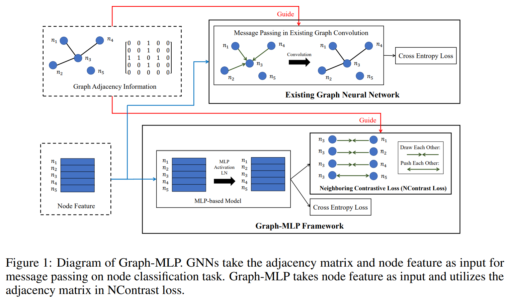
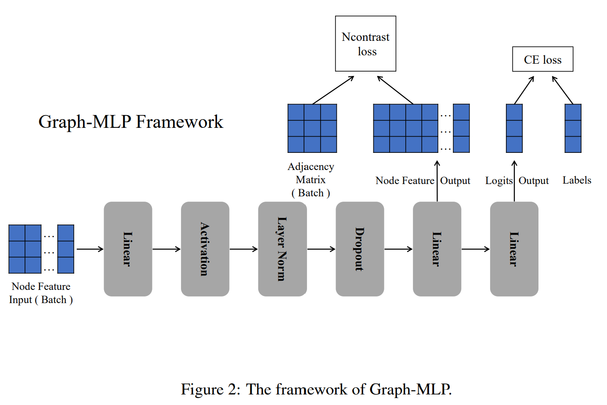
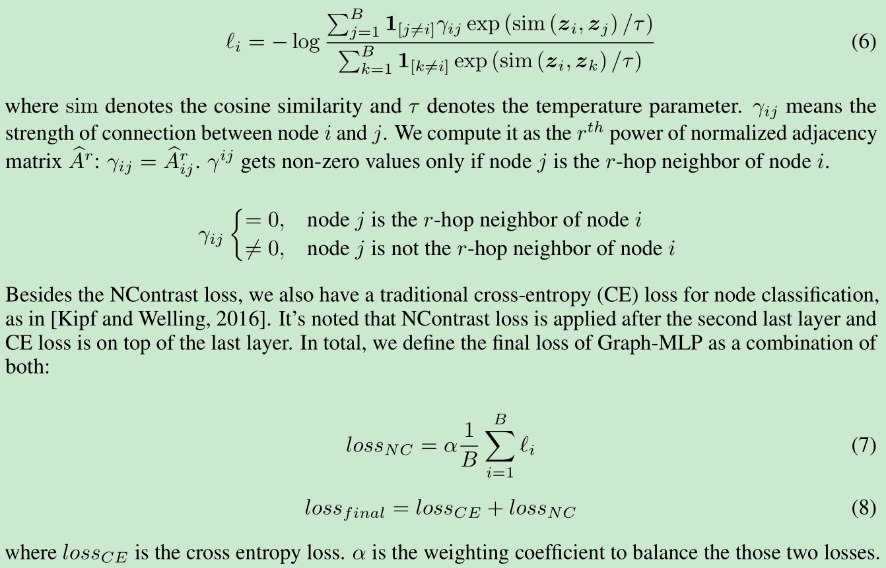
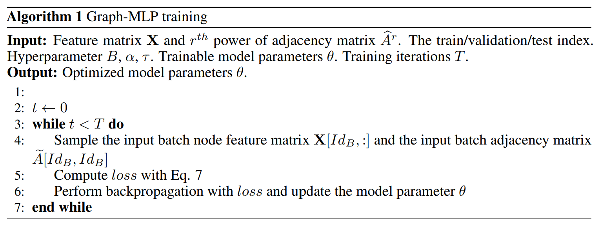

# Graph-MLP: Node Classification without Message Passing in Graph

[1] Hu, Yang, Haoxuan You, Zhecan Wang, Zhicheng Wang, Erjin Zhou, and Yue Gao. “Graph-MLP: Node Classification without Message Passing in Graph.” ArXiv:2106.04051 [Cs], June 7, 2021. http://arxiv.org/abs/2106.04051.

 https://github.com/yanghu819/Graph-MLP

# Abstract

Graph Neural Network (GNN) has been demonstrated its effectiveness in dealing with non-Euclidean structural data. Both spatial-based and spectral-based GNNs are relying on adjacency matrix to guide message passing among neighbors during feature aggregation. Recent works have mainly focused on powerful message passing modules, however, in this paper, we show that none of the message passing modules is necessary. Instead, we propose a pure multilayer-perceptron-based framework, Graph-MLP with the supervision signal leveraging graph structure, which is sufficient for learning discriminative node representation. In model-level, Graph-MLP only includes multi-layer perceptrons, activation function, and layer normalization. In the loss level, we design a neighboring contrastive (NContrast) loss to bridge the gap between GNNs and MLPs by utilizing the adjacency information implicitly. This design allows our model to be lighter and more robust when facing large-scale graph data and corrupted adjacency information. Extensive experiments prove that even without adjacency information in testing phase, our framework can still reach comparable and even superior performance against the state-of-the-art models in the graph node classification task.

# Motivation

- 作者认为基于谱域以及基于空间的 GNN 的方法在特征聚合的时候利用邻接矩阵去传递消息是不必要的
- 实验证明，为什么不必要。去掉效果一样好

# Main Contributions

- 提出了一个简单的没有消息传递的基于 MLP 的 GNN 模块。这是第一个没有显式消息传递模块的深度学习架构用于图节点分类任务。
- 一个先进的邻居对比损失函数来隐式的结合图结构和节点表示
- 实验效果比现在好或者相当，并且效率高；并且在残缺的邻居矩阵上也具有很好的鲁棒性

# Introduction

整个 Graph-MLP 的图表如下所示：

Graph-MLP 隐式地使用来自节点连接信息的监督信号来指导基于纯 MLP 的模型进行图节点分类。包含线性层与激活函数、归一化层和 dropout 层相结合。提出了一种新的相邻对比（NContrast）损失来隐式地将图结构合并到特征转换中。更具体地说，对于每个节点，其 i-hop 邻居被视为正样本，其他未连接的节点被视为负样本。所选节点与正/负节点之间的距离将拉近/推得更近/更远。

好处：
- 通过绕过前馈传播中的消息传递来提高计算效率
- 推理过程中对损坏边的鲁棒性：在实际应用中，经常会发生一些新样本没有连接到现有图中的任何节点，例如 “一个新的社交网络平台用户到推荐系统”。有时，收集的连接信息中可能会有一些噪音。然后，由于空置或噪声邻接信息，传统的 GNN 无法提供推荐。但是 Graph-MLP 框架的推理阶段不需要邻接连接。因为我们的 Ncontrast 损失允许 Graph-MLP 学习结构感知节点的特征转换。因此，尽管用户节点缺少连接，Graph-MLP 仍然可以提供相关的建议。

# Model

## MLP-based Structure

有三层：

- 第一层就是常用的 Linear-Activation-Layer Normalization-Dropout 这样的
- 第二层是为了用来计算 NContrast 的，对应下面的 $\mathbf{Z}$
- 第三层是为了计算节点分类的 loss 的，对应下面的 $\mathbf{Y}$

$$\mathbf{X}^{(1)}=Dropout(LN(\sigma(\mathbf{X}W^0)))$$
$$\mathbf{Z}=\mathbf{X}^{(1)}W^1$$
$$\mathbf{Y}=\mathbf{Z}W^2$$

## Neighbouring Contrastive Loss

为了使用图连接信息进行特征提取，直观上连接的节点应该彼此相似，未连接的节点应该在特征空间中远离。这与对比学习中的想法非常吻合。出于这样的动机，提出了一种 Neighboring Contrastive loss，它使基于 MLP 的模型能够在没有显式消息传递模块的情况下学习图节点连接。

对于每个点，他的 i-hop 邻居被认为是正样本，其余的节点被认为是负样本。根据上面的分析，针对正样本将会和目标节点更相近，反之负样本则更远。

所以第 i 个结点的 NContrast 损失如下：

## Training

前面那个 B 参数是随机采样的。如果没有正样本呢，就移除掉这个节点的 loss

## Inference

在推理过程中，传统的图形建模，例如 GNN 需要邻接矩阵和节点特征作为输入。不同的是，我们基于 MLP 的方法只需要节点特征作为输入。因此，当邻接信息被破坏或丢失时，Graph-MLP 仍然可以提供一致可靠的结果。在传统的图建模中，图信息嵌入在输入的邻接矩阵中。对于这些模型，图节点转换的学习在很大程度上依赖于内部消息传递，这对每个邻接矩阵输入中的连接很敏感。但是，我们对图形结构的监督应用于损失级别。因此，我们的框架能够在节点特征转换期间学习图结构分布，而无需前馈消息传递。这允许我们的模型在推理过程中对特定连接不那么敏感。

# My Thoughts

- 很早就关注这个论文了，但是各大公众号都有，现在才看，貌似还没被接受？https://zhuanlan.zhihu.com/p/385848111
- 论文很简单，想法也很新颖吗？感觉说第一应该有点不妥，我看知乎上的评论貌似也有以前类似的工作？
- 感觉实验对比的还挺少的，而且这样的想法确实很考验写作功底，看如何说了。其实论文还有很多需要推敲的地方，比如负样本没有为什么要去掉等等，，，
- 本来自己也关注这一块，文章提出的 loss 还是想法很不错的，GNN 确实在很多任务上其实有点类似于大材小用的效果，可能真正的实力还没发挥出，或者是就是不适合某些问题？这个需要继续研究了
- 这篇博客作者给了一点点证明的想法，https://zhuanlan.zhihu.com/p/385848111

# Conclusion

In this paper, we propose a novel MLP-based method, Graph-MLP for learning graph node feature distribution. Despite its light structure, to our best knowledge, it is the first deep learning framework to effectively perform graph node classification task without explicit message passing modules. For further supervising our model in term of learning graph node transformation, we propose the NContrast loss to enable learning the structural node distribution without explicit referencing to graph connections i.e. adjacency matrix in feedforward. This flexibility in learning contextual knowledge without the message passing modules enables our mode to inference with even corrupted edge information. Our extensive experiments showcase that Graph-MLP is able to deliver comparable and even superior results against the state-of-the-art in node classification tasks with a much simpler and
lighter structure.

@Author: Forrest Stone
@Email: ysbrilliant@163.com
@Github: https://github.com/Forrest-Stone
@Date: 2021-07-26 Monday 21:15:38
