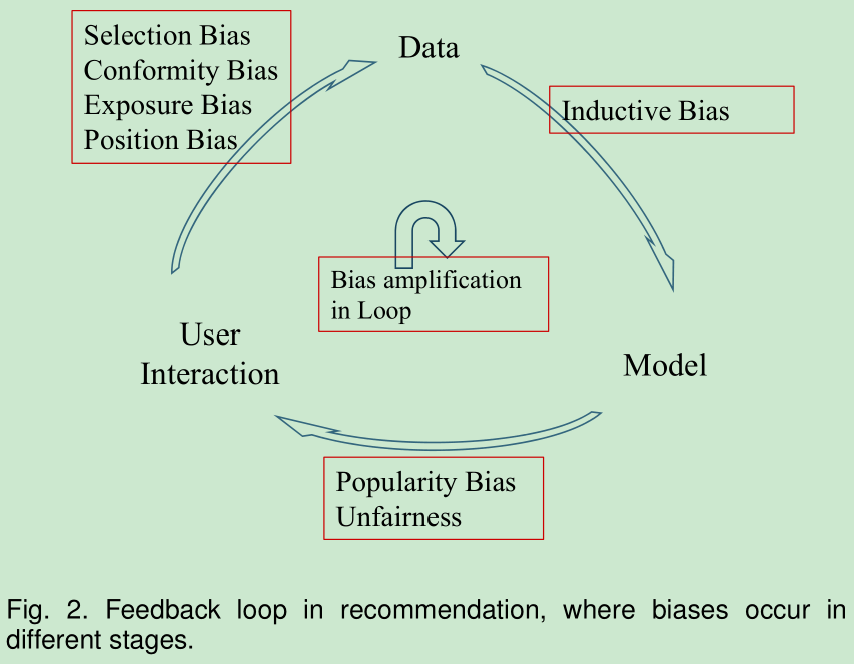
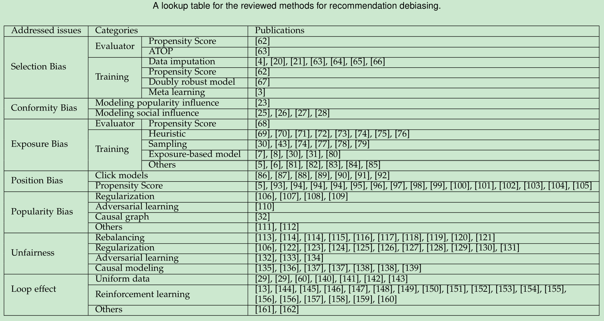
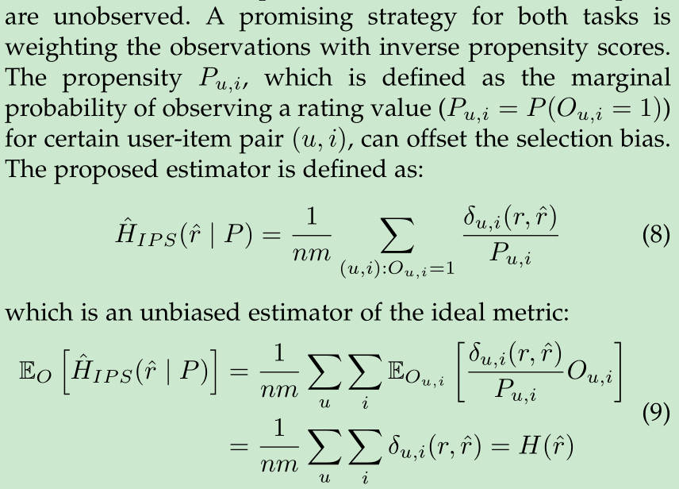
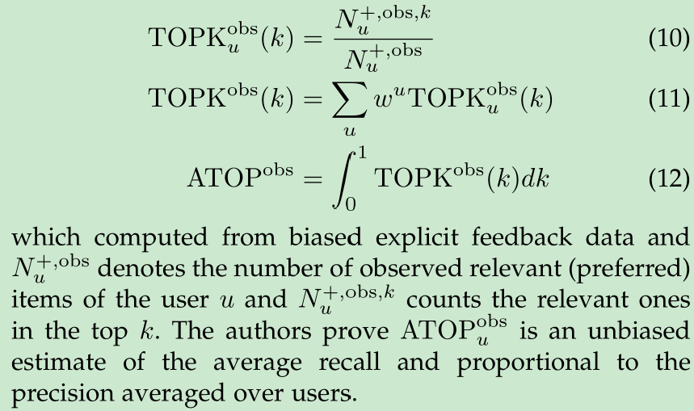
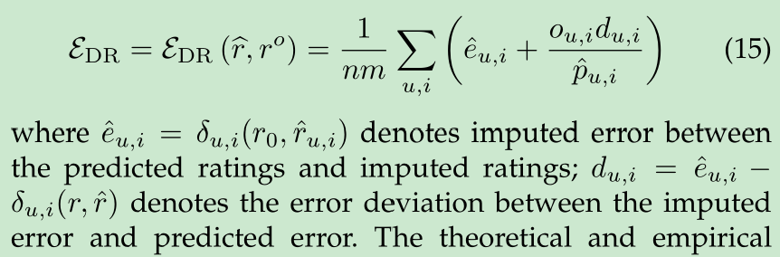
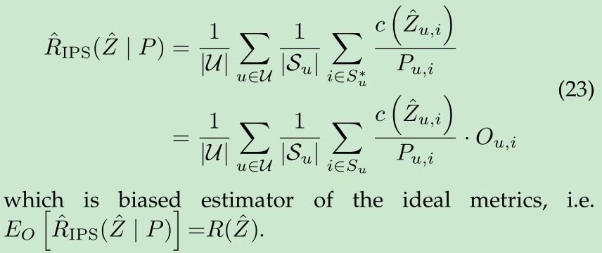
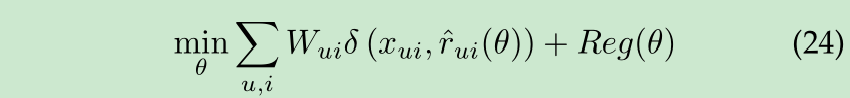
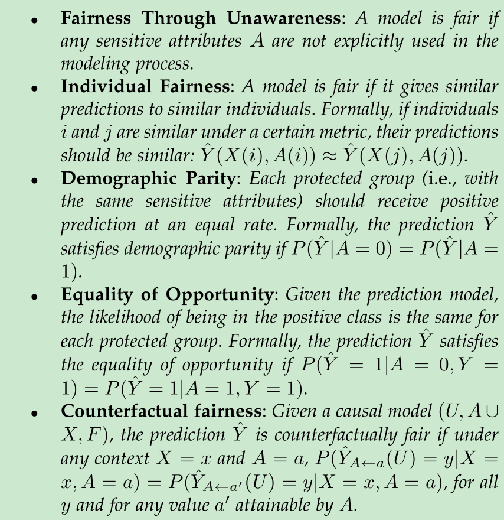
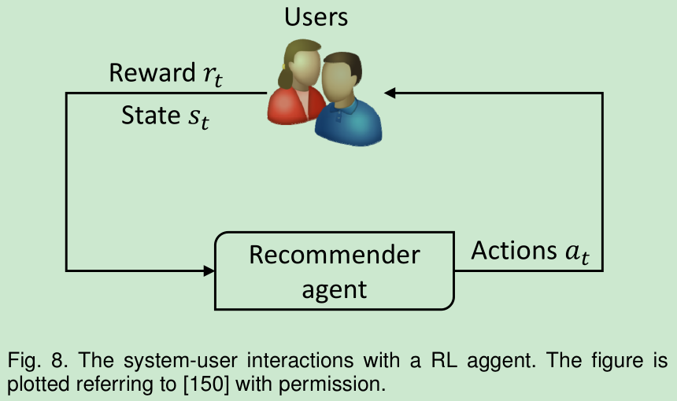

# Bias and Debias in Recommender System: A Survey and Future Directions

[1] Chen, Jiawei, Hande Dong, Xiang Wang, Fuli Feng, Meng Wang, and Xiangnan He. “Bias and Debias in Recommender System: A Survey and Future Directions.” ArXiv:2010.03240 [Cs], October 7, 2020. http://arxiv.org/abs/2010.03240.

# Abstract

While recent years have witnessed a rapid growth of research papers on recommender system (RS), most of the papers focus on inventing machine learning models to better fit user behavior data. However, user behavior data is observational rather than experimental. This makes various biases widely exist in the data, including but not limited to selection bias, position bias, exposure bias, and popularity bias. Blindly fitting the data without considering the inherent biases will result in many serious issues, e.g., the discrepancy between offline evaluation and online metrics, hurting user satisfaction and trust on the recommendation service, etc. To transform the large volume of research models into practical improvements, it is highly urgent to explore the impacts of the biases and perform debiasing when necessary. When reviewing the papers that consider biases in RS, we find that, to our surprise, the studies are rather fragmented and lack a systematic organization. The terminology “bias” is widely used in the literature, but its definition is usually vague and even inconsistent across papers. This motivates us to provide a systematic survey of existing work on RS biases. In this paper, we first summarize seven types of biases in recommendation, along with their definitions and characteristics. We then provide a taxonomy to position and organize the existing work on recommendation debiasing. Finally, we identify some open challenges and envision some future directions, with the hope of inspiring more research work on this important yet less investigated topic.

# Motivation

- 用户行为数据是观察性的而不是实验性的。导致数据中存在很多的偏差。
- 现有的定义包括研究都是很分散的没有体系

# Main Contributions

- 总结论推荐系统中的七种偏置，并提供了定义和特点
- 总结了现在有的推荐系统中的去偏差的方法并分类
- 研究现有挑战并讨论未来的方向

# Introduction

推荐系统中偏差广泛存在
- 推荐模型训练用的用户行为数据是观察性的而不是实验性的。主要原因是用户根据暴露的物品产生行为，使得观察数据被系统的暴露机制和用户的自我选择所混淆。
- 项目或者用户在数据中表现得不同。例如，某些项目比其他项目更受欢迎，因此会收到更多的用户行为。因此，这些热门项目会对模型训练产生更大的影响，从而使推荐偏向于它们。同样的情况也适用于用户端。
- 推荐系统的一种性质是反馈循环。其曝光机制决定了用户行为，这些行为又被作为推荐系统的训练数据。这种反馈循环不仅会产生偏见，而且会随着时间的推移加剧偏见，导致 “富人更富” 的马太效应。

# Feedback Loop in Recommendation

将推荐的生命周期分为三个主要组件，如下图：

- User->Data：从用户收集数据的阶段。包含隐式反馈数据和显式反馈数据
- Data->Model：用收集的数据训练推荐模型，从用户历史行为数据学习用户的偏好
- Model->User：给用户推荐结果，将会影响用户未来的选择和决定

# Bias in Recommendation

## Bias in Data

### Bias in explicit feedback data

- Selection Bias. 选择偏差是因为用户可以自由选择要评分的项目，因此观察到的评分不是所有评分的代表性样本。换句话说，评级数据通常不是随机丢失的（MNAR）。
  - 用户往往喜欢倾向于给他们喜欢的项目评分
  - 用户尤其喜欢评分非常好或者非常差的项目
- Conformity Bias. 从众偏差的发生是因为用户倾向于与组中的其他人评分相似，即使这样做与他们自己的判断背道而驰，使得评分值并不总是表示用户的真实偏好。

### Bias in implicit feedback data

- Exposure Bias. 暴露偏差发生是因为用户只能接触到一部分的特定项目，因此未观察到的交互并不总是代表负面偏好。

未被观测的交互可能有两个原因：
- 项目不是用户感兴趣的
- 用户不知道这个项目

因此对于未观察到的数据很容易导致歧义，无法区分真正的负面互动（例如暴露但不感兴趣）和潜在的正面互动（例如未暴露）。

可以细分为：
  - previous mode bias. 暴露受先前推荐系统策略的影响，该系统控制要显示的项目。
  - selection bias. 用户会搜索查找感兴趣的，用户的选择也是一种曝光，让更相关的项目更容易被曝光
  - 用户的背景信息也会影响项目的曝光，比如社交朋友，所属社区以及地理位置等
  - popularity bias. 流行的项目更容易被用户看到

- Position Bias. 位置偏差是因为用户倾向于与推荐列表中较高位置的项目进行交互，而不管项目的实际相关性如何，因此交互的项目可能不是高度相关的。

## Bias in Model

偏置也不一定是有害的，事实上，在模型设计中故意添加了一些归纳偏置，以实现一些理想的特性。

- Inductive Bias. 归纳偏差表示模型为更好地学习目标函数和泛化训练数据而做出的假设。

将预测泛化到看不见的例子的能力是机器学习的核心。如果没有对数据或模型的假设，则无法实现泛化，因为看不见的示例可能具有任意的输出空间。同样，构建 RS 需要对目标函数的性质添加一些假设。除了目标函数，在其他方面也加入了归纳偏置。一个例子是自适应负采样器，其目的是对 “困难” 实例进行过采样以提高学习速度，即使最终的损失函数和原来的不一样。另一个例子是离散排序模型，它将用户和项目作为二进制代码嵌入以提高推荐效率，这是以牺牲表示能力为代价的。

## Bias and Unfairness in Results

- Popularity Bias. 热门商品的推荐频率甚至超过其受欢迎程度。

长尾现象：在大多数情况下，一小部分热门项目占了用户交互的大部分。

忽视流行偏置导致的问题：
- 它降低了个性化的水平并损害了偶然性。特别是对于小众用户而言
- 它降低了推荐结果的公平性。受欢迎的商品并不总是高质量的。过度推荐热门物品即使是很好的匹配也会降低其他物品的知名度，这是不公平的。
- 流行偏差会进一步增加流行物品的曝光机会，使流行物品更受欢迎。为未来训练收集的数据变得更加不平衡，产生所谓的 “马太效应” 问题。

- Unfairness. 该系统系统地和不公平地歧视某些个人或个人群体以利于其他人。

基于种族、性别、年龄、教育水平或财富等属性，不同的用户群体通常在数据中的代表是不平等的。在对此类不平衡数据进行训练时，模型极有可能学习这些代表性过高的群体，在排名结果中加强它们，并可能导致系统性歧视并降低弱势群体的可见性（例如，代表性不足的少数群体、种族或性别刻板印象）。例如，男性和女生所看到的工作推荐不一样。类似地，社交图中的朋友推荐可能会强化对多数人的历史偏见，并防止少数人成为具有高影响力的社会影响者。

## Feedback Loop Amplifies Biases

不同阶段发生的偏差可能会随着时间的推移沿着循环进一步加剧。以位置偏差为例，顶级项目通常受益于更大的流量，这反过来又增加了它们的排名突出和它们收到的流量，从而导致了富人变富的场景。这些放大的偏差也会降低多样性并加剧用户的同质化，从而增加所谓的 “回声室” 或 “过滤气泡”。

# Debias Methods

## Methods for Selection Bias

观察到的评分数据并不是所有评分的代表性样本

### Debiasing in evaluation

这几种都是对有偏的训练好的模型进行评价

- Propensity Score. 使用逆序倾向得分，其实就是一个概率值

- ATOP. 基于以下假设：在观察到的数据中随机缺少相关（高）评级值；关于其他评级值，我们允许任意缺失的数据机制，只要它们缺少比相关评级值更高的概率。

缺点：只有真正的倾向可见时，才能保证 IPS 的估计器无偏。如果未正确指向倾向性，IPS 估算器仍将有偏。仅当两个假设保持时，才能保证 ATOP 的无偏。在实践中，丢失的机制通常很复杂，假设并不总是有效的。

### Debiasing in model training

- Data imputation. 数据的缺失值处理。考虑两个任务：评级预测任务（用户给出的评级值）和缺少数据预测任务（用户选择哪个项目去评分）。性能不好，因为缺失值的处理

- Propensity score. 倾向得分。跟以前一样，不过会导致高方差的影响，特别是当项目的流行度或者用户的火哦的那个有倾斜的时候。

- Doubly robust model.

仍然需要相对准确的倾向分数或归纳数据，这通常很难指定。

- Meta Learning. 首先使用两个特定的推荐模型预先列出两个预测器（A1，A2），以产生具有伪额定值的可靠数据集，然后在伪额定值上培训目标推荐模型 A0。取决于预训练的预测器 A2 的质量。

## Methods for Conformity Bias

- 考虑用户评级符合公众意见。
- 将用户的评级值视为用户偏好和社会影响的合成结果。

## Methods for Exposure Bias

当用户仅暴露于项目的一部分时，发生曝光偏差，以至于未观察到的交互数据并不总是意味着负信号。

### Debiasing in evaluation

跟前面介绍的一样的原理，只是对应解决的问题是每个观察

### Debiasing in model training

将所有未观测到的交互都看成是负样本，并分配信心。

信心 $W_{ui}$ 的权重分为下面三类：

- Heuristic. 自己根据阈值或者计算设定，计算太大参数太多，粗粒度的效果又不好
- Sampling. 采样策略确定哪些数据用于更新参数以及频率，从而缩放数据贡献。
- Exposure-based model. 捕获用户对项目暴露的可能性。
- Others. 特定问题特定对待

## Methods for Position Bias

排名在前面的项目更可能被选择尽管相关性可能不太大

### Click models

- 通过优化观察点击的可能性来制定关于用户浏览行为的假设，并估计真正的相关反馈。
- 另一种级联模型。聚合单击单个查询会话中的咔嗒声并跳过单个模型。假设用户从第一个到最后一个检查项目，然后单击取决于上面显示的所有项目的相关性。

### Propensity score

仅仅跟位置有关，可以将结果随机化，但是效果会下降也会影响用户的体验。

## Methods for Popularity Bias

- Regularization. 不多说，针对流行项目处理正则化
- Adversarial learning. 基本思想是在推荐者 G 和介绍的对手 D 之间演奏 MIN-MAX 博弈，因此 D 赋予了改善利基项目的推荐机会的信号。
- Causal graph. 反事实推理。
- Others. 利用社交关系，重排序等

## Methods for Unfairness

主要是考虑了敏感因素

### Fairness Formulations

$A$：敏感属性，或被保护的属性
$X$：其他的观察到的属性
$U$：未观察到的属性
$Y$: 要被预测的真实值

通常简单起见，$A$ 用二进制属性编码

### Rebalancing

灵感来自过去用于解决类别不平衡问题的策略，一个常见的范例是平衡数据或推荐结果，关于某些公平目标如人口统计学。这种重新平衡数据的想法在公平游戏排名中普遍存在，在那里公平约束可以以各种形式表示。

### Regularization

正则化线的基本思想是将公平标准作为符号器制定，以指导模型的优化。根据定义的那几个规则去定义正则化的函数

### Adversarial Learning

对抗性学习路线的目的是获得公平，作为公平代表的副作用。其基本思想是在预测模型和对手模型之间进行极小极大博弈，其中对手试图从数据表示中预测敏感属性，因此最小化对手的性能就是删除表示中与敏感属性相关的信息。

### Causal Modeling

通常，公平地被制定为敏感属性的因果效果，这是通过在因果图中应用反事实干预来评估的。

## Methods for Mitigating Loop Effect

### Uniform data.

要收集统一数据，这种方法通过使用随机日志记录策略而不是正常推荐策略进行干预。也就是说，对于每个用户，它们不使用推荐模型进行物品传递，而是随机选择某些项目并以统一分布对它们进行排序。会影响用户体验，选择那些小数据也是一个挑战。

### Reinforcement learning

推荐系统中存在探索-开发困境，其中开发是推荐预测最佳匹配用户偏好的项目，而探索是随机推荐项目以收集更多无偏见的用户反馈以更好地捕获用户偏好。RL可以平衡开发和探索之间的竞争，并最大限度地利用系统的长期满意度。但是如何评价一个策略是一个挑战。

# Future work

## Evaluation of Propensity Scores

只有在正确指定倾向分数时，才能保证IPS策略的有效性和无偏见。如何获得适当的倾向分数仍然是一个重要的研究问题。

## General Debiasing Framework

在现实世界中，各种偏见通常同时发生。例如，用户通常对他们喜欢的项目进行评分，并且其评级值受公众意见的影响，其中符合性偏置和选择偏差在收集的数据中混合。此外，额定用户项目对的分布通常倾向于流行项目或特定用户组，使得推荐结果容易遭受普及偏见和不公平。必须需要推荐系统需要一般的脱叠框架来处理偏差的混合。

## Better Evaluation

现有方法需要准确的倾向分数或依赖于相当数量的无偏见数据。然而，前者的准确性不能保证，而后者伤害了用户体验，并且通常受到在线交通的非常小的百分比。 统一数据提供金标准的无偏见信息，但其小规模使其由于高方差而不足以彻底评估推荐模型。使用大规模偏置数据和小型无偏的数据探索新的评估方式将是一个有趣的方向。

## Knowlege-enhanced Debiasing

利用丰富的辅助信息是自然的，可以提高去偏的功效。有趣的方向是如何更好地利用这种辅助信息，因为该属性不是被隔绝的，而是彼此连接形成知识图。知识图表捕获了更丰富的信息，这对于了解数据偏差有用。知识图的另一个优点是其一般性。每个类型的所有数据，数据源和数据库都可以由知识图表表示和操作。

## Explanation and Reasoning with Causal Graph

因果图用于从数据中阐明潜在的因果关系，从知识和数据的组合导出因果关系，预测动作的影响，以及评估观察到的事件和场景的解释。一方面，除偏的关键是推荐，原因和影响推荐模型或数据。在因果图中，大多数偏差都可以用温和的引起假设和额外的混杂因子理解。偏见的效果也可以通过图表中的随意路径推断出来。另一方面，推荐通常被认为是类似于用特定药物治疗患者的干预，需要进行反事实推理。

## Dynamic Bias

在现实世界中，偏见通常是动态而不是静态。探讨偏见如何发展和分析动态偏差如何影响推荐，这将是有趣和有价值的。

## Fairness-Accuracy Trade-off

准确性和公平性之间的权衡在推荐方案中具有重要意义，敏感属性来牺牲推荐性能。确定特定的不公平问题；仔细定义公平标准，以涵盖各种用例；设计一些可控方法，可以控制公平性和准确性之间的权衡。

# My Thoughts

- 这是在知乎上偶然看到的这篇文章，其实是一个博客里面说让看看推荐系统里面的偏置和除偏的方法，找工作有用。确实以前没关注过这方面的问题，不过总结的不错，但是总感觉少了点什么又说不上来。
- 不知道是不是看这篇论文，感觉这几天讨论都往偏置上跑了。不过也确实是，有意思

# Conclusion

In this article, with reviewing more than 140 papers, we systematically summarize the seven kinds of biases in recommendation, along with providing their definitions and characteristics. We further devise a taxonomy to organize and position existing debiasing approaches. We list some open problems and research topics worth to be further explored. We hope this survey can benefit the researchers and practitioners who are keen to understand the biases in recommendation and inspire more research work in this area.

@Author: Forrest Stone
@Email: ysbrilliant@163.com
@Github: https://github.com/Forrest-Stone
@Date: 2021-08-25 Wednesday 10:37:22
