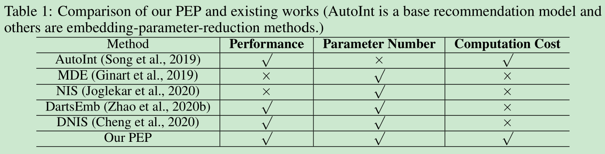
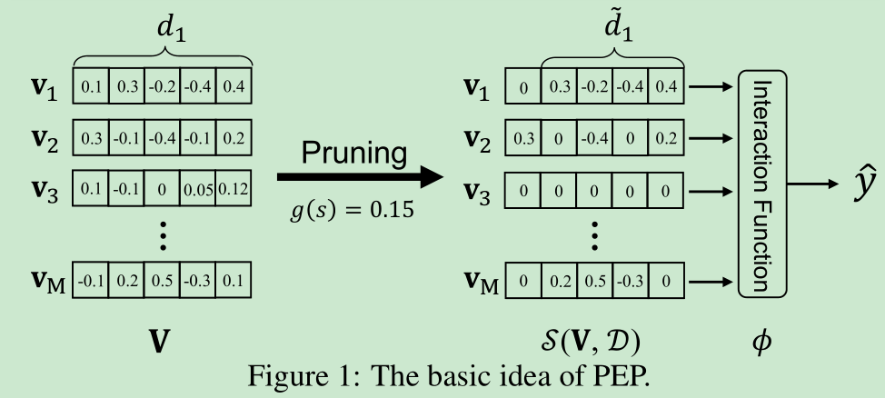
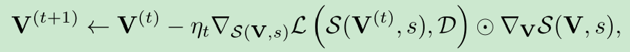
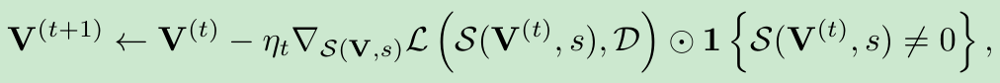
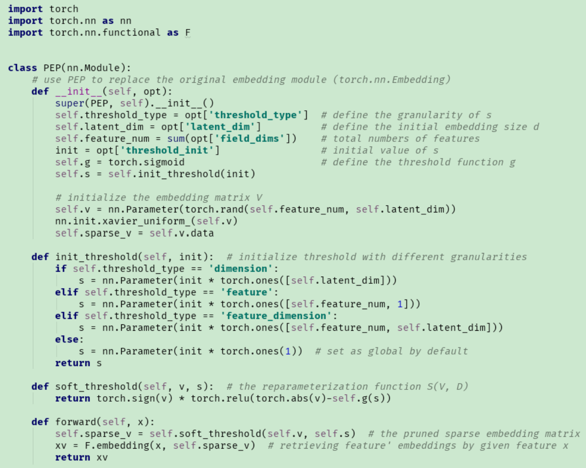

# Learnable Embedding Sizes for Recommender Systems

[1] Liu, Siyi, Chen Gao, Yihong Chen, Depeng Jin, and Yong Li. “Learnable Embedding Sizes for Recommender Systems.” ArXiv:2101.07577 [Cs], March 11, 2021. http://arxiv.org/abs/2101.07577.

 https://github.com/ssui-liu/learnable-embed-sizes-for-RecSys

[2] Frankle, Jonathan, and Michael Carbin. “THE LOTTERY TICKET HYPOTHESIS: FINDING SPARSE, TRAINABLE NEURAL NETWORKS,” 2019, 42.

# Abstract

The embedding-based representation learning is commonly used in deep learning recommendation models to map the raw sparse features to dense vectors. The traditional embedding manner that assigns a uniform size to all features has two issues. First, the numerous features inevitably lead to a gigantic embedding table that causes a high memory usage cost. Second, it is likely to cause the over-fitting problem for those features that do not require too large representation capacity. Existing works that try to address the problem always cause a significant drop in recommendation performance or suffer from the limitation of unaffordable training time cost. In this paper, we propose a novel approach, named PEP1 (short for Plug-in Embedding Pruning), to reduce the size of the embedding table while avoiding the drop of recommendation accuracy. PEP prunes embedding parameter where the pruning threshold(s) can be adaptively learned from data. Therefore we can automatically obtain a mixed-dimension embedding-scheme by pruning redundant parameters for each feature. PEP is a general framework that can plug in various base recommendation models. Extensive experiments demonstrate it can efficiently cut down embedding parameters and boost the base model’s performance. Specifically, it achieves strong recommendation performance while reducing 97-99% parameters. As for the computation cost, PEP only brings an additional 20-30% time cost compared with base models.

# Motivation

- 以前固定大小的特征嵌入面临的问题是：一是巨大的内存消耗，二是有些特征不需要很多的参数所以可能会引起过拟合的问题
- 主要的出发点是在嵌入表的大小和推荐性能之间达到一个平衡。

# Main Contributions

- 以前的方法是为每个特征的嵌入大小分配固定的值，而本文是通过可学习的剪枝操作为每个特征设定不同的嵌入大小
- 本文提出的 PEP（Plug-in Embedding Pruning）方法可以任意嵌入到其他的推荐模型中去，是一个通用的框架

# Introduction

嵌入表示学习将稀疏的分类特征映射为低维的实值稠密特征向量，来提取用户的偏好胡总和项目的特征。最重要的是这个嵌入表的设计，因为嵌入表的包含大量的参数，并且比较消耗内存。嵌入表的规模限制着模型的效率。此外，统一大小的嵌入特征可能很难处理不同特征之间的异质性，比如某些特征更稀疏，并且分配很大的嵌入大小会导致过拟合的问题。以上导致学习的模型经常是次优的。

现有的处理方法：

- 联系紧密的特征共享一部分特征。限制是工程师需要仔细设计参数共享的比例，来平衡精度和成本，其次是无法找到冗余的部分，性能不太好
- 人为设计规则分配为不同特征分配不同的嵌入大小或者神经架构搜等，计算成本太高，太耗时耗力

论文的处理方法：

- 设计灵活的嵌入大小，根据梯度下降和嵌入参数联合训练学习阈值，这里的阈值可以自动确定参数的重要性，小于阈值的元素被裁剪
- 利用 LTH 重新训练模型保证比较好的效果
- 模型只需要运行一次就可以获得多个内存高效的嵌入矩阵

比较如下：

# Model

## Problem Formulation

推荐模型将用户和物品的属性的组合作为它的输入向量 $x$:

$$\mathbf{x}=[\mathbf{x}_1;\mathbf{x}_2;...;\mathbf{x}_M]$$

$M$ 表示特征域的数量，$x_i$ 是第 $i$ 个域的特征表示（通常用 one-hot 编码表示）。然后对于 $x_i$，模型对应的嵌入表示如下：

$$\mathbf{v}_i=\mathbf{V}_i\mathbf{x}_i$$

$V_i \in \mathcal{R}^{n_i \times d}$ 是第 $i$ 个域的嵌入矩阵，$n_i$ 是第 $i$ 个域的特征数量，$d$ 表示嵌入维度。

$$V_i=\{V_1, V_2,..., V_n\}$$

模型的预测如下：

$$\hat{y}=\phi(x|V, \Theta)$$

最小化损失如下：

$$min \mathcal{L}(V, \Theta, \mathcal{D})$$

$\mathcal{D}=\{x,y\}$ 是喂入模型的数据，通过最大化似然函数交叉熵优化模型

## Learnable Embedding Sizes through Pruning

如上图，论文的目的就是将 $V_i$ 的嵌入大小降低，也就是将每个特征固定大小的 $d_i$ 变为不同大小的 $\hat{d}_i$。

直接学习 $\hat{d}_i$ 由于极大的优化空间和离散型不太现实，所以就想到了替代方案，列稀疏性。

$$min\mathcal{L}, s.t.||V||_0 \leq k$$

$L_0$ 正则化，例如非零个数，$k$ 表示嵌入参数的总体约束。当然由于 $L_0$ 非凸性这个是 NP 问题，然后学习了近似的凸松弛的 $L_1$ 范数。然而，首先，将最优值投影到  球面上的过程需要太多的计算成本，特别是当推荐模型有数百万个参数时。其次，$k$ 需要专家手动设置。考虑到特征对任务具有不同的重要性，这种操作显然是次优的。为了解决这两个挑战，受软阈值重参数化（Soft Threshold Reparameterization）的启发，作者通过梯度下降来更新的可学习的阈值 (s) 进而对 $V$ 进行剪枝操作。

$V$ 的重参数化如下：

$$\hat{V}=\mathcal{S}(V,s)=sign(V)ReLU(|V|-g(s))$$

$\hat{V}\in \mathcal{R}^{N\times d}$ 表示重参数化后的嵌入矩阵，$g(s)$ 是一个剪枝阈值。

优化如下损失函数：

$$min \mathcal{L}(S(V,s), \Theta, \mathcal{D})$$

作者还推导了一下反向传播：

## Retrain with Lottery Ticket Hypothesis

使用修剪后的嵌入表重新训练基本模型。Lottery Ticket Hypothesis [2] 说明随机初始化的密集网络中的子网络可以匹配原始网络，当以相同的迭代次数进行隔离训练时。这个子网络被称为中奖票。因此，我们不是随机重新初始化权重，而是重新训练基础模型，同时将权重重新初始化回其原始（但现在被屏蔽）的权重。

## Pruning with Finer Granularity

嵌入向量 $V_i$ 中的不同维度可能具有不同的重要性，不同领域的特征也可能具有高度不同的重要性。因此，嵌入矩阵中的值需要不同的稀疏预算，并且使用全局阈值进行修剪可能不是最佳的。为了更好地处理 $V$ 中不同特征/维度之间的异质性，论文设计了不同粒度的不同阈值策略。

- Global Wise：本文前面，$s \in \mathcal{R}$

- Dimension Wise：阈值参数 $s$ 被设置为向量 $s \in \mathcal{R}^{d}$。嵌入中的每个值都将被单独修剪。
- Feature Wise：阈值参数 $s$ 定义为向量$s \in \mathcal{R}^{N}$。可以以不同的方式对每个特征的嵌入进行修剪
- Feature-Dimension Wise：该变体结合了上述阈值类型，以获得最细粒度的剪枝。具体来说，阈值被设置为矩阵 $s \in \mathcal{R}^{N\times d}$。

Code implementation:

# My Thoughts

- 这篇论文好久之前就下载了，在一个公众号上还是知乎上看到的忘记了。要是不看这篇论文我还不知道现实中有这种问题存在。不过我看到作者介绍相关工作的时候除了人工专家设置的，最近的工作都是 20 年的，确实比较新
- 本文比较详细记录的，然后还是有很多细节没有搞明白，因为以前没有研究过这个方面的内容。并且，引用了其他的文章。不过论文的理论分析还是很好的，一步步来的说的很清楚。
- 最近才看到 ICIR 这样的单栏论文，附录都很详细啊

# Conclusion

In this paper, we approach the common problem of fixed-size embedding table in today’s feature-based recommender systems. We propose a general plug-in framework to learn the suitable embedding sizes for different features adaptively. The proposed PEP method is efficient can be easily applied to various recommendation models. Experiments on three state-of-the-art recommendation models and three benchmark datasets verify that PEP can achieve strong recommendation performance while significantly reducing the parameter number and can be trained efficiently.

@Author: Forrest Stone
@Email: ysbrilliant@163.com
@Github: https://github.com/Forrest-Stone
@Date: 2021-08-17 Tuesday 11:00:15
