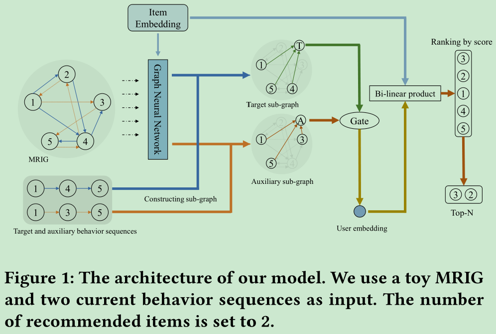
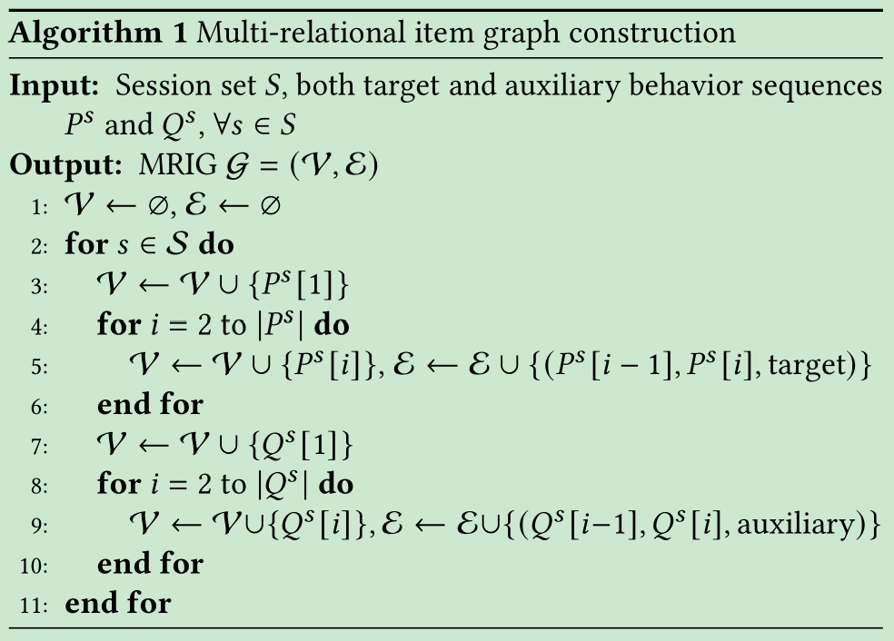
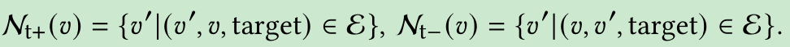

# Beyond Clicks: Modeling Multi-Relational Item Graph for Session-Based Target Behavior Prediction

[1] Wang, Wen, Wei Zhang, Shukai Liu, Qi Liu, Bo Zhang, Leyu Lin, and Hongyuan Zha. “Beyond Clicks: Modeling Multi-Relational Item Graph for Session-Based Target Behavior Prediction.” ArXiv:2002.07993 [Cs], April 8, 2021. http://arxiv.org/abs/2002.07993.

  https://github.com/Autumn945/MGNN-SPred

# Abstract

Session-based target behavior prediction aims to predict the next item to be interacted with specific behavior types (e.g., clicking). Although existing methods for session-based behavior prediction leverage powerful representation learning approaches to encode items’ sequential relevance in a low-dimensional space, they suffer from several limitations. Firstly, they focus on only utilizing the same type of user behavior for prediction, but ignore the potential of taking other behavior data as auxiliary information. This is particularly crucial when the target behavior is sparse but important (e.g., buying or sharing an item). Secondly, item-to-item relations are modeled separately and locally in one behavior sequence, and they lack a principled way to globally encode these relations more effectively. To overcome these limitations, we propose a novel Multi-relational Graph Neural Network model for Session-based target behavior Prediction, namely MGNN-SPred for short. Specifically, we build a Multi-Relational Item Graph (MRIG) based on all behavior sequences from all sessions, involving target and auxiliary behavior types. Based on MRIG, MGNN-SPred learns global item-to-item relations and further obtains user preferences w.r.t. current target and auxiliary behavior sequences, respectively. In the end, MGNN-SPred leverages a gating mechanism to adaptively fuse user representations for predicting next item interacted with target behavior. The extensive experiments on two real-world datasets demonstrate the superiority of MGNN-SPred by comparing with state-of-the-art session-based prediction methods, validating the benefits of leveraging auxiliary behavior and learning item-to-item relations over MRIG.

# Motivation

- 现有的方法只用一种类型的用户行为数据去预测，没有考虑其余的行为数据作为辅助信息。特别是数据比较稀疏并且其余的行为数据比较重要的时候，比如购买和分享大多数情况下比点击跟重要一些
- 项目之间的关系都是在一个小序列中建模的，没有考虑在全局地建模这些项目之间地关系

# Main Contributions

- 不仅仅用一种行为数据，而是用了两种行为数据。并且建立了多关系项目图来学习全局的项目之间的关系
- 用 GNN 学习全局的项目关系并且通过门控机制对于每个当前的行为序列结合得到用户的兴趣

# Introduction

原先的方法假设下一个项目仅仅只依赖于在同一个序列中他向前的项目，针对于会话推荐来说，忽略了其余的项目信息。

多会话推荐的话需要知道用户的 ID 来连接多个会话，所以由于隐私问题和用户的可扩展性本文只考虑了单会话推荐。

# Model

## Graph Construction

用户买完 a 再买 b 只能说明他们之间存在一些依赖关系，并不能反映太多的相似性，因为一个用户很少在短期内买两个相似的项目。相反，如果浏览完 a 再去点击 b，说明他们具有极大的相似性。因为直觉上一个用户会浏览很多相似的项目，而选择最合适的那个去购买。

多关系项目图构图的流程：

图中有两种类型的有向边。

## Item Representation Learning

首先是 one-hot 编码嵌入一下得到初始化的结点表示 $e_v=E^T\bar{e}_v$

然后针对结点的关系，定义了四种集合：target-forward/backward，auxiliary-forward/backward。如下面公式所示：

然后针对每一种关系对结点的邻居做一个均值操作：

## Sequence Representation Learning

其实就是如何用序列中的结点嵌入获得序列的表示，论文中针对不同类型的行为序列定义了不同的虚拟节点来表示聚合后的嵌入表示：论文尝试了多种方法发现均值池化还不错：

然后考虑到不同类型的行为数据对用户的兴趣构建有不同的影响。并且不同的用户对对不同的行为有不同的关注度，比如有些用户喜欢浏览网页或者项目很武断随意，有些就喜欢浏览想买的。用门控机制去构建：

$$\alpha=\sigma(W_g[p;q])$$

$$o=\alpha \cdot p+(1-\alpha)\cdot q$$

## Model Prediction and Training

$$s_v=o^TWe_v$$

$$\hat{y}=softmax(s)$$

$$\mathcal{L}_{RS}=-\sum_{i=1}^{|\mathcal{V|}}y_ilog(\hat{y}_i)$$

## Experimental Setup

辅助行为的处理方式略有不同，因为用户很可能在购买或共享某个项目之前单击该项目。为了避免辅助输入已经看到标签，我们只将单击的项目放在用户购买或共享的目标项目之前。我们设定了最大长度 L 对于这两种类型的序列，只保留最后一种 L 超过最大长度的项目。

# My Thoughts

- 这篇论文最早是投稿的时候审稿人推荐的，说是和我的研究问题一样，当时看题目就知道不一样，现在来看就是不一样啊，为什么审稿人让我和他比较。然后发现好多篇论文都引用了这篇，就索性看了看了
- 这也是我看的第一篇关于多关系的建图的论文吧，论文里一些概念解释挺精辟的，没有像一些论文净是一些空话，而且学到的东西不少，更重要的是还提供了源代码
- 这已经是第 n 篇看到的关于大图的文章了，昨天组会别人分享的也是这样的做法，难道又是一阵风，我已经剩余了西北风了。

# Conclusion

In this paper, we study session-based target behavior prediction. Two limitations of existing relevant models are addressed: using only target behavior for next item prediction and lacking a principled way to encode global item-to-item relations. To alleviate the issues, MGNN-SPred is proposed, with the major novelties of building and modeling of the multi-relational item graph. In addition, a gating mechanism is adopted to adaptively fuse target behavior sequences and auxiliary behavior sequences into the user preference representations for the next item prediction. Comprehensive experiments on two real-world datasets demonstrate MGNN-SPred achieves the best performance and its design is rational.

@Author: Forrest Stone
@Email: ysbrilliant@163.com
@Github: https://github.com/Forrest-Stone
@Date: 2021-09-14 Tuesday 19:01:41
