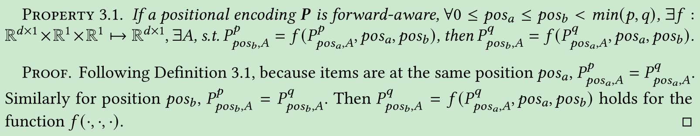

# Exploiting Positional Information for Session-based Recommendation

[1] Qiu, Ruihong, Zi Huang, Tong Chen, and Hongzhi Yin. “Exploiting Positional Information for Session-Based Recommendation.” ArXiv:2107.00846 [Cs], July 9, 2021. https://doi.org/10.1145/3473339.

[2] You, Jiaxuan, Rex Ying, and Jure Leskovec. “Position-Aware Graph Neural Networks.” ArXiv:1906.04817 [Cs, Stat], June 13, 2019. http://arxiv.org/abs/1906.04817.

# Abstract

For present e-commerce platforms, it is important to accurately predict users’ preference for a timely next-item recommendation. To achieve this goal, session-based recommender systems are developed, which are based on a sequence of the most recent user-item interactions to avoid the influence raised from outdated historical records. Although a session can usually reflect a user’s current preference, a local shift of the user’s intention within the session may still exist. Specifically, the interactions that take place in the early positions within a session generally indicate the user’s initial intention, while later interactions are more likely to represent the latest intention. Such positional information has been rarely considered in existing methods, which restricts their ability to capture the significance of interactions at different positions. To thoroughly exploit the positional information within a session, a theoretical framework is developed in this paper to provide an in-depth analysis of the positional information. We formally define the properties of forward-awareness and backward-awareness to evaluate the ability of positional encoding schemes in capturing the initial and the latest intention. According to our analysis, existing positional encoding schemes are generally forward-aware only, which can hardly represent the dynamics of the intention in a session. To enhance the positional encoding scheme for the session-based recommendation, a dual positional encoding (DPE) is proposed to account for both forward-awareness and backward-awareness. Based on DPE, we propose a novel Positional Recommender (PosRec) model with a well-designed Position-aware Gated Graph Neural Network module to fully exploit the positional information for session-based recommendation tasks. Extensive experiments are conducted on two e-commerce benchmark datasets, Yoochoose and Diginetica and the experimental results show the superiority of the PosRec by comparing it with the state-of-the-art session-based recommender models.

# Motivation

- 主要是现有的基于会话推荐的方法考虑位置因素比较少，更具体的是，在会话中交互发生较早位置往往暗示着用户的初试兴趣，而会话中后来的交互更可能代表了用户的最新兴趣。这在以前的方法中是很少研究的
- 以前位置编码方法是前向感知的，很难在会话中捕获用户的动态兴趣

# Main Contributions

- 设计了一个理论框架来分析会话推荐中不同的位置编码对位置信息表示能力的研究
- 提出了一个双向位置编码，从两个方向（前向和后向感知）来为会话中的位置信息进行表示，并且扩展了一个可学习得版本
- 将提出的双向位置编码方式融合到门控图神经网络中去，设计了一个模块更好的进行会话推荐

# Introduction

如下图，在会话中相同的项目出现在不同的会话中不同位置，从前面和后面看将导致不同的位置关系。由于在一个会话中特定位置得项目携带着反映用户初始兴趣和最新兴趣得位置信息，所以如何有效利用前向和后向的位置信息是本文的重点目标。

基于 RNN 的模型根据时间序列喂入模型，但是由于循环结构关注于更多的当前兴趣而很容易忽视了初始兴趣。此外还有推导偏差

基于注意力的模型，一个是用位置编码，但是只用了前向位置编码忽视了后向的位置编码；一个是用会话中的最后一个交互参加同一会话中的其他交互。但是会忽视除了最后一个位置的其余交互的位置信息，其实也就是只关注了当前兴趣忽视了出初始兴趣。

基于 GNN 的模型，基于交互的相对位置构图。但是无法知道那个是前向信息和后向信息，如上图，在第一个会话中，7 和后面的 3 建边，在第二个中，7 和前面的 5 和 6 建边，不知道那个是前向和后向，毕竟不同位置影响不一样。

Positional Encoding：

- Absolute positional encoding：为序列中每一个位置分配一个固定的向量，可以是正弦方式或者是学习的方式
- Relative positional encoding：学习一种相对的位置关系
- Other positional encodings：2D 或者 3D 或者树状的

# Theoretical Framework for Positional Encoding

## Positional Encoding

## Property of Positional Encoding

主要是定义了前向感知和后向感知：意思就是前向的话从前到后每个位置应该是相同的，后向的话从后面的位置计算位置信息应该也是一样的

## Positional Information for Session-based Recommendation

- 在SBRS中可以表示位置信息的位置编码是前向感知和后向感知的
- 正弦位置编码不能表示SBRS中的位置信息，因为它是前向感知的，而不是后向感知的。
- 相对位置编码不能表示SBRS中的位置信息，因为它既不是前向感知的，也不是后向感知的。
- 反向正弦位置编码不能表示SBRS中的位置信息，因为它是向后感知的，而不是向前感知的。

## Beyond Single Directional Positional Encoding

- additional positional encoding
  - additional sinusoidal positional encoding (ASPE)
- 2D positional encoding
  - 2D sinusoidal positional encoding (2DSPE)

# Model

## Dual Positional Encoding

这里要注意的是，如果正好是 4 的倍数，倒没有啥可以说的。如果是 10，前五个要用前两个方程式，后面的五个用后两个。

下面这个是可学习的双向位置编码 LDPE：

## Positional Recommender Model

### Session Graph

带权有向图，没啥好说的，还是以前的建图方案。

### Position-aware Gated Graph Neural Network.

用 GGNN 去聚合邻居的信息

- 用 PGNN 聚合 anchor

PGNN[2] 这篇论文是随机采样图中所有的点当作 anchor 结点。因为第一个节点和最后一个节点以及重复出现的结点具有重要的可见性，所以本文将这些结点作为 anchor 结点来提高归纳偏置。anchor 结点和其他节点的权重是考虑在无权无向图上的节点间的距离。

### Bidirectional Transformer Readout Function with (L)DPE.

这里要注意的是双向 Transformer 层是作用在图层面上的，而不是会话的序列层面上，主要是考虑到序列里会有一些重复项的噪音干扰。还有要注意的是下角标 0 和 $l-1$ 表示的是序列中的第一个和最后一个项目。当然，如果序列中不含重复项就没啥可说的，如果有的话，重复项的位置编码 (L)DPE 最先出现的一个用前向，最后一个出现的用后向。那要是多于三个呢？

### Objective Function.

## Discussion

- Comparisons with Existing Recommendation Methods：重复项的处理，位置的处理
- Comparisons with Existing Position Encoding Schemes：初始兴趣和当前兴趣

# My Thoughts

- 去看了下这几个作者的简介，哎。为啥别人都能把事情做的这么好，上次特他们的利用跨会话信息包括这次的位置信息，我都想到了，只是没有继续深入研究下去，看来这方向的论文还是有提升空间的，不过以后有了思路之后要尽快实施下去
- 论文中关于位置信息的理论分析什么的都不错，不过还是有些没太看明白如果不仔细研究的话，可以说解决了我心中的某些疑惑，因为也想到了用位置信息做文章还没去看关于位置信息的处理。包含后面的位置信息的实验很丰富很不错
- 其实一直关注到了 baseline 里面的 Item-KNN 效果其实也蛮不错的，说明了无监督的方法其实也是一个考虑的方向，我当时就猜到了无监督图的方法没想到已经有人做出来了，应该以后会很热门

# Conclusion

In this paper, we investigate how the positional information can be exploited in the session-based recommendation. We find that there are two types of positional information, forward and the backward to represent the initial and the latest intentions in a session. A theoretical framework is proposed to analyze the representation ability of positional encoding schemes for the positional information in the session-based recommendation task. Specifically, the forward-awareness and the backward-awareness are defined for the evaluation of these schemes. Conventionally, a positional encoding is designed for language models with only the forward-awareness. However, session-based recommendation requires both of the the forward-awareness and the backward-awareness. Therefore, a novel (learned) dual positional encoding scheme ((L)DPE) is proposed to fully capture both of the forward and the backward positional information. Besides, we design a PGGNN module to enhance the representation ability for graph neural networks to make use of the positional information. Combining both (L)DPE and the PGGNN, we build a PosRec model to perform the

@Author: Forrest Stone
@Email: ysbrilliant@163.com
@Github: https://github.com/Forrest-Stone
@Date: 2021-09-10 Friday 17:06:38
